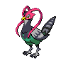

---

## Important Trainers

1. [Gym Leader Skyla](../important_trainers#gym-leader-skyla)

---

## Generic Trainers</h3>

| Trainer | P1 | P2 | P3 | P4 | P5 | P6 |
|:-------:|:--:|:--:|:--:|:--:|:--:|:--:|
|  Worker Cliff |  [Mantine](../../pokemon/mantine.wild_md/) Lv. 50 |  [Crobat](../../pokemon/crobat.wild_md/) Lv. 50 |  [Togekiss](../../pokemon/togekiss.wild_md/) Lv. 50 |  [Charizard](../../pokemon/charizard.wild_md/) Lv. 50 |  [Honchkrow](../../pokemon/honchkrow.wild_md/) Lv. 50 |
|  Worker Brady |  [Swoobat](../../pokemon/swoobat.wild_md/) Lv. 51 |  [Staraptor](../../pokemon/staraptor.wild_md/) Lv. 51 |  [Altaria](../../pokemon/altaria.wild_md/) Lv. 51 |  [Drifblim](../../pokemon/drifblim.wild_md/) Lv. 51 |  [Tropius](../../pokemon/tropius.wild_md/) Lv. 51 |
|  Pilot Ted |  [Chatot](../../pokemon/chatot.wild_md/) Lv. 50 |  [Sigilyph](../../pokemon/sigilyph.wild_md/) Lv. 50 |  [Unfezant](../../pokemon/unfezant.wild_md/) Lv. 50 |  [Scyther](../../pokemon/scyther.wild_md/) Lv. 50 |  [Delibird](../../pokemon/delibird.wild_md/) Lv. 50 |
|  Pilot Chase |  [Jumpluff](../../pokemon/jumpluff.wild_md/) Lv. 50 |  [Xatu](../../pokemon/xatu.wild_md/) Lv. 50 |  [Noctowl](../../pokemon/noctowl.wild_md/) Lv. 50 |  [Pelipper](../../pokemon/pelipper.wild_md/) Lv. 50 |  [Ledian](../../pokemon/ledian.wild_md/) Lv. 50 |
|  Worker Arnold |  [Swellow](../../pokemon/swellow.wild_md/) Lv. 52 |  [Farfetch'd](../../pokemon/farfetchd.wild_md/) Lv. 52 |  [Aerodactyl](../../pokemon/aerodactyl.wild_md/) Lv. 52 |  [Archeops](../../pokemon/archeops.wild_md/) Lv. 52 |  [Pidgeot](../../pokemon/pidgeot.wild_md/) Lv. 52 |

