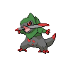

# Moor of Icirrus – Trainer Rosters

---

## Generic Trainers</h3>

| Trainer | P1 | P2 | P3 | P4 | P5 | P6 |
|:-------:|:--:|:--:|:--:|:--:|:--:|:--:|
|  PKMN Ranger Harry |  [Seismitoad](../../pokemon/seismitoad.md/) Lv. 58 |  [Fraxure](../../pokemon/fraxure.md/) Lv. 58 |  [Umbreon](../../pokemon/umbreon.md/) Lv. 58 |
|  PKMN Ranger Chloris |  [Lilligant](../../pokemon/lilligant.md/) Lv. 58 |  [Swampert](../../pokemon/swampert.md/) Lv. 58 |  [Porygon-Z](../../pokemon/porygon-z.md/) Lv. 58 |
|  Fisherman Damon |  [Stunfisk](../../pokemon/stunfisk.md/) Lv. 57 |  [Seaking](../../pokemon/seaking.md/) Lv. 57 |  [Kingdra](../../pokemon/kingdra.md/) Lv. 57 |
|  Parasol Lady Miriah |  [Chandelure](../../pokemon/chandelure.md/) Lv. 58 |  [Vaporeon](../../pokemon/vaporeon.md/) Lv. 58 |  [Golurk](../../pokemon/golurk.md/) Lv. 58 |

