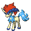

### Puddle

| Sprite | Pokémon | Encounter Type | Chance |
| :---: | --- | :---: | --- |
|  | [Quagsire](../../pokemon/quagsire.md/) | {: style='max-width: 24px;' } | 20% |
|  | [Stunfisk](../../pokemon/stunfisk.md/) | {: style='max-width: 24px;' } | 20% |
|  | [Gastrodon](../../pokemon/gastrodon.md/) | {: style='max-width: 24px;' } | 10% |
|  | [Toxicroak](../../pokemon/toxicroak.md/) | {: style='max-width: 24px;' } | 10% |
|  | [Swalot](../../pokemon/swalot.md/) | {: style='max-width: 24px;' } | 10% |
|  | [Weezing](../../pokemon/weezing.md/) | {: style='max-width: 24px;' } | 10% |
|  | [Muk](../../pokemon/muk.md/) | {: style='max-width: 24px;' } | 10% |
|  | [Palpitoad](../../pokemon/palpitoad.md/) | {: style='max-width: 24px;' } | 10%

### Surfing

| Sprite | Pokémon | Encounter Type | Chance |
| :---: | --- | :---: | --- |
|  | [Stunfisk](../../pokemon/stunfisk.md/) | {: style='max-width: 24px;' } | 60% |
|  | [Barboach](../../pokemon/barboach.md/) | {: style='max-width: 24px;' } | 40%

### Rippling Surfing

| Sprite | Pokémon | Encounter Type | Chance |
| :---: | --- | :---: | --- |
|  | [Whiscash](../../pokemon/whiscash.md/) | {: style='max-width: 24px;' } | 60% |
|  | [Seismitoad](../../pokemon/seismitoad.md/) | {: style='max-width: 24px;' } | 40%

### Fishing

| Sprite | Pokémon | Encounter Type | Chance |
| :---: | --- | :---: | --- |
|  | [Barboach](../../pokemon/barboach.md/) | {: style='max-width: 24px;' } | 70% |
|  | [Stunfisk](../../pokemon/stunfisk.md/) | {: style='max-width: 24px;' } | 30%

### Rippling Fishing

| Sprite | Pokémon | Encounter Type | Chance |
| :---: | --- | :---: | --- |
|  | [Barboach](../../pokemon/barboach.md/) | {: style='max-width: 24px;' } | 60% |
|  | [Stunfisk](../../pokemon/stunfisk.md/) | {: style='max-width: 24px;' } | 30% |
|  | [Whiscash](../../pokemon/whiscash.md/) | {: style='max-width: 24px;' } | 10% |

### Legendary Encounter

| Sprite | Pokémon | Level | Encounter Type | Location | Chance |
| :---: | --- | --- | :---: | --- | --- |
|  | Keldeo | Level 56 | {: style='max-width: 24px;' } | Moor of Icirrus, Autumn | 1% |
