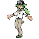

---

## PKMN Trainer N – 2

**Battle Type:** Double Battle

    | Pokémon | Attributes | Item | Moves |
    |:-------:|------------|:----:|-------|
|  | **Lv. 19** [Drilbur](../../pokemon/drilbur.md/) **Ability:** ? {: width="48"} | No Item | 1. — 2. — 3. — 4. — |
|  | **Lv. 19** [Bronzor](../../pokemon/bronzor.md/) **Ability:** ? {: width="48"} {: width="48"} | No Item | 1. — 2. — 3. — 4. — |
|  | **Lv. 19** [Tympole](../../pokemon/tympole.md/) **Ability:** ? {: width="48"} | No Item | 1. — 2. — 3. — 4. — |
|  | **Lv. 19** [Vulpix](../../pokemon/vulpix.md/) **Ability:** ? {: width="48"} | No Item | 1. — 2. — 3. — 4. — |
|  | **Lv. 19** [Zorua](../../pokemon/zorua.md/) **Ability:** ? {: width="48"} | No Item | 1. — 2. — 3. — 4. — |

---

## Gym Leader Lenora

**Battle Type:** Double Battle

**Reward:** TM67 Retaliate

    | Pokémon | Attributes | Item | Moves |
    |:-------:|------------|:----:|-------|
|  | **Lv. 18** [Stantler](../../pokemon/stantler.md/) **Ability:** Intimidate {: width="48"} | No Item | 1: Retaliate 2: Hypnosis 3: Disable 4: Extrasensory |
|  | **Lv. 18** [Herdier](../../pokemon/herdier.md/) **Ability:** Intimidate {: width="48"} | No Item | 1: Retaliate 2: Bite 3: Helping Hand 4: Charm |
|  | **Lv. 18** [Furret](../../pokemon/furret.md/) **Ability:** Keen Eye {: width="48"} | No Item | 1: Retaliate 2: Follow Me 3: Thunderbolt 4: Reversal |
|  | **Lv. 18** [Bibarel](../../pokemon/bibarel.md/) **Ability:** Moody {: width="48"} {: width="48"} | No Item | 1: Retaliate 2: Curse 3: Aqua Tail 4: Amnesia |
|  | **Lv. 20** [Watchog](../../pokemon/watchog.md/) **Ability:** Analytic {: width="48"} |  Sitrus Berry | 1: Retaliate 2: Hypnosis 3: Super Fang 4: Crunch |
|  | **Lv. 20** [Bouffalant](../../pokemon/bouffalant.md/) **Ability:** Sap Sipper {: width="48"} |  Sitrus Berry | 1: Retaliate 2: Aerial Ace 3: Rock Tomb 4: Revenge |

