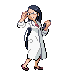

# Nacrene City – Trainer Rosters

---

## Important Trainers

1. [PKMN Trainer N – 2](important_trainers.md#pkmn-trainer-n-2)
2. [Gym Leader Lenora](important_trainers.md#gym-leader-lenora)

---

## Generic Trainers</h3>

| Trainer | P1 | P2 | P3 | P4 | P5 | P6 |
|:-------:|:--:|:--:|:--:|:--:|:--:|:--:|
|  Lass Dye |  [Breloom](../../pokemon/breloom.md/) Lv. 85 |
|  School Kid Carter |  [Aipom](../../pokemon/aipom.md/) Lv. 18 |  [Snubbull](../../pokemon/snubbull.md/) Lv. 18 |  [Minccino](../../pokemon/minccino.md/) Lv. 18 |  [Lickitung](../../pokemon/lickitung.md/) Lv. 18 |
|  Scientist Satomi |  [Ditto](../../pokemon/ditto.md/) Lv. 18 |  [Smeargle](../../pokemon/smeargle.md/) Lv. 18 |  [Porygon](../../pokemon/porygon.md/) Lv. 18 |  [Castform](../../pokemon/castform.md/) Lv. 18 |
|  School Kid Lydia |  [Buneary](../../pokemon/buneary.md/) Lv. 18 |  [Clefairy](../../pokemon/clefairy.md/) Lv. 18 |  [Jigglypuff](../../pokemon/jigglypuff.md/) Lv. 18 |  [Delcatty](../../pokemon/delcatty.md/) Lv. 18 |

