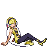
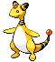

# Nimbasa City – Important Trainers

---

## PKMN Trainer N – 3

**Battle Type:** Double Battle

    | Pokémon | Attributes | Item | Moves |
    |:-------:|------------|:----:|-------|
|  | **Lv. 33** [Hippopotas](../../pokemon/hippopotas.md/) **Ability:** ? {: width="48"} | No Item | 1. — 2. — 3. — 4. — |
|  | **Lv. 33** [Maractus](../../pokemon/maractus.md/) **Ability:** ? {: width="48"} | No Item | 1. — 2. — 3. — 4. — |
|  | **Lv. 33** [Gligar](../../pokemon/gligar.md/) **Ability:** ? {: width="48"} {: width="48"} | No Item | 1. — 2. — 3. — 4. — |
|  | **Lv. 33** [Larvesta](../../pokemon/larvesta.md/) **Ability:** ? {: width="48"} {: width="48"} | No Item | 1. — 2. — 3. — 4. — |
|  | **Lv. 33** [Golett](../../pokemon/golett.md/) **Ability:** ? {: width="48"} {: width="48"} | No Item | 1. — 2. — 3. — 4. — |
|  | **Lv. 33** [Sigilyph](../../pokemon/sigilyph.md/) **Ability:** ? {: width="48"} {: width="48"} | No Item | 1. — 2. — 3. — 4. — |

---

## Gym Leader Elesa

**Battle Type:** Single Battle

**Reward:** TM93 Wild Charge

    | Pokémon | Attributes | Item | Moves |
    |:-------:|------------|:----:|-------|
|  | **Lv. 36** [Emolga](../../pokemon/emolga.md/) **Ability:** Static {: width="48"} {: width="48"} | No Item | 1: Wild Charge 2: U-turn 3: Acrobatics 4: Roost |
|  | **Lv. 36** [Manectric](../../pokemon/manectric.md/) **Ability:** Static {: width="48"} | No Item | 1: Thunderbolt 2: Volt Switch 3: Flamethrower 4: Attract |
|  | **Lv. 36** [Ampharos](../../pokemon/ampharos.md/) **Ability:** Static {: width="48"} | No Item | 1: Thunderbolt 2: Charge 3: Focus Blast 4: Cotton Guard |
|  | **Lv. 36** [Raichu](../../pokemon/raichu.md/) **Ability:** Static {: width="48"} | No Item | 1: Wild Charge 2: Volt Switch 3: Grass Knot 4: Focus Blast |
|  | **Lv. 36** [Galvantula](../../pokemon/galvantula.md/) **Ability:** Compound Eyes {: width="48"} {: width="48"} | No Item | 1: Thunder 2: Volt Switch 3: Signal Beam 4: Energy Ball |
|  | **Lv. 38** [Zebstrika](../../pokemon/zebstrika.md/) **Ability:** Sap Sipper {: width="48"} |  Sitrus Berry | 1: Wild Charge 2: Volt Switch 3: Flame Charge 4: Double Kick |

