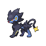

---

## Important Trainers

1. [PKMN Trainer N – 3](important_trainer_rosters.wild_md#pkmn-trainer-n-3)
2. [Gym Leader Elesa](important_trainer_rosters.wild_md#gym-leader-elesa)

---

## Generic Trainers</h3>

| Trainer | P1 | P2 | P3 | P4 | P5 | P6 |
|:-------:|:--:|:--:|:--:|:--:|:--:|:--:|
|  Plasma Grunt |  [Mawile](../../pokemon/mawile.wild_md/) Lv. 31 |  [Sableye](../../pokemon/sableye.wild_md/) Lv. 31 |
|  Lady Magnolia |  [Plusle](../../pokemon/plusle.wild_md/) Lv. 33 |  [Minun](../../pokemon/minun.wild_md/) Lv. 33 |  [Joltik](../../pokemon/joltik.wild_md/) Lv. 33 |  [Tynamo](../../pokemon/tynamo.wild_md/) Lv. 33 |  [Pichu](../../pokemon/pichu.wild_md/) Lv. 33 |
|  Rich Boy Cody |  [Pachirisu](../../pokemon/pachirisu.wild_md/) Lv. 34 |  [Electabuzz](../../pokemon/electabuzz.wild_md/) Lv. 34 |  [Pikachu](../../pokemon/pikachu.wild_md/) Lv. 34 |  [Flaaffy](../../pokemon/flaaffy.wild_md/) Lv. 34 |  [Jolteon](../../pokemon/jolteon.wild_md/) Lv. 34 |
|  Rich Boy Rolan |  [Luxray](../../pokemon/luxray.wild_md/) Lv. 34 |  [Jolteon](../../pokemon/jolteon.wild_md/) Lv. 34 |  [Magneton](../../pokemon/magneton.wild_md/) Lv. 34 |  [Electrode](../../pokemon/electrode.wild_md/) Lv. 34 |  [Lanturn](../../pokemon/lanturn.wild_md/) Lv. 34 |
|  Lady Colette |  [Stunfisk](../../pokemon/stunfisk.wild_md/) Lv. 35 |  [Rotom](../../pokemon/rotom.wild_md/) Lv. 35 |  [Emolga](../../pokemon/emolga.wild_md/) Lv. 35 |

