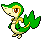

# Nuvema Town – Important Trainers

---

## Rival Bianca – 1

**Battle Type:** Single Battle

=== "Tepig"

    | Pokémon | Attributes | Item | Moves |
    |:-------:|------------|:----:|-------|
    |  | **Lv. 5** [Snivy](../../pokemon/snivy.md/) **Ability:** Contrary {: width="48"} | No Item | 1. — 2. — 3. — 4. — |
    

=== "Snivy"

    | Pokémon | Attributes | Item | Moves |
    |:-------:|------------|:----:|-------|
    |  | **Lv. 5** [Oshawott](../../pokemon/oshawott.md/) **Ability:** Vital Spirit {: width="48"} | No Item | 1. — 2. — 3. — 4. — |
    

=== "Oshawott"

    | Pokémon | Attributes | Item | Moves |
    |:-------:|------------|:----:|-------|
    |  | **Lv. 5** [Tepig](../../pokemon/tepig.md/) **Ability:** Adaptability {: width="48"} | No Item | 1. — 2. — 3. — 4. — |
    

---

## Rival Cheren – 1

**Battle Type:** Single Battle

=== "Tepig"

    | Pokémon | Attributes | Item | Moves |
    |:-------:|------------|:----:|-------|
    |  | **Lv. 5** [Oshawott](../../pokemon/oshawott.md/) **Ability:** Contrary {: width="48"} | No Item | 1. — 2. — 3. — 4. — |
    

=== "Snivy"

    | Pokémon | Attributes | Item | Moves |
    |:-------:|------------|:----:|-------|
    |  | **Lv. 5** [Tepig](../../pokemon/tepig.md/) **Ability:** Vital Spirit {: width="48"} | No Item | 1. — 2. — 3. — 4. — |
    

=== "Oshawott"

    | Pokémon | Attributes | Item | Moves |
    |:-------:|------------|:----:|-------|
    |  | **Lv. 5** [Snivy](../../pokemon/snivy.md/) **Ability:** Adaptability {: width="48"} | No Item | 1. — 2. — 3. — 4. — |
    

---

## Rival Bianca – Final

**Battle Type:** Rotation Battle

=== "Tepig"

    | Pokémon | Attributes | Item | Moves |
    |:-------:|------------|:----:|-------|
    |  | **Lv. 88** [Persian](../../pokemon/persian.md/) **Ability:** Technician {: width="48"} |  Normal Gem | 1: Nasty Plot 2: Hypnosis 3: Swift 4: Fake Out |
    |  | **Lv. 88** [Musharna](../../pokemon/musharna.md/) **Ability:** Analytic {: width="48"} |  Psychic Gem | 1: Hypnosis 2: Psychic 3: Energy Ball 4: Reflect |
    |  | **Lv. 88** [Mienshao](../../pokemon/mienshao.md/) **Ability:** Reckless {: width="48"} |  Flying Gem | 1: High Jump Kick 2: U-turn 3: Stone Edge 4: Acrobatics |
    |  | **Lv. 88** [Chandelure](../../pokemon/chandelure.md/) **Ability:** Levitate {: width="48"} {: width="48"} |  Sitrus Berry | 1: Flamethrower 2: Shadow Ball 3: Will-O-Wisp 4: Psychic |
    |  | **Lv. 88** [Simipour](../../pokemon/simipour.md/) **Ability:** Unburden {: width="48"} |  Flying Gem | 1: Work Up 2: Acrobatics 3: Focus Blast 4: Hydro Pump |
    |  | **Lv. 90** [Serperior](../../pokemon/serperior.md/) **Ability:** Contrary {: width="48"} {: width="48"} |  Life Orb | 1: Leaf Storm 2: Leech Seed 3: Glare 4: Reflect |
    

=== "Snivy"

    | Pokémon | Attributes | Item | Moves |
    |:-------:|------------|:----:|-------|
    |  | **Lv. 88** [Persian](../../pokemon/persian.md/) **Ability:** Technician {: width="48"} |  Normal Gem | 1: Nasty Plot 2: Hypnosis 3: Swift 4: Fake Out |
    |  | **Lv. 88** [Musharna](../../pokemon/musharna.md/) **Ability:** Analytic {: width="48"} |  Psychic Gem | 1: Hypnosis 2: Psychic 3: Energy Ball 4: Reflect |
    |  | **Lv. 88** [Mienshao](../../pokemon/mienshao.md/) **Ability:** Reckless {: width="48"} |  Flying Gem | 1: High Jump Kick 2: U-turn 3: Stone Edge 4: Acrobatics |
    |  | **Lv. 88** [Lilligant](../../pokemon/lilligant.md/) **Ability:** Own Tempo {: width="48"} |  Sitrus Berry | 1: Petal Dance 2: Focus Blast 3: Sleep Powder 4: Aromatherapy |
    |  | **Lv. 88** [Simisear](../../pokemon/simisear.md/) **Ability:** Unburden {: width="48"} |  Flying Gem | 1: Work Up 2: Acrobatics 3: Focus Blast 4: Overheat |
    |  | **Lv. 90** [Samurott](../../pokemon/samurott.md/) **Ability:** Vital Spirit {: width="48"} {: width="48"} |  Life Orb | 1: Hydro Pump 2: Shell Smash 3: Megahorn 4: Ice Beam |
    

=== "Oshawott"

    | Pokémon | Attributes | Item | Moves |
    |:-------:|------------|:----:|-------|
    |  | **Lv. 88** [Persian](../../pokemon/persian.md/) **Ability:** Technician {: width="48"} |  Normal Gem | 1: Nasty Plot 2: Hypnosis 3: Swift 4: Fake Out |
    |  | **Lv. 88** [Musharna](../../pokemon/musharna.md/) **Ability:** Analytic {: width="48"} |  Psychic Gem | 1: Hypnosis 2: Psychic 3: Energy Ball 4: Reflect |
    |  | **Lv. 88** [Mienshao](../../pokemon/mienshao.md/) **Ability:** Reckless {: width="48"} |  Flying Gem | 1: High Jump Kick 2: U-turn 3: Stone Edge 4: Acrobatics |
    |  | **Lv. 88** [Milotic](../../pokemon/milotic.md/) **Ability:** Multiscale {: width="48"} |  Sitrus Berry | 1: Surf 2: Ice Beam 3: Hypnosis 4: Dragon Tail |
    |  | **Lv. 88** [Simisage](../../pokemon/simisage.md/) **Ability:** Unburden {: width="48"} |  Flying Gem | 1: Work Up 2: Acrobatics 3: Focus Blast 4: Leaf Storm |
    |  | **Lv. 90** [Emboar](../../pokemon/emboar.md/) **Ability:** Adaptability {: width="48"} {: width="48"} |  Life Orb | 1: Fire Blast 2: Bulk Up 3: Wild Charge 4: Hammer Arm |
    

