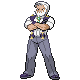

---

## Gym Leader Drayden

**Battle Type:** Rotation Battle

**Reward:** TM82 Dragon Tail

**Version:** Blaze Black

| Pokemon | Attributes | Moves |
|:-------:|------------|-------|
|  |**Lv. 64** [Druddigon](../../pokemon/druddigon.md/) **Item:** Rocky Helmet  **Ability:** Rough Skin |  1: Outrage 2: Revenge 3: Earthquake 4: Dragon Tail |
|  |**Lv. 64** [Charizard](../../pokemon/charizard.md/) **Item:** Salac Berry  **Ability:** Blaze |  1: Belly Drum 2: Fire Punch 3: Earthquake 4: Substitute |
|  |**Lv. 64** [Flygon](../../pokemon/flygon.md/) **Item:** Yache Berry  **Ability:** Levitate |  1: Quiver Dance 2: Dragon Pulse 3: Earth Power 4: Fire Blast |
|  |**Lv. 64** [Salamence](../../pokemon/salamence.md/) **Item:** Life Orb  **Ability:** Moxie |  1: Outrage 2: Hydro Pump 3: Brick Break 4: Fire Blast |
|  |**Lv. 64** [Kingdra](../../pokemon/kingdra.md/) **Item:** White Herb  **Ability:** Sniper |  1: Draco Meteor 2: Waterfall 3: Outrage 4: Frost Breath |
|  |**Lv. 66** [Haxorus](../../pokemon/haxorus.md/) **Item:** Sitrus Berry  **Ability:** Mold Breaker |  1: Dragon Dance 2: Outrage 3: Earthquake 4: Dragon Tail |

---

## Gym Leader Iris

**Battle Type:** Triple Battle

**Reward:** TM82 Dragon Tail

**Version:** Volt White

| Pokemon | Attributes | Moves |
|:-------:|------------|-------|
|  |**Lv. 63** [Druddigon](../../pokemon/druddigon.md/) **Item:** Rocky Helmet  **Ability:** Rough Skin |  1: Outrage 2: Revenge 3: Earthquake 4: Dragon Tail |
|  |**Lv. 63** [Gyarados](../../pokemon/gyarados.md/) **Item:** Wacan Berry  **Ability:** Moxie |  1: Dragon Dance 2: Aqua Tail 3: Ice Fang 4: Earthquake |
|  |**Lv. 63** [Altaria](../../pokemon/altaria.md/) **Item:** Yache Berry  **Ability:** Natural Cure |  1: Cotton Guard 2: Dragon Pulse 3: Ice Beam 4: Fire Blast |
|  |**Lv. 65** [Dragonite](../../pokemon/dragonite.md/) **Item:** Sitrus Berry  **Ability:** Multiscale |  1: Stone Edge 2: Dragon Claw 3: Hurricane 4: Thunder |
|  |**Lv. 65** [Kingdra](../../pokemon/kingdra.md/) **Item:** Damp Rock  **Ability:** Swift Swim |  1: Rain Dance 2: Hydro Pump 3: Dragon Pulse 4: Blizzard |
|  |**Lv. 65** [Haxorus](../../pokemon/haxorus.md/) **Item:** Dragon Gem  **Ability:** Mold Breaker |  1: Dragon Dance 2: Outrage 3: Earthquake 4: Dragon Tail |

