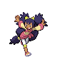

---

## Gym Leader Drayden

| Pokemon | Attributes | Moves |
|:-------:|------------|-------|
|  [Druddigon](../../pokemon/druddigon.md/) |**Level:** 64 **Item:** Rocky Helmet **Ability:** Rough Skin | 1. Outrage 2. Revenge 3. Earthquake 4. Dragon Tail |
|  [Charizard](../../pokemon/charizard.md/) |**Level:** 64 **Item:** Salac Berry **Ability:** Blaze | 1. Belly Drum 2. Fire Punch 3. Earthquake 4. Substitute |
|  [Flygon](../../pokemon/flygon.md/) |**Level:** 64 **Item:** Yache Berry **Ability:** Levitate | 1. Quiver Dance 2. Dragon Pulse 3. Earth Power 4. Fire Blast |
|  [Salamence](../../pokemon/salamence.md/) |**Level:** 64 **Item:** Life Orb **Ability:** Moxie | 1. Outrage 2. Hydro Pump 3. Brick Break 4. Fire Blast |
|  [Kingdra](../../pokemon/kingdra.md/) |**Level:** 64 **Item:** White Herb **Ability:** Sniper | 1. Draco Meteor 2. Waterfall 3. Outrage 4. Frost Breath |
|  [Haxorus](../../pokemon/haxorus.md/) |**Level:** 66 **Item:** Sitrus Berry **Ability:** Mold Breaker | 1. Dragon Dance 2. Outrage 3. Earthquake 4. Dragon Tail |

---

## Gym Leader Iris

| Pokemon | Attributes | Moves |
|:-------:|------------|-------|
|  [Druddigon](../../pokemon/druddigon.md/) |**Level:** 63 **Item:** Rocky Helmet **Ability:** Rough Skin | 1. Outrage 2. Revenge 3. Earthquake 4. Dragon Tail |
|  [Gyarados](../../pokemon/gyarados.md/) |**Level:** 63 **Item:** Wacan Berry **Ability:** Moxie | 1. Dragon Dance 2. Aqua Tail 3. Ice Fang 4. Earthquake |
|  [Altaria](../../pokemon/altaria.md/) |**Level:** 63 **Item:** Yache Berry **Ability:** Natural Cure | 1. Cotton Guard 2. Dragon Pulse 3. Ice Beam 4. Fire Blast |
|  [Dragonite](../../pokemon/dragonite.md/) |**Level:** 65 **Item:** Sitrus Berry **Ability:** Multiscale | 1. Stone Edge 2. Dragon Claw 3. Hurricane 4. Thunder |
|  [Kingdra](../../pokemon/kingdra.md/) |**Level:** 65 **Item:** Damp Rock **Ability:** Swift Swim | 1. Rain Dance 2. Hydro Pump 3. Dragon Pulse 4. Blizzard |
|  [Haxorus](../../pokemon/haxorus.md/) |**Level:** 65 **Item:** Dragon Gem **Ability:** Mold Breaker | 1. Dragon Dance 2. Outrage 3. Earthquake 4. Dragon Tail |

