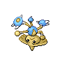

---

## Important Trainers

1. [Gym Leader Drayden](important_trainers.md#gym-leader-drayden)
2. [Gym Leader Iris](important_trainers.md#gym-leader-iris)

---

## Generic Trainers</h3>

| Trainer | P1 | P2 | P3 | P4 | P5 | P6 |
|:-------:|:--:|:--:|:--:|:--:|:--:|:--:|
|  Ace Trainer Eileen |  [Vaporeon](../../pokemon/vaporeon.md/) Lv. 63 |  [Jolteon](../../pokemon/jolteon.md/) Lv. 63 |  [Flareon](../../pokemon/flareon.md/) Lv. 63 |
|  Ace Trainer Lou |  [Hitmonlee](../../pokemon/hitmonlee.md/) Lv. 63 |  [Hitmonchan](../../pokemon/hitmonchan.md/) Lv. 63 |  [Hitmontop](../../pokemon/hitmontop.md/) Lv. 63 |
|  Ace Trainer Webster |  [Gyarados](../../pokemon/gyarados.md/) Lv. 58 |  [Dragonair](../../pokemon/dragonair.md/) Lv. 56 |  [Dragonair](../../pokemon/dragonair.md/) Lv. 56 |  [Aerodactyl](../../pokemon/aerodactyl.md/) Lv. 60 |  [Dragonite](../../pokemon/dragonite.md/) Lv. 62 |
|  Ace Trainer Olwen |  [Zweilous](../../pokemon/zweilous.md/) Lv. 62 |  [Druddigon](../../pokemon/druddigon.md/) Lv. 62 |  [Ampharos](../../pokemon/ampharos.md/) Lv. 62 |
|  Ace Trainer Jose |  [Fraxure](../../pokemon/fraxure.md/) Lv. 62 |  [Gyarados](../../pokemon/gyarados.md/) Lv. 62 |  [Charizard](../../pokemon/charizard.md/) Lv. 62 |
|  Ace Trainer Clara |  [Milotic](../../pokemon/milotic.md/) Lv. 62 |  [Dragonair](../../pokemon/dragonair.md/) Lv. 62 |  [Kangaskhan](../../pokemon/kangaskhan.md/) Lv. 62 |
|  Veteran Hugo |  [Druddigon](../../pokemon/druddigon.md/) Lv. 63 |  [Flygon](../../pokemon/flygon.md/) Lv. 63 |  [Garchomp](../../pokemon/garchomp.md/) Lv. 63 |
|  Ace Trainer Tom |  [Steelix](../../pokemon/steelix.md/) Lv. 62 |  [Tyranitar](../../pokemon/tyranitar.md/) Lv. 62 |  [Altaria](../../pokemon/altaria.md/) Lv. 62 |
|  Ace Trainer Dara |  [Druddigon](../../pokemon/druddigon.md/) Lv. 63 |  [Zweilous](../../pokemon/zweilous.md/) Lv. 63 |  [Flygon](../../pokemon/flygon.md/) Lv. 63 |
|  Veteran Kim |  [Druddigon](../../pokemon/druddigon.md/) Lv. 63 |  [Altaria](../../pokemon/altaria.md/) Lv. 63 |  [Salamence](../../pokemon/salamence.md/) Lv. 63 |

