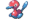

### Grass, Normal

| Sprite | Pokémon | Encounter Type | Chance |
| :---: | --- | :---: | --- |
|  | [Porygon](../pokemon/porygon.md/) | {: style='max-width: 24px;' } | 20% |
|  | [Klang](../pokemon/klang.md/) | {: style='max-width: 24px;' } | 20% |
|  | [Magneton](../pokemon/magneton.md/) | {: style='max-width: 24px;' } | 20% |
|  | [Electrode](../pokemon/electrode.md/) | {: style='max-width: 24px;' } | 20% |
|  | [Kingler](../pokemon/kingler.md/) | {: style='max-width: 24px;' } | 10% |
|  | [Shuckle](../pokemon/shuckle.md/) | {: style='max-width: 24px;' } | 10%

### Grass, Special

| Sprite | Pokémon | Encounter Type | Chance |
| :---: | --- | :---: | --- |
|  | [Audino](../pokemon/audino.md/) | {: style='max-width: 24px;' } | 95% |
|  | [Porygon2](../pokemon/porygon2.md/) | {: style='max-width: 24px;' } | 5%

### Surf, Normal

| Sprite | Pokémon | Encounter Type | Chance |
| :---: | --- | :---: | --- |
|  | [Wingull](../pokemon/wingull.md/) | {: style='max-width: 24px;' } | 60% |
|  | [Tentacool](../pokemon/tentacool.md/) | {: style='max-width: 24px;' } | 30% |
|  | [Pelipper](../pokemon/pelipper.md/) | {: style='max-width: 24px;' } | 10%

### Surf, Special

| Sprite | Pokémon | Encounter Type | Chance |
| :---: | --- | :---: | --- |
|  | [Tentacruel](../pokemon/tentacruel.md/) | {: style='max-width: 24px;' } | 60% |
|  | [Frillish](../pokemon/frillish.md/) | {: style='max-width: 24px;' } | 30% |
|  | [Jellicent](../pokemon/jellicent.md/) | {: style='max-width: 24px;' } | 10%

### Fish, Normal

| Sprite | Pokémon | Encounter Type | Chance |
| :---: | --- | :---: | --- |
|  | [Krabby](../pokemon/krabby.md/) | {: style='max-width: 24px;' } | 60% |
|  | [Corphish](../pokemon/corphish.md/) | {: style='max-width: 24px;' } | 40%

### Fish, Special

| Sprite | Pokémon | Encounter Type | Chance |
| :---: | --- | :---: | --- |
|  | [Kingler](../pokemon/kingler.md/) | {: style='max-width: 24px;' } | 60% |
|  | [Crawdaunt](../pokemon/crawdaunt.md/) | {: style='max-width: 24px;' } | 40% |
