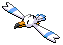
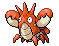

### Grass

| Sprite | Pokémon | Encounter Type | Chance |
| :---: | --- | :---: | --- |
|  | [Porygon](../../pokemon/porygon.md/) | {: style='max-width: 24px;' } | 20% |
|  | [Klang](../../pokemon/klang.md/) | {: style='max-width: 24px;' } | 20% |
|  | [Magneton](../../pokemon/magneton.md/) | {: style='max-width: 24px;' } | 20% |
|  | [Electrode](../../pokemon/electrode.md/) | {: style='max-width: 24px;' } | 20% |
|  | [Kingler](../../pokemon/kingler.md/) | {: style='max-width: 24px;' } | 10% |
|  | [Shuckle](../../pokemon/shuckle.md/) | {: style='max-width: 24px;' } | 10%

### Rustling Grass

| Sprite | Pokémon | Encounter Type | Chance |
| :---: | --- | :---: | --- |
|  | [Audino](../../pokemon/audino.md/) | {: style='max-width: 24px;' } | 95% |
|  | [Porygon2](../../pokemon/porygon2.md/) | {: style='max-width: 24px;' } | 5%

### Surfing

| Sprite | Pokémon | Encounter Type | Chance |
| :---: | --- | :---: | --- |
|  | [Wingull](../../pokemon/wingull.md/) | {: style='max-width: 24px;' } | 60% |
|  | [Tentacool](../../pokemon/tentacool.md/) | {: style='max-width: 24px;' } | 30% |
|  | [Pelipper](../../pokemon/pelipper.md/) | {: style='max-width: 24px;' } | 10%

### Rippling Surfing

| Sprite | Pokémon | Encounter Type | Chance |
| :---: | --- | :---: | --- |
|  | [Tentacruel](../../pokemon/tentacruel.md/) | {: style='max-width: 24px;' } | 60% |
|  | [Frillish](../../pokemon/frillish.md/) | {: style='max-width: 24px;' } | 30% |
|  | [Jellicent](../../pokemon/jellicent.md/) | {: style='max-width: 24px;' } | 10%

### Fishing

| Sprite | Pokémon | Encounter Type | Chance |
| :---: | --- | :---: | --- |
|  | [Krabby](../../pokemon/krabby.md/) | {: style='max-width: 24px;' } | 60% |
|  | [Corphish](../../pokemon/corphish.md/) | {: style='max-width: 24px;' } | 40%

### Rippling Fishing

| Sprite | Pokémon | Encounter Type | Chance |
| :---: | --- | :---: | --- |
|  | [Kingler](../../pokemon/kingler.md/) | {: style='max-width: 24px;' } | 60% |
|  | [Crawdaunt](../../pokemon/crawdaunt.md/) | {: style='max-width: 24px;' } | 40% |
