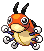
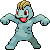
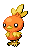
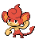

---

## Pinwheel Forest – Outsid

### Grass, Normal

| Sprite | Pokémon | Encounter Type | Chance |
| :---: | --- | :---: | --- |
|  | [Tympole](../pokemon/tympole.md/) | {: style='max-width: 24px;' } | 20% |
|  | [Timburr](../pokemon/timburr.md/) | {: style='max-width: 24px;' } | 20% |
|  | [Meditite](../pokemon/meditite.md/) | {: style='max-width: 24px;' } | 10% |
|  | [Spinarak](../pokemon/spinarak.md/) | {: style='max-width: 24px;' } | 10% |
|  | [Ledyba](../pokemon/ledyba.md/) | {: style='max-width: 24px;' } | 10% |
|  | [Machop](../pokemon/machop.md/) | {: style='max-width: 24px;' } | 10% |
|  | [Makuhita](../pokemon/makuhita.md/) | {: style='max-width: 24px;' } | 10% |
|  | [Croagunk](../pokemon/croagunk.md/) | {: style='max-width: 24px;' } | 5% |
|  | [Slakoth](../pokemon/slakoth.md/) | {: style='max-width: 24px;' } | 5%

### Grass, Doubles

| Sprite | Pokémon | Encounter Type | Chance |
| :---: | --- | :---: | --- |
|  | [Throh](../pokemon/throh.md/) | {: style='max-width: 24px;' } | 20% |
|  | [Sawk](../pokemon/sawk.md/) | {: style='max-width: 24px;' } | 20% |
|  | [Dunsparce](../pokemon/dunsparce.md/) | {: style='max-width: 24px;' } | 10% |
|  | [Doduo](../pokemon/doduo.md/) | {: style='max-width: 24px;' } | 10% |
|  | [Snubbull](../pokemon/snubbull.md/) | {: style='max-width: 24px;' } | 10% |
|  | [Aipom](../pokemon/aipom.md/) | {: style='max-width: 24px;' } | 10% |
|  | [Cubone](../pokemon/cubone.md/) | {: style='max-width: 24px;' } | 9% |
|  | [Burmy](../pokemon/burmy.md/) | {: style='max-width: 24px;' } | 9% |
|  | [Heracross](../pokemon/heracross.md/) | {: style='max-width: 24px;' } | 2%

### Grass, Special

| Sprite | Pokémon | Encounter Type | Chance |
| :---: | --- | :---: | --- |
|  | [Audino](../pokemon/audino.md/) | {: style='max-width: 24px;' } | 50% |
|  | [Tepig](../pokemon/tepig.md/) | {: style='max-width: 24px;' } | 10% |
|  | [Tyrogue](../pokemon/tyrogue.md/) | {: style='max-width: 24px;' } | 10% |
|  | [Riolu](../pokemon/riolu.md/) | {: style='max-width: 24px;' } | 10% |
|  | [Charmander](../pokemon/charmander.md/) | {: style='max-width: 24px;' } | 5% |
|  | [Cyndaquil](../pokemon/cyndaquil.md/) | {: style='max-width: 24px;' } | 5% |
|  | [Torchic](../pokemon/torchic.md/) | {: style='max-width: 24px;' } | 5% |
|  | [Chimchar](../pokemon/chimchar.md/) | {: style='max-width: 24px;' } | 5%

---

## Pinwheel Forest – Insid

### Grass, Normal

| Sprite | Pokémon | Encounter Type | Chance |
| :---: | --- | :---: | --- |
|  | [Cottonee](../pokemon/cottonee.md/) | {: style='max-width: 24px;' } | 20% |
|  | [Petilil](../pokemon/petilil.md/) | {: style='max-width: 24px;' } | 20% |
|  | [Sewaddle](../pokemon/sewaddle.md/) | {: style='max-width: 24px;' } | 10% |
|  | [Venipede](../pokemon/venipede.md/) | {: style='max-width: 24px;' } | 10% |
|  | [Oddish](../pokemon/oddish.md/) | {: style='max-width: 24px;' } | 10% |
|  | [Bellsprout](../pokemon/bellsprout.md/) | {: style='max-width: 24px;' } | 10% |
|  | [Shroomish](../pokemon/shroomish.md/) | {: style='max-width: 24px;' } | 5% |
|  | [Exeggcute](../pokemon/exeggcute.md/) | {: style='max-width: 24px;' } | 5% |
|  | [Murkrow](../pokemon/murkrow.md/) | {: style='max-width: 24px;' } | 5% |
|  | [Misdreavus](../pokemon/misdreavus.md/) | {: style='max-width: 24px;' } | 5%

### Grass, Doubles

| Sprite | Pokémon | Encounter Type | Chance |
| :---: | --- | :---: | --- |
|  | [Tangela](../pokemon/tangela.md/) | {: style='max-width: 24px;' } | 20% |
|  | [Roselia](../pokemon/roselia.md/) | {: style='max-width: 24px;' } | 20% |
|  | [Swadloon](../pokemon/swadloon.md/) | {: style='max-width: 24px;' } | 10% |
|  | [Whirlipede](../pokemon/whirlipede.md/) | {: style='max-width: 24px;' } | 10% |
|  | [Gloom](../pokemon/gloom.md/) | {: style='max-width: 24px;' } | 10% |
|  | [Weepinbell](../pokemon/weepinbell.md/) | {: style='max-width: 24px;' } | 10% |
|  | [Carnivine](../pokemon/carnivine.md/) | {: style='max-width: 24px;' } | 5% |
|  | [Scyther](../pokemon/scyther.md/) | {: style='max-width: 24px;' } | 5% |
|  | [Pinsir](../pokemon/pinsir.md/) | {: style='max-width: 24px;' } | 5% |
|  | [Vigoroth](../pokemon/vigoroth.md/) | {: style='max-width: 24px;' } | 5%

### Grass, Special

| Sprite | Pokémon | Encounter Type | Chance |
| :---: | --- | :---: | --- |
|  | [Audino](../pokemon/audino.md/) | {: style='max-width: 24px;' } | 40% |
|  | [Snivy](../pokemon/snivy.md/) | {: style='max-width: 24px;' } | 10% |
|  | [Pansage](../pokemon/pansage.md/) | {: style='max-width: 24px;' } | 10% |
|  | [Panpour](../pokemon/panpour.md/) | {: style='max-width: 24px;' } | 10% |
|  | [Pansear](../pokemon/pansear.md/) | {: style='max-width: 24px;' } | 10% |
|  | [Bulbasaur](../pokemon/bulbasaur.md/) | {: style='max-width: 24px;' } | 5% |
|  | [Chikorita](../pokemon/chikorita.md/) | {: style='max-width: 24px;' } | 5% |
|  | [Treecko](../pokemon/treecko.md/) | {: style='max-width: 24px;' } | 5% |
|  | [Turtwig](../pokemon/turtwig.md/) | {: style='max-width: 24px;' } | 5%

### Surf, Normal

| Sprite | Pokémon | Encounter Type | Chance |
| :---: | --- | :---: | --- |
|  | [Surskit](../pokemon/surskit.md/) | {: style='max-width: 24px;' } | 100%

### Surf, Special

| Sprite | Pokémon | Encounter Type | Chance |
| :---: | --- | :---: | --- |
|  | [Masquerain](../pokemon/masquerain.md/) | {: style='max-width: 24px;' } | 100%

### Fish, Normal

| Sprite | Pokémon | Encounter Type | Chance |
| :---: | --- | :---: | --- |
|  | [Psyduck](../pokemon/psyduck.md/) | {: style='max-width: 24px;' } | 60% |
|  | [Poliwag](../pokemon/poliwag.md/) | {: style='max-width: 24px;' } | 40%

### Fish, Special

| Sprite | Pokémon | Encounter Type | Chance |
| :---: | --- | :---: | --- |
|  | [Poliwhirl](../pokemon/poliwhirl.md/) | {: style='max-width: 24px;' } | 95% |
|  | [Politoed](../pokemon/politoed.md/) | {: style='max-width: 24px;' } | 5% |

### Legendary Encounter

| Sprite | Pokémon | Level | Encounter Type | Location | Chance |
| :---: | --- | --- | :---: | --- | --- |
|  | Virizion | Level 56 | Set | Rumination Field | – |
