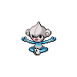
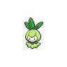
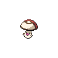

# Pinwheel Forest – Trainer Rosters

---

## Generic Trainers</h3>

| Trainer | P1 | P2 | P3 | P4 | P5 | P6 |
|:-------:|:--:|:--:|:--:|:--:|:--:|:--:|
|  Nurse Shery |  [Happiny](../../pokemon/happiny.md/) Lv. 18 |  [Audino](../../pokemon/audino.md/) Lv. 18 |
|  Preschooler Juliet |  [Pansage](../../pokemon/pansage.md/) Lv. 18 |  [Panpour](../../pokemon/panpour.md/) Lv. 18 |  [Pansear](../../pokemon/pansear.md/) Lv. 18 |
|  Preschooler Homer |  [Roggenrola](../../pokemon/roggenrola.md/) Lv. 18 |  [Geodude](../../pokemon/geodude.md/) Lv. 18 |  [Aron](../../pokemon/aron.md/) Lv. 18 |
|  Youngster Keita |  [Spinarak](../../pokemon/spinarak.md/) Lv. 18 |  [Doduo](../../pokemon/doduo.md/) Lv. 18 |  [Charmander](../../pokemon/charmander.md/) Lv. 18 |
|  Youngster Zachary |  [Burmy](../../pokemon/burmy.md/) Lv. 18 |  [Torchic](../../pokemon/torchic.md/) Lv. 18 |  [Ledyba](../../pokemon/ledyba.md/) Lv. 18 |
|  Battle Girl Lee |  [Timburr](../../pokemon/timburr.md/) Lv. 18 |  [Croagunk](../../pokemon/croagunk.md/) Lv. 18 |  [Tyrogue](../../pokemon/tyrogue.md/) Lv. 18 |  [Throh](../../pokemon/throh.md/) Lv. 18 |
|  Black Belt Kentaro |  [Machop](../../pokemon/machop.md/) Lv. 18 |  [Meditite](../../pokemon/meditite.md/) Lv. 18 |  [Riolu](../../pokemon/riolu.md/) Lv. 18 |  [Sawk](../../pokemon/sawk.md/) Lv. 18 |
|  Twins Mayo & May D |  [Sewaddle](../../pokemon/sewaddle.md/) Lv. 20 |  [Venipede](../../pokemon/venipede.md/) Lv. 20 |  [Cottonee](../../pokemon/cottonee.md/) Lv. 20 |  [Petilil](../../pokemon/petilil.md/) Lv. 20 |
|  Plasma Grunt |  [Sandile](../../pokemon/sandile.md/) Lv. 21 |  [Skorupi](../../pokemon/skorupi.md/) Lv. 21 |  [Foongus](../../pokemon/foongus.md/) Lv. 21 |
|  Plasma Grunt |  [Stunky](../../pokemon/stunky.md/) Lv. 21 |  [Glameow](../../pokemon/glameow.md/) Lv. 21 |  [Mightyena](../../pokemon/mightyena.md/) Lv. 21 |
|  PKMN Ranger Forrest |  [Dunsparce](../../pokemon/dunsparce.md/) Lv. 22 |  [Chimchar](../../pokemon/chimchar.md/) Lv. 22 |  [Heracross](../../pokemon/heracross.md/) Lv. 22 |
|  Youngster Nicholas |  [Shroomish](../../pokemon/shroomish.md/) Lv. 21 |  [Cyndaquil](../../pokemon/cyndaquil.md/) Lv. 21 |  [Treecko](../../pokemon/treecko.md/) Lv. 21 |
|  PKMN Ranger Audra |  [Tangela](../../pokemon/tangela.md/) Lv. 22 |  [Bulbasaur](../../pokemon/bulbasaur.md/) Lv. 22 |  [Scyther](../../pokemon/scyther.md/) Lv. 22 |
|  PKMN Ranger Irene |  [Roselia](../../pokemon/roselia.md/) Lv. 22 |  [Chikorita](../../pokemon/chikorita.md/) Lv. 22 |  [Pinsir](../../pokemon/pinsir.md/) Lv. 22 |
|  Plasma Grunt |  [Murkrow](../../pokemon/murkrow.md/) Lv. 22 |  [Liepard](../../pokemon/liepard.md/) Lv. 22 |
|  PKMN Ranger Miguel |  [Vigoroth](../../pokemon/vigoroth.md/) Lv. 22 |  [Turtwig](../../pokemon/turtwig.md/) Lv. 22 |  [Mothim](../../pokemon/mothim.md/) Lv. 22 |
|  Plasma Grunt |  [Golbat](../../pokemon/golbat.md/) Lv. 23 |  [Scraggy](../../pokemon/scraggy.md/) Lv. 23 |  [Beedrill](../../pokemon/beedrill.md/) Lv. 23 |  [Carnivine](../../pokemon/carnivine.md/) Lv. 23 |
|  School Kid Millie |  [Tranquill](../../pokemon/tranquill.md/) Lv. 22 |  [Furret](../../pokemon/furret.md/) Lv. 22 |  [Ivysaur](../../pokemon/ivysaur.md/) Lv. 22 |
|  Lass Eva |  [Oddish](../../pokemon/oddish.md/) Lv. 22 |  [Bellsprout](../../pokemon/bellsprout.md/) Lv. 22 |  [Pidgeotto](../../pokemon/pidgeotto.md/) Lv. 22 |  [Wartortle](../../pokemon/wartortle.md/) Lv. 22 |
|  School Kid Sammy |  [Linoone](../../pokemon/linoone.md/) Lv. 22 |  [Noctowl](../../pokemon/noctowl.md/) Lv. 22 |  [Charmeleon](../../pokemon/charmeleon.md/) Lv. 22 |  [Sandshrew](../../pokemon/sandshrew.md/) Lv. 22 |

