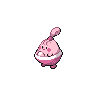
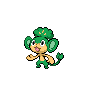
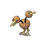
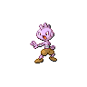
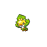
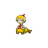

---

## Generic Trainers</h3>

| Trainer | P1 | P2 | P3 | P4 | P5 | P6 |
|:-------:|:--:|:--:|:--:|:--:|:--:|:--:|
|  Nurse Shery |  [Happiny](../../pokemon/happiny.wild_md/) Lv. 18 |  [Audino](../../pokemon/audino.wild_md/) Lv. 18 |
|  Preschooler Juliet |  [Pansage](../../pokemon/pansage.wild_md/) Lv. 18 |  [Panpour](../../pokemon/panpour.wild_md/) Lv. 18 |  [Pansear](../../pokemon/pansear.wild_md/) Lv. 18 |
|  Preschooler Homer |  [Roggenrola](../../pokemon/roggenrola.wild_md/) Lv. 18 |  [Geodude](../../pokemon/geodude.wild_md/) Lv. 18 |  [Aron](../../pokemon/aron.wild_md/) Lv. 18 |
|  Youngster Keita |  [Spinarak](../../pokemon/spinarak.wild_md/) Lv. 18 |  [Doduo](../../pokemon/doduo.wild_md/) Lv. 18 |  [Charmander](../../pokemon/charmander.wild_md/) Lv. 18 |
|  Youngster Zachary |  [Burmy](../../pokemon/burmy.wild_md/) Lv. 18 |  [Torchic](../../pokemon/torchic.wild_md/) Lv. 18 |  [Ledyba](../../pokemon/ledyba.wild_md/) Lv. 18 |
|  Battle Girl Lee |  [Timburr](../../pokemon/timburr.wild_md/) Lv. 18 |  [Croagunk](../../pokemon/croagunk.wild_md/) Lv. 18 |  [Tyrogue](../../pokemon/tyrogue.wild_md/) Lv. 18 |  [Throh](../../pokemon/throh.wild_md/) Lv. 18 |
|  Black Belt Kentaro |  [Machop](../../pokemon/machop.wild_md/) Lv. 18 |  [Meditite](../../pokemon/meditite.wild_md/) Lv. 18 |  [Riolu](../../pokemon/riolu.wild_md/) Lv. 18 |  [Sawk](../../pokemon/sawk.wild_md/) Lv. 18 |
|  Twins Mayo & May D |  [Sewaddle](../../pokemon/sewaddle.wild_md/) Lv. 20 |  [Venipede](../../pokemon/venipede.wild_md/) Lv. 20 |  [Cottonee](../../pokemon/cottonee.wild_md/) Lv. 20 |  [Petilil](../../pokemon/petilil.wild_md/) Lv. 20 |
|  Plasma Grunt |  [Sandile](../../pokemon/sandile.wild_md/) Lv. 21 |  [Skorupi](../../pokemon/skorupi.wild_md/) Lv. 21 |  [Foongus](../../pokemon/foongus.wild_md/) Lv. 21 |
|  Plasma Grunt |  [Stunky](../../pokemon/stunky.wild_md/) Lv. 21 |  [Glameow](../../pokemon/glameow.wild_md/) Lv. 21 |  [Mightyena](../../pokemon/mightyena.wild_md/) Lv. 21 |
|  PKMN Ranger Forrest |  [Dunsparce](../../pokemon/dunsparce.wild_md/) Lv. 22 |  [Chimchar](../../pokemon/chimchar.wild_md/) Lv. 22 |  [Heracross](../../pokemon/heracross.wild_md/) Lv. 22 |
|  Youngster Nicholas |  [Shroomish](../../pokemon/shroomish.wild_md/) Lv. 21 |  [Cyndaquil](../../pokemon/cyndaquil.wild_md/) Lv. 21 |  [Treecko](../../pokemon/treecko.wild_md/) Lv. 21 |
|  PKMN Ranger Audra |  [Tangela](../../pokemon/tangela.wild_md/) Lv. 22 |  [Bulbasaur](../../pokemon/bulbasaur.wild_md/) Lv. 22 |  [Scyther](../../pokemon/scyther.wild_md/) Lv. 22 |
|  PKMN Ranger Irene |  [Roselia](../../pokemon/roselia.wild_md/) Lv. 22 |  [Chikorita](../../pokemon/chikorita.wild_md/) Lv. 22 |  [Pinsir](../../pokemon/pinsir.wild_md/) Lv. 22 |
|  Plasma Grunt |  [Murkrow](../../pokemon/murkrow.wild_md/) Lv. 22 |  [Liepard](../../pokemon/liepard.wild_md/) Lv. 22 |
|  PKMN Ranger Miguel |  [Vigoroth](../../pokemon/vigoroth.wild_md/) Lv. 22 |  [Turtwig](../../pokemon/turtwig.wild_md/) Lv. 22 |  [Mothim](../../pokemon/mothim.wild_md/) Lv. 22 |
|  Plasma Grunt |  [Golbat](../../pokemon/golbat.wild_md/) Lv. 23 |  [Scraggy](../../pokemon/scraggy.wild_md/) Lv. 23 |  [Beedrill](../../pokemon/beedrill.wild_md/) Lv. 23 |  [Carnivine](../../pokemon/carnivine.wild_md/) Lv. 23 |
|  School Kid Millie |  [Tranquill](../../pokemon/tranquill.wild_md/) Lv. 22 |  [Furret](../../pokemon/furret.wild_md/) Lv. 22 |  [Ivysaur](../../pokemon/ivysaur.wild_md/) Lv. 22 |
|  Lass Eva |  [Oddish](../../pokemon/oddish.wild_md/) Lv. 22 |  [Bellsprout](../../pokemon/bellsprout.wild_md/) Lv. 22 |  [Pidgeotto](../../pokemon/pidgeotto.wild_md/) Lv. 22 |  [Wartortle](../../pokemon/wartortle.wild_md/) Lv. 22 |
|  School Kid Sammy |  [Linoone](../../pokemon/linoone.wild_md/) Lv. 22 |  [Noctowl](../../pokemon/noctowl.wild_md/) Lv. 22 |  [Charmeleon](../../pokemon/charmeleon.wild_md/) Lv. 22 |  [Sandshrew](../../pokemon/sandshrew.wild_md/) Lv. 22 |

