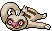
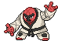
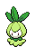
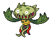

---

## Pinwheel Forest – Outsid

### Grass

| Sprite | Pokémon | Encounter Type | Chance |
| :---: | --- | :---: | --- |
|  | [Tympole](../../pokemon/tympole.md/) | {: style='max-width: 24px;' } | 20% |
|  | [Timburr](../../pokemon/timburr.md/) | {: style='max-width: 24px;' } | 20% |
|  | [Meditite](../../pokemon/meditite.md/) | {: style='max-width: 24px;' } | 10% |
|  | [Spinarak](../../pokemon/spinarak.md/) | {: style='max-width: 24px;' } | 10% |
|  | [Ledyba](../../pokemon/ledyba.md/) | {: style='max-width: 24px;' } | 10% |
|  | [Machop](../../pokemon/machop.md/) | {: style='max-width: 24px;' } | 10% |
|  | [Makuhita](../../pokemon/makuhita.md/) | {: style='max-width: 24px;' } | 10% |
|  | [Croagunk](../../pokemon/croagunk.md/) | {: style='max-width: 24px;' } | 5% |
|  | [Slakoth](../../pokemon/slakoth.md/) | {: style='max-width: 24px;' } | 5%

### Dark Grass

| Sprite | Pokémon | Encounter Type | Chance |
| :---: | --- | :---: | --- |
|  | [Throh](../../pokemon/throh.md/) | {: style='max-width: 24px;' } | 20% |
|  | [Sawk](../../pokemon/sawk.md/) | {: style='max-width: 24px;' } | 20% |
|  | [Dunsparce](../../pokemon/dunsparce.md/) | {: style='max-width: 24px;' } | 10% |
|  | [Doduo](../../pokemon/doduo.md/) | {: style='max-width: 24px;' } | 10% |
|  | [Snubbull](../../pokemon/snubbull.md/) | {: style='max-width: 24px;' } | 10% |
|  | [Aipom](../../pokemon/aipom.md/) | {: style='max-width: 24px;' } | 10% |
|  | [Cubone](../../pokemon/cubone.md/) | {: style='max-width: 24px;' } | 9% |
|  | [Burmy](../../pokemon/burmy.md/) | {: style='max-width: 24px;' } | 9% |
|  | [Heracross](../../pokemon/heracross.md/) | {: style='max-width: 24px;' } | 2%

### Rustling Grass

| Sprite | Pokémon | Encounter Type | Chance |
| :---: | --- | :---: | --- |
|  | [Audino](../../pokemon/audino.md/) | {: style='max-width: 24px;' } | 50% |
|  | [Tepig](../../pokemon/tepig.md/) | {: style='max-width: 24px;' } | 10% |
|  | [Tyrogue](../../pokemon/tyrogue.md/) | {: style='max-width: 24px;' } | 10% |
|  | [Riolu](../../pokemon/riolu.md/) | {: style='max-width: 24px;' } | 10% |
|  | [Charmander](../../pokemon/charmander.md/) | {: style='max-width: 24px;' } | 5% |
|  | [Cyndaquil](../../pokemon/cyndaquil.md/) | {: style='max-width: 24px;' } | 5% |
|  | [Torchic](../../pokemon/torchic.md/) | {: style='max-width: 24px;' } | 5% |
|  | [Chimchar](../../pokemon/chimchar.md/) | {: style='max-width: 24px;' } | 5%

---

## Pinwheel Forest – Insid

### Grass

| Sprite | Pokémon | Encounter Type | Chance |
| :---: | --- | :---: | --- |
|  | [Cottonee](../../pokemon/cottonee.md/) | {: style='max-width: 24px;' } | 20% |
|  | [Petilil](../../pokemon/petilil.md/) | {: style='max-width: 24px;' } | 20% |
|  | [Sewaddle](../../pokemon/sewaddle.md/) | {: style='max-width: 24px;' } | 10% |
|  | [Venipede](../../pokemon/venipede.md/) | {: style='max-width: 24px;' } | 10% |
|  | [Oddish](../../pokemon/oddish.md/) | {: style='max-width: 24px;' } | 10% |
|  | [Bellsprout](../../pokemon/bellsprout.md/) | {: style='max-width: 24px;' } | 10% |
|  | [Shroomish](../../pokemon/shroomish.md/) | {: style='max-width: 24px;' } | 5% |
|  | [Exeggcute](../../pokemon/exeggcute.md/) | {: style='max-width: 24px;' } | 5% |
|  | [Murkrow](../../pokemon/murkrow.md/) | {: style='max-width: 24px;' } | 5% |
|  | [Misdreavus](../../pokemon/misdreavus.md/) | {: style='max-width: 24px;' } | 5%

### Dark Grass

| Sprite | Pokémon | Encounter Type | Chance |
| :---: | --- | :---: | --- |
|  | [Tangela](../../pokemon/tangela.md/) | {: style='max-width: 24px;' } | 20% |
|  | [Roselia](../../pokemon/roselia.md/) | {: style='max-width: 24px;' } | 20% |
|  | [Swadloon](../../pokemon/swadloon.md/) | {: style='max-width: 24px;' } | 10% |
|  | [Whirlipede](../../pokemon/whirlipede.md/) | {: style='max-width: 24px;' } | 10% |
|  | [Gloom](../../pokemon/gloom.md/) | {: style='max-width: 24px;' } | 10% |
|  | [Weepinbell](../../pokemon/weepinbell.md/) | {: style='max-width: 24px;' } | 10% |
|  | [Carnivine](../../pokemon/carnivine.md/) | {: style='max-width: 24px;' } | 5% |
|  | [Scyther](../../pokemon/scyther.md/) | {: style='max-width: 24px;' } | 5% |
|  | [Pinsir](../../pokemon/pinsir.md/) | {: style='max-width: 24px;' } | 5% |
|  | [Vigoroth](../../pokemon/vigoroth.md/) | {: style='max-width: 24px;' } | 5%

### Rustling Grass

| Sprite | Pokémon | Encounter Type | Chance |
| :---: | --- | :---: | --- |
|  | [Audino](../../pokemon/audino.md/) | {: style='max-width: 24px;' } | 40% |
|  | [Snivy](../../pokemon/snivy.md/) | {: style='max-width: 24px;' } | 10% |
|  | [Pansage](../../pokemon/pansage.md/) | {: style='max-width: 24px;' } | 10% |
|  | [Panpour](../../pokemon/panpour.md/) | {: style='max-width: 24px;' } | 10% |
|  | [Pansear](../../pokemon/pansear.md/) | {: style='max-width: 24px;' } | 10% |
|  | [Bulbasaur](../../pokemon/bulbasaur.md/) | {: style='max-width: 24px;' } | 5% |
|  | [Chikorita](../../pokemon/chikorita.md/) | {: style='max-width: 24px;' } | 5% |
|  | [Treecko](../../pokemon/treecko.md/) | {: style='max-width: 24px;' } | 5% |
|  | [Turtwig](../../pokemon/turtwig.md/) | {: style='max-width: 24px;' } | 5%

### Surfing

| Sprite | Pokémon | Encounter Type | Chance |
| :---: | --- | :---: | --- |
|  | [Surskit](../../pokemon/surskit.md/) | {: style='max-width: 24px;' } | 100%

### Rippling Surfing

| Sprite | Pokémon | Encounter Type | Chance |
| :---: | --- | :---: | --- |
|  | [Masquerain](../../pokemon/masquerain.md/) | {: style='max-width: 24px;' } | 100%

### Fishing

| Sprite | Pokémon | Encounter Type | Chance |
| :---: | --- | :---: | --- |
|  | [Psyduck](../../pokemon/psyduck.md/) | {: style='max-width: 24px;' } | 60% |
|  | [Poliwag](../../pokemon/poliwag.md/) | {: style='max-width: 24px;' } | 40%

### Rippling Fishing

| Sprite | Pokémon | Encounter Type | Chance |
| :---: | --- | :---: | --- |
|  | [Poliwhirl](../../pokemon/poliwhirl.md/) | {: style='max-width: 24px;' } | 95% |
|  | [Politoed](../../pokemon/politoed.md/) | {: style='max-width: 24px;' } | 5% |

### Legendary Encounter

| Sprite | Pokémon | Level | Encounter Type | Location | Chance |
| :---: | --- | --- | :---: | --- | --- |
|  | Virizion | Level 56 | Set | Rumination Field | – |
