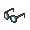
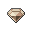
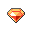
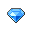
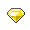
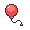
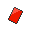

# Pokémon League – Important Trainers

---

## Elite Four Shauntal

**Battle Type:** Double Battle

    | Pokémon | Attributes | Item | Moves |
    |:-------:|------------|:----:|-------|
|  | **Lv. 71** [Drifblim](../../pokemon/drifblim.md/) **Ability:** Flare Boost {: width="48"} {: width="48"} | No Item | 1: Tailwind 2: Shadow Ball 3: Thunderbolt 4: Hurricane |
|  | **Lv. 71** [Golurk](../../pokemon/golurk.md/) **Ability:** Iron Fist {: width="48"} {: width="48"} | No Item | 1: Earthquake 2: Shadow Punch 3: Hammer Arm 4: Rock Polish |
|  | **Lv. 71** [Mismagius](../../pokemon/mismagius.md/) **Ability:** Levitate {: width="48"} | No Item | 1: Shadow Ball 2: Nasty Plot 3: Thunderbolt 4: Will-O-Wisp |
|  | **Lv. 71** [Froslass](../../pokemon/froslass.md/) **Ability:** Levitate {: width="48"} {: width="48"} | No Item | 1: Shadow Ball 2: Blizzard 3: Thunderbolt 4: Will-O-Wisp |
|  | **Lv. 73** [Jellicent](../../pokemon/jellicent.md/) **Ability:** Cursed Body {: width="48"} {: width="48"} | No Item | 1: Shadow Ball 2: Hydro Pump 3: Will-O-Wisp 4: Recover |
|  | **Lv. 73** [Chandelure](../../pokemon/chandelure.md/) **Ability:** Levitate {: width="48"} {: width="48"} | No Item | 1: Shadow Ball 2: Fire Blast 3: Energy Ball 4: Psychic |

---

## Elite Four Grimsley

**Battle Type:** Double Battle

    | Pokémon | Attributes | Item | Moves |
    |:-------:|------------|:----:|-------|
|  | **Lv. 71** [Sharpedo](../../pokemon/sharpedo.md/) **Ability:** Speed Boost {: width="48"} {: width="48"} |  Rocky Helmet | 1: Protect 2: Crunch 3: Aqua Jet 4: Hydro Pump |
|  | **Lv. 71** [Liepard](../../pokemon/liepard.md/) **Ability:** Prankster {: width="48"} |  Liechi Berry | 1: Thunder Wave 2: Sucker Punch 3: Charm 4: Wild Charge |
|  | **Lv. 71** [Honchkrow](../../pokemon/honchkrow.md/) **Ability:** Moxie {: width="48"} {: width="48"} |  Scope Lens | 1: Thunder Wave 2: Brave Bird 3: Sucker Punch 4: Heat Wave |
|  | **Lv. 71** [Absol](../../pokemon/absol.md/) **Ability:** Super Luck {: width="48"} |  Scope Lens | 1: Megahorn 2: Night Slash 3: Psycho Cut 4: Perish Song |
|  | **Lv. 73** [Houndoom](../../pokemon/houndoom.md/) **Ability:** Intimidate {: width="48"} {: width="48"} |  Focus Sash | 1: Dark Pulse 2: Fire Blast 3: Sucker Punch 4: Hidden Power |
|  | **Lv. 73** [Bisharp](../../pokemon/bisharp.md/) **Ability:** Defiant {: width="48"} {: width="48"} |  Black Glasses | 1: Sucker Punch 2: X-Scissor 3: Leaf Blade 4: Stone Edge |

---

## Elite Four Marshal

**Battle Type:** Double Battle

    | Pokémon | Attributes | Item | Moves |
    |:-------:|------------|:----:|-------|
|  | **Lv. 71** [Throh](../../pokemon/throh.md/) **Ability:** Guts {: width="48"} |  Flame Orb | 1: Superpower 2: Facade 3: Fling 4: Rock Slide |
|  | **Lv. 71** [Sawk](../../pokemon/sawk.md/) **Ability:** Sturdy {: width="48"} |  Salac Berry | 1: Close Combat 2: Stone Edge 3: Payback 4: Return |
|  | **Lv. 71** [Breloom](../../pokemon/breloom.md/) **Ability:** Technician {: width="48"} {: width="48"} |  Focus Sash | 1: Spore 2: Bullet Seed 3: Drain Punch 4: Mach Punch |
|  | **Lv. 71** [Poliwrath](../../pokemon/poliwrath.md/) **Ability:** Water Absorb {: width="48"} {: width="48"} |  Wacan Berry | 1: Waterfall 2: Brick Break 3: Icy Wind 4: Vacuum Wave |
|  | **Lv. 73** [Mienshao](../../pokemon/mienshao.md/) **Ability:** Reckless {: width="48"} |  Flying Gem | 1: Acrobatics 2: High Jump Kick 3: U-turn 4: Stone Edge |
|  | **Lv. 73** [Conkeldurr](../../pokemon/conkeldurr.md/) **Ability:** Iron Fist {: width="48"} |  Chesto Berry | 1: Mach Punch 2: Drain Punch 3: Stone Edge 4: Rest |

---

## Elite Four Caitlin

**Battle Type:** Double Battle (First Fight) / Single Battle (Rematch)

    | Pokémon | Attributes | Item | Moves |
    |:-------:|------------|:----:|-------|
|  | **Lv. 71** [Musharna](../../pokemon/musharna.md/) **Ability:** Telepathy {: width="48"} |  Light Clay | 1: Trick Room 2: Psyshock 3: Reflect 4: Light Screen |
|  | **Lv. 71** [Sigilyph](../../pokemon/sigilyph.md/) **Ability:** Magic Guard {: width="48"} {: width="48"} |  Life Orb | 1: Protect 2: Hurricane 3: Psychic 4: Ice Beam |
|  | **Lv. 71** [Beheeyem](../../pokemon/beheeyem.md/) **Ability:** Analytic {: width="48"} |  Wise Glasses | 1: Trick Room 2: Thunderbolt 3: Psychic 4: Energy Ball |
|  | **Lv. 71** [Bronzong](../../pokemon/bronzong.md/) **Ability:** Levitate {: width="48"} {: width="48"} |  Chesto Berry | 1: Trick Room 2: Rest 3: Earthquake 4: Gyro Ball |
|  | **Lv. 73** [Gothitelle](../../pokemon/gothitelle.md/) **Ability:** Magic Bounce {: width="48"} {: width="48"} |  Sitrus Berry | 1: Trick Room 2: Focus Blast 3: Psychic 4: Thunderbolt |
|  | **Lv. 73** [Reuniclus](../../pokemon/reuniclus.md/) **Ability:** Magic Guard {: width="48"} |  Life Orb | 1: Trick Room 2: Thunder 3: Psychic 4: Energy Ball |

---

## PKMN Trainer N – Final

**Battle Type:** Single Battle

=== "Blaze Black"

    | Pokémon | Attributes | Item | Moves |
    |:-------:|------------|:----:|-------|
    |  | **Lv. 73** [Zoroark](../../pokemon/zoroark.md/) **Ability:** Illusion {: width="48"} |  Dark Gem | 1: Night Daze 2: Focus Blast 3: Flamethrower 4: Grass Knot |
    |  | **Lv. 73** [Aerodactyl](../../pokemon/aerodactyl.md/) **Ability:** Rock Head {: width="48"} {: width="48"} |  Rock Gem | 1: Earthquake 2: Thunder Fang 3: Head Smash 4: Dragon Dance |
    |  | **Lv. 73** [Porygon-Z](../../pokemon/porygon-z.md/) **Ability:** Adaptability {: width="48"} |  Normal Gem | 1: Tri Attack 2: Ice Beam 3: Dark Pulse 4: Thunderbolt |
    |  | **Lv. 73** [Magmortar](../../pokemon/magmortar.md/) **Ability:** Flash Fire {: width="48"} |  Fire Gem | 1: Thunderbolt 2: Focus Blast 3: Nasty Plot 4: Magma Storm |
    |  | **Lv. 73** [Slowbro](../../pokemon/slowbro.md/) **Ability:** Regenerator {: width="48"} {: width="48"} |  Water Gem | 1: Surf 2: Psychic 3: Flamethrower 4: Slack Off |
    |  | **Lv. 75** [Zekrom](../../pokemon/zekrom.md/) **Ability:** Teravolt {: width="48"} {: width="48"} |  Life Orb | 1: Dragon Claw 2: Bolt Strike 3: Light Screen 4: Hone Claws |
    

=== "Volt White"

    | Pokémon | Attributes | Item | Moves |
    |:-------:|------------|:----:|-------|
    |  | **Lv. 73** [Zoroark](../../pokemon/zoroark.md/) **Ability:** Illusion {: width="48"} |  Dark Gem | 1: Night Daze 2: Focus Blast 3: Flamethrower 4: Grass Knot |
    |  | **Lv. 73** [Aerodactyl](../../pokemon/aerodactyl.md/) **Ability:** Rock Head {: width="48"} {: width="48"} |  Rock Gem | 1: Earthquake 2: Thunder Fang 3: Head Smash 4: Dragon Dance |
    |  | **Lv. 73** [Porygon-Z](../../pokemon/porygon-z.md/) **Ability:** Adaptability {: width="48"} |  Normal Gem | 1: Tri Attack 2: Ice Beam 3: Dark Pulse 4: Thunderbolt |
    |  | **Lv. 73** [Electivire](../../pokemon/electivire.md/) **Ability:** Vital Spirit {: width="48"} {: width="48"} |  Electric Gem | 1: Earthquake 2: Close Combat 3: Volt Tackle 4: Ice Punch |
    |  | **Lv. 73** [Slowking](../../pokemon/slowking.md/) **Ability:** Regenerator {: width="48"} {: width="48"} |  Water Gem | 1: Surf 2: Psychic 3: Aura Sphere 4: Slack Off |
    |  | **Lv. 75** [Reshiram](../../pokemon/reshiram.md/) **Ability:** Turboblaze {: width="48"} {: width="48"} |  White Herb | 1: Dragon Pulse 2: Blue Flare 3: Reflect 4: Draco Meteor |
    

---

## Team Plasma Ghetsis

**Battle Type:** Single Battle

    | Pokémon | Attributes | Item | Moves |
    |:-------:|------------|:----:|-------|
|  | **Lv. 75** [Drapion](../../pokemon/drapion.md/) **Ability:** Sniper {: width="48"} {: width="48"} |  Scope Lens | 1: Night Slash 2: Cross Poison 3: Storm Throw 4: Toxic Spikes |
|  | **Lv. 75** [Dusknoir](../../pokemon/dusknoir.md/) **Ability:** Cursed Body {: width="48"} |  Sitrus Berry | 1: Payback 2: Will-O-Wisp 3: Pain Split 4: Earthquake |
|  | **Lv. 75** [Eelektross](../../pokemon/eelektross.md/) **Ability:** Levitate {: width="48"} |  Flying Gem | 1: Acrobatics 2: Thunder 3: Flamethrower 4: Rock Slide |
|  | **Lv. 75** [Gyarados](../../pokemon/gyarados.md/) **Ability:** Moxie {: width="48"} {: width="48"} |  Life Orb | 1: Aqua Tail 2: Dragon Dance 3: Thunder Wave 4: Earthquake |
|  | **Lv. 75** [Genesect](../../pokemon/genesect.md/) **Ability:** Download {: width="48"} {: width="48"} |  Focus Sash | 1: Bug Buzz 2: Ice Beam 3: Thunderbolt 4: Rock Polish |
|  | **Lv. 77** [Hydreigon](../../pokemon/hydreigon.md/) **Ability:** Levitate {: width="48"} {: width="48"} |  White Herb | 1: Draco Meteor 2: Fire Blast 3: Focus Blast 4: Dark Pulse |

---

## Elite Four Shauntal – Rematch

**Battle Type:** Single Battle

    | Pokémon | Attributes | Item | Moves |
    |:-------:|------------|:----:|-------|
|  | **Lv. 91** [Cofagrigus](../../pokemon/cofagrigus.md/) **Ability:** Mummy {: width="48"} {: width="48"} | No Item | 1: Will-O-Wisp 2: Shadow Ball 3: Psychic 4: Disable |
|  | **Lv. 91** [Gengar](../../pokemon/gengar.md/) **Ability:** Levitate {: width="48"} {: width="48"} | No Item | 1: Focus Blast 2: Shadow Ball 3: Thunder 4: Sludge Bomb |
|  | **Lv. 91** [Sableye](../../pokemon/sableye.md/) **Ability:** Prankster {: width="48"} {: width="48"} | No Item | 1: Recover 2: Shadow Claw 3: Foul Play 4: Will-O-Wisp |
|  | **Lv. 91** [Golurk](../../pokemon/golurk.md/) **Ability:** No Guard {: width="48"} {: width="48"} | No Item | 1: Dynamic Punch 2: Shadow Punch 3: Earthquake 4: Substitute |
|  | **Lv. 91** [Jellicent](../../pokemon/jellicent.md/) **Ability:** Cursed Body {: width="48"} {: width="48"} | No Item | 1: Hydro Pump 2: Shadow Ball 3: Recover 4: Will-O-Wisp |
|  | **Lv. 93** [Chandelure](../../pokemon/chandelure.md/) **Ability:** Levitate {: width="48"} {: width="48"} | No Item | 1: Fire Blast 2: Shadow Ball 3: Hidden Power 4: Calm Mind |

---

## Elite Four Grimsley – Rematch

**Battle Type:** Single Battle

    | Pokémon | Attributes | Item | Moves |
    |:-------:|------------|:----:|-------|
|  | **Lv. 91** [Honchkrow](../../pokemon/honchkrow.md/) **Ability:** Moxie {: width="48"} {: width="48"} |  Flying Gem | 1: Brave Bird 2: Sucker Punch 3: Superpower 4: Heat Wave |
|  | **Lv. 91** [Sharpedo](../../pokemon/sharpedo.md/) **Ability:** Speed Boost {: width="48"} {: width="48"} |  Focus Sash | 1: Protect 2: Hydro Pump 3: Crunch 4: Aqua Jet |
|  | **Lv. 91** [Weavile](../../pokemon/weavile.md/) **Ability:** Technician {: width="48"} {: width="48"} |  Expert Belt | 1: Rock Smash 2: Ice Shard 3: Night Slash 4: X-Scissor |
|  | **Lv. 91** [Houndoom](../../pokemon/houndoom.md/) **Ability:** Intimidate {: width="48"} {: width="48"} |  Power Herb | 1: Nasty Plot 2: Fire Blast 3: Dark Pulse 4: Solar Beam |
|  | **Lv. 91** [Bisharp](../../pokemon/bisharp.md/) **Ability:** Defiant {: width="48"} {: width="48"} |  Air Balloon | 1: Sucker Punch 2: Swords Dance 3: Thunder Wave 4: Swagger |
|  | **Lv. 93** [Zoroark](../../pokemon/zoroark.md/) **Ability:** Illusion {: width="48"} |  Life Orb | 1: Night Daze 2: Flamethrower 3: Focus Blast 4: Grass Knot |

---

## Elite Four Marshal – Rematch

**Battle Type:** Single Battle

    | Pokémon | Attributes | Item | Moves |
    |:-------:|------------|:----:|-------|
|  | **Lv. 91** [Mienshao](../../pokemon/mienshao.md/) **Ability:** Reckless {: width="48"} | No Item | 1: High Jump Kick 2: Stone Edge 3: Grass Knot 4: Hidden Power |
|  | **Lv. 91** [Breloom](../../pokemon/breloom.md/) **Ability:** Poison Heal {: width="48"} {: width="48"} | No Item | 1: Protect 2: Leech Seed 3: Drain Punch 4: Seed Bomb |
|  | **Lv. 91** [Scrafty](../../pokemon/scrafty.md/) **Ability:** Moxie {: width="48"} {: width="48"} | No Item | 1: Sucker Punch 2: High Jump Kick 3: Light Screen 4: Head Smash |
|  | **Lv. 91** [Lucario](../../pokemon/lucario.md/) **Ability:** Justified {: width="48"} {: width="48"} | No Item | 1: High Jump Kick 2: Dragon Pulse 3: Ice Punch 4: Bullet Punch |
|  | **Lv. 91** [Blaziken](../../pokemon/blaziken.md/) **Ability:** Speed Boost {: width="48"} {: width="48"} | No Item | 1: Protect 2: Blaze Kick 3: High Jump Kick 4: Baton Pass |
|  | **Lv. 93** [Conkeldurr](../../pokemon/conkeldurr.md/) **Ability:** Iron Fist {: width="48"} | No Item | 1: Mach Punch 2: Stone Edge 3: Payback 4: Drain Punch |

---

## Elite Four Caitlin – Rematch

**Battle Type:** Single Battle

    | Pokémon | Attributes | Item | Moves |
    |:-------:|------------|:----:|-------|
|  | **Lv. 91** [Musharna](../../pokemon/musharna.md/) **Ability:** Analytic {: width="48"} |  Chesto Berry | 1: Yawn 2: Psyshock 3: Rest 4: Shadow Ball |
|  | **Lv. 91** [Gardevoir](../../pokemon/gardevoir.md/) **Ability:** Trace {: width="48"} {: width="48"} |  Psychic Gem | 1: Psychic 2: Focus Blast 3: Will-O-Wisp 4: Reflect |
|  | **Lv. 91** [Sigilyph](../../pokemon/sigilyph.md/) **Ability:** Tinted Lens {: width="48"} {: width="48"} |  Life Orb | 1: Psychic 2: Ice Beam 3: Energy Ball 4: Hurricane |
|  | **Lv. 91** [Gothitelle](../../pokemon/gothitelle.md/) **Ability:** Shadow Tag {: width="48"} {: width="48"} |  Dark Gem | 1: Dark Pulse 2: Psychic 3: Charm 4: Thunder Wave |
|  | **Lv. 91** [Reuniclus](../../pokemon/reuniclus.md/) **Ability:** Magic Guard {: width="48"} |  Life Orb | 1: Psychic 2: Focus Blast 3: Thunder 4: Recover |
|  | **Lv. 93** [Metagross](../../pokemon/metagross.md/) **Ability:** Analytic {: width="48"} {: width="48"} |  Expert Belt | 1: Meteor Mash 2: Zen Headbutt 3: Earthquake 4: Ice Punch |

---

## Champion Alder

**Battle Type:** Single Battle

    | Pokémon | Attributes | Item | Moves |
    |:-------:|------------|:----:|-------|
|  | **Lv. 95** [Bouffalant](../../pokemon/bouffalant.md/) **Ability:** Reckless {: width="48"} |  Choice Band | 1: Head Charge 2: Earthquake 3: Payback 4: Return |
|  | **Lv. 95** [Braviary](../../pokemon/braviary.md/) **Ability:** Defiant {: width="48"} {: width="48"} |  Flying Gem | 1: Brave Bird 2: Rock Slide 3: Superpower 4: Extreme Speed |
|  | **Lv. 95** [Espeon](../../pokemon/espeon.md/) **Ability:** Magic Bounce {: width="48"} |  Focus Sash | 1: Morning Sun 2: Psyshock 3: Grass Knot 4: Aura Sphere |
|  | **Lv. 95** [Flygon](../../pokemon/flygon.md/) **Ability:** Levitate {: width="48"} {: width="48"} |  Yache Berry | 1: Draco Meteor 2: Earthquake 3: Dragon Claw 4: Fire Punch |
|  | **Lv. 95** [Vanilluxe](../../pokemon/vanilluxe.md/) **Ability:** Weak Armor {: width="48"} |  Red Card | 1: Frost Breath 2: Weather Ball 3: Ice Shard 4: Energy Ball |
|  | **Lv. 100** [Volcarona](../../pokemon/volcarona.md/) **Ability:** Drought {: width="48"} {: width="48"} |  Life Orb | 1: Fiery Dance 2: Bug Buzz 3: Quiver Dance 4: Thunderbolt |

