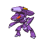
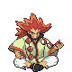
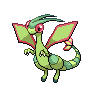

---

## Elite Four Shauntal

| Pokemon | Attributes | Moves |
|:-------:|------------|-------|
|  |**Lv. 71** [Drifblim](../../pokemon/drifblim.md/) **Item:** No Item **Ability:** Flare Boost | 1. Tailwind 2. Shadow Ball 3. Thunderbolt 4. Hurricane |
|  |**Lv. 71** [Golurk](../../pokemon/golurk.md/) **Item:** No Item **Ability:** Iron Fist | 1. Earthquake 2. Shadow Punch 3. Hammer Arm 4. Rock Polish |
|  |**Lv. 71** [Mismagius](../../pokemon/mismagius.md/) **Item:** No Item **Ability:** Levitate | 1. Shadow Ball 2. Nasty Plot 3. Thunderbolt 4. Will-O-Wisp |
|  |**Lv. 71** [Froslass](../../pokemon/froslass.md/) **Item:** No Item **Ability:** Levitate | 1. Shadow Ball 2. Blizzard 3. Thunderbolt 4. Will-O-Wisp |
|  |**Lv. 73** [Jellicent](../../pokemon/jellicent.md/) **Item:** No Item **Ability:** Cursed Body | 1. Shadow Ball 2. Hydro Pump 3. Will-O-Wisp 4. Recover |
|  |**Lv. 73** [Chandelure](../../pokemon/chandelure.md/) **Item:** No Item **Ability:** Levitate | 1. Shadow Ball 2. Fire Blast 3. Energy Ball 4. Psychic |

---

## Elite Four Grimsley

| Pokemon | Attributes | Moves |
|:-------:|------------|-------|
|  |**Lv. 71** [Sharpedo](../../pokemon/sharpedo.md/) **Item:** Rocky Helmet **Ability:** Speed Boost | 1. Protect 2. Crunch 3. Aqua Jet 4. Hydro Pump |
|  |**Lv. 71** [Liepard](../../pokemon/liepard.md/) **Item:** Liechi Berry **Ability:** Prankster | 1. Thunder Wave 2. Sucker Punch 3. Charm 4. Wild Charge |
|  |**Lv. 71** [Honchkrow](../../pokemon/honchkrow.md/) **Item:** Scope Lens **Ability:** Moxie | 1. Thunder Wave 2. Brave Bird 3. Sucker Punch 4. Heat Wave |
|  |**Lv. 71** [Absol](../../pokemon/absol.md/) **Item:** Scope Lens **Ability:** Super Luck | 1. Megahorn 2. Night Slash 3. Psycho Cut 4. Perish Song |
|  |**Lv. 73** [Houndoom](../../pokemon/houndoom.md/) **Item:** Focus Sash **Ability:** Intimidate | 1. Dark Pulse 2. Fire Blast 3. Sucker Punch 4. Hidden Power |
|  |**Lv. 73** [Bisharp](../../pokemon/bisharp.md/) **Item:** Black Glasses **Ability:** Defiant | 1. Sucker Punch 2. X-Scissor 3. Leaf Blade 4. Stone Edge |

---

## Elite Four Marshal

| Pokemon | Attributes | Moves |
|:-------:|------------|-------|
|  |**Lv. 71** [Throh](../../pokemon/throh.md/) **Item:** Flame Orb **Ability:** Guts | 1. Superpower 2. Facade 3. Fling 4. Rock Slide |
|  |**Lv. 71** [Sawk](../../pokemon/sawk.md/) **Item:** Salac Berry **Ability:** Sturdy | 1. Close Combat 2. Stone Edge 3. Payback 4. Return |
|  |**Lv. 71** [Breloom](../../pokemon/breloom.md/) **Item:** Focus Sash **Ability:** Technician | 1. Spore 2. Bullet Seed 3. Drain Punch 4. Mach Punch |
|  |**Lv. 71** [Poliwrath](../../pokemon/poliwrath.md/) **Item:** Wacan Berry **Ability:** Water Absorb | 1. Waterfall 2. Brick Break 3. Icy Wind 4. Vacuum Wave |
|  |**Lv. 73** [Mienshao](../../pokemon/mienshao.md/) **Item:** Flying Gem **Ability:** Reckless | 1. Acrobatics 2. High Jump Kick 3. U-turn 4. Stone Edge |
|  |**Lv. 73** [Conkeldurr](../../pokemon/conkeldurr.md/) **Item:** Chesto Berry **Ability:** Iron Fist | 1. Mach Punch 2. Drain Punch 3. Stone Edge 4. Rest |

---

## Elite Four Caitlin

| Pokemon | Attributes | Moves |
|:-------:|------------|-------|
|  |**Lv. 71** [Musharna](../../pokemon/musharna.md/) **Item:** Light Clay **Ability:** Telepathy | 1. Trick Room 2. Psyshock 3. Reflect 4. Light Screen |
|  |**Lv. 71** [Sigilyph](../../pokemon/sigilyph.md/) **Item:** Life Orb **Ability:** Magic Guard | 1. Protect 2. Hurricane 3. Psychic 4. Ice Beam |
|  |**Lv. 71** [Beheeyem](../../pokemon/beheeyem.md/) **Item:** Wise Glasses **Ability:** Analytic | 1. Trick Room 2. Thunderbolt 3. Psychic 4. Energy Ball |
|  |**Lv. 71** [Bronzong](../../pokemon/bronzong.md/) **Item:** Chesto Berry **Ability:** Levitate | 1. Trick Room 2. Rest 3. Earthquake 4. Gyro Ball |
|  |**Lv. 73** [Gothitelle](../../pokemon/gothitelle.md/) **Item:** Sitrus Berry **Ability:** Magic Bounce | 1. Trick Room 2. Focus Blast 3. Psychic 4. Thunderbolt |
|  |**Lv. 73** [Reuniclus](../../pokemon/reuniclus.md/) **Item:** Life Orb **Ability:** Magic Guard | 1. Trick Room 2. Thunder 3. Psychic 4. Energy Ball |

---

## PKMN Trainer N – Final

=== "Blaze Black"

    | Pokemon | Attributes | Moves |
    |:-------:|------------|-------|
    |  |**Lv. 73** [Zoroark](../../pokemon/zoroark.md/) **Item:** Dark Gem **Ability:** Illusion | 1. Night Daze 2. Focus Blast 3. Flamethrower 4. Grass Knot |
    |  |**Lv. 73** [Aerodactyl](../../pokemon/aerodactyl.md/) **Item:** Rock Gem **Ability:** Rock Head | 1. Earthquake 2. Thunder Fang 3. Head Smash 4. Dragon Dance |
    |  |**Lv. 73** [Porygon-Z](../../pokemon/porygon-z.md/) **Item:** Normal Gem **Ability:** Adaptability | 1. Tri Attack 2. Ice Beam 3. Dark Pulse 4. Thunderbolt |
    |  |**Lv. 73** [Magmortar](../../pokemon/magmortar.md/) **Item:** Fire Gem **Ability:** Flash Fire | 1. Thunderbolt 2. Focus Blast 3. Nasty Plot 4. Magma Storm |
    |  |**Lv. 73** [Slowbro](../../pokemon/slowbro.md/) **Item:** Water Gem **Ability:** Regenerator | 1. Surf 2. Psychic 3. Flamethrower 4. Slack Off |
    |  |**Lv. 75** [Zekrom](../../pokemon/zekrom.md/) **Item:** Life Orb **Ability:** Teravolt | 1. Dragon Claw 2. Bolt Strike 3. Light Screen 4. Hone Claws |
    

=== "Volt White"

    | Pokemon | Attributes | Moves |
    |:-------:|------------|-------|
    |  |**Lv. 73** [Zoroark](../../pokemon/zoroark.md/) **Item:** Dark Gem **Ability:** Illusion | 1. Night Daze 2. Focus Blast 3. Flamethrower 4. Grass Knot |
    |  |**Lv. 73** [Aerodactyl](../../pokemon/aerodactyl.md/) **Item:** Rock Gem **Ability:** Rock Head | 1. Earthquake 2. Thunder Fang 3. Head Smash 4. Dragon Dance |
    |  |**Lv. 73** [Porygon-Z](../../pokemon/porygon-z.md/) **Item:** Normal Gem **Ability:** Adaptability | 1. Tri Attack 2. Ice Beam 3. Dark Pulse 4. Thunderbolt |
    |  |**Lv. 73** [Electivire](../../pokemon/electivire.md/) **Item:** Electric Gem **Ability:** Vital Spirit | 1. Earthquake 2. Close Combat 3. Volt Tackle 4. Ice Punch |
    |  |**Lv. 73** [Slowking](../../pokemon/slowking.md/) **Item:** Water Gem **Ability:** Regenerator | 1. Surf 2. Psychic 3. Aura Sphere 4. Slack Off |
    |  |**Lv. 75** [Reshiram](../../pokemon/reshiram.md/) **Item:** White Herb **Ability:** Turboblaze | 1. Dragon Pulse 2. Blue Flare 3. Reflect 4. Draco Meteor |
    

---

## Team Plasma Ghetsis

| Pokemon | Attributes | Moves |
|:-------:|------------|-------|
|  |**Lv. 75** [Drapion](../../pokemon/drapion.md/) **Item:** Scope Lens **Ability:** Sniper | 1. Night Slash 2. Cross Poison 3. Storm Throw 4. Toxic Spikes |
|  |**Lv. 75** [Dusknoir](../../pokemon/dusknoir.md/) **Item:** Sitrus Berry **Ability:** Cursed Body | 1. Payback 2. Will-O-Wisp 3. Pain Split 4. Earthquake |
|  |**Lv. 75** [Eelektross](../../pokemon/eelektross.md/) **Item:** Flying Gem **Ability:** Levitate | 1. Acrobatics 2. Thunder 3. Flamethrower 4. Rock Slide |
|  |**Lv. 75** [Gyarados](../../pokemon/gyarados.md/) **Item:** Life Orb **Ability:** Moxie | 1. Aqua Tail 2. Dragon Dance 3. Thunder Wave 4. Earthquake |
|  |**Lv. 75** [Genesect](../../pokemon/genesect.md/) **Item:** Focus Sash **Ability:** Download | 1. Bug Buzz 2. Ice Beam 3. Thunderbolt 4. Rock Polish |
|  |**Lv. 77** [Hydreigon](../../pokemon/hydreigon.md/) **Item:** White Herb **Ability:** Levitate | 1. Draco Meteor 2. Fire Blast 3. Focus Blast 4. Dark Pulse |

---

## Elite Four Shauntal – Rematch

| Pokemon | Attributes | Moves |
|:-------:|------------|-------|
|  |**Lv. 91** [Cofagrigus](../../pokemon/cofagrigus.md/) **Item:** No Item **Ability:** Mummy | 1. Will-O-Wisp 2. Shadow Ball 3. Psychic 4. Disable |
|  |**Lv. 91** [Gengar](../../pokemon/gengar.md/) **Item:** No Item **Ability:** Levitate | 1. Focus Blast 2. Shadow Ball 3. Thunder 4. Sludge Bomb |
|  |**Lv. 91** [Sableye](../../pokemon/sableye.md/) **Item:** No Item **Ability:** Prankster | 1. Recover 2. Shadow Claw 3. Foul Play 4. Will-O-Wisp |
|  |**Lv. 91** [Golurk](../../pokemon/golurk.md/) **Item:** No Item **Ability:** No Guard | 1. Dynamic Punch 2. Shadow Punch 3. Earthquake 4. Substitute |
|  |**Lv. 91** [Jellicent](../../pokemon/jellicent.md/) **Item:** No Item **Ability:** Cursed Body | 1. Hydro Pump 2. Shadow Ball 3. Recover 4. Will-O-Wisp |
|  |**Lv. 93** [Chandelure](../../pokemon/chandelure.md/) **Item:** No Item **Ability:** Levitate | 1. Fire Blast 2. Shadow Ball 3. Hidden Power 4. Calm Mind |

---

## Elite Four Grimsley – Rematch

| Pokemon | Attributes | Moves |
|:-------:|------------|-------|
|  |**Lv. 91** [Honchkrow](../../pokemon/honchkrow.md/) **Item:** Flying Gem **Ability:** Moxie | 1. Brave Bird 2. Sucker Punch 3. Superpower 4. Heat Wave |
|  |**Lv. 91** [Sharpedo](../../pokemon/sharpedo.md/) **Item:** Focus Sash **Ability:** Speed Boost | 1. Protect 2. Hydro Pump 3. Crunch 4. Aqua Jet |
|  |**Lv. 91** [Weavile](../../pokemon/weavile.md/) **Item:** Expert Belt **Ability:** Technician | 1. Rock Smash 2. Ice Shard 3. Night Slash 4. X-Scissor |
|  |**Lv. 91** [Houndoom](../../pokemon/houndoom.md/) **Item:** Power Herb **Ability:** Intimidate | 1. Nasty Plot 2. Fire Blast 3. Dark Pulse 4. Solar Beam |
|  |**Lv. 91** [Bisharp](../../pokemon/bisharp.md/) **Item:** Air Balloon **Ability:** Defiant | 1. Sucker Punch 2. Swords Dance 3. Thunder Wave 4. Swagger |
|  |**Lv. 93** [Zoroark](../../pokemon/zoroark.md/) **Item:** Life Orb **Ability:** Illusion | 1. Night Daze 2. Flamethrower 3. Focus Blast 4. Grass Knot |

---

## Elite Four Marshal – Rematch

| Pokemon | Attributes | Moves |
|:-------:|------------|-------|
|  |**Lv. 91** [Mienshao](../../pokemon/mienshao.md/) **Item:** No Item **Ability:** Reckless | 1. High Jump Kick 2. Stone Edge 3. Grass Knot 4. Hidden Power |
|  |**Lv. 91** [Breloom](../../pokemon/breloom.md/) **Item:** No Item **Ability:** Poison Heal | 1. Protect 2. Leech Seed 3. Drain Punch 4. Seed Bomb |
|  |**Lv. 91** [Scrafty](../../pokemon/scrafty.md/) **Item:** No Item **Ability:** Moxie | 1. Sucker Punch 2. High Jump Kick 3. Light Screen 4. Head Smash |
|  |**Lv. 91** [Lucario](../../pokemon/lucario.md/) **Item:** No Item **Ability:** Justified | 1. High Jump Kick 2. Dragon Pulse 3. Ice Punch 4. Bullet Punch |
|  |**Lv. 91** [Blaziken](../../pokemon/blaziken.md/) **Item:** No Item **Ability:** Speed Boost | 1. Protect 2. Blaze Kick 3. High Jump Kick 4. Baton Pass |
|  |**Lv. 93** [Conkeldurr](../../pokemon/conkeldurr.md/) **Item:** No Item **Ability:** Iron Fist | 1. Mach Punch 2. Stone Edge 3. Payback 4. Drain Punch |

---

## Elite Four Caitlin – Rematch

| Pokemon | Attributes | Moves |
|:-------:|------------|-------|
|  |**Lv. 91** [Musharna](../../pokemon/musharna.md/) **Item:** Chesto Berry **Ability:** Analytic | 1. Yawn 2. Psyshock 3. Rest 4. Shadow Ball |
|  |**Lv. 91** [Gardevoir](../../pokemon/gardevoir.md/) **Item:** Psychic Gem **Ability:** Trace | 1. Psychic 2. Focus Blast 3. Will-O-Wisp 4. Reflect |
|  |**Lv. 91** [Sigilyph](../../pokemon/sigilyph.md/) **Item:** Life Orb **Ability:** Tinted Lens | 1. Psychic 2. Ice Beam 3. Energy Ball 4. Hurricane |
|  |**Lv. 91** [Gothitelle](../../pokemon/gothitelle.md/) **Item:** Dark Gem **Ability:** Shadow Tag | 1. Dark Pulse 2. Psychic 3. Charm 4. Thunder Wave |
|  |**Lv. 91** [Reuniclus](../../pokemon/reuniclus.md/) **Item:** Life Orb **Ability:** Magic Guard | 1. Psychic 2. Focus Blast 3. Thunder 4. Recover |
|  |**Lv. 93** [Metagross](../../pokemon/metagross.md/) **Item:** Expert Belt **Ability:** Analytic | 1. Meteor Mash 2. Zen Headbutt 3. Earthquake 4. Ice Punch |

---

## Champion Alder

| Pokemon | Attributes | Moves |
|:-------:|------------|-------|
|  |**Lv. 95** [Bouffalant](../../pokemon/bouffalant.md/) **Item:** Choice Band **Ability:** Reckless | 1. Head Charge 2. Earthquake 3. Payback 4. Return |
|  |**Lv. 95** [Braviary](../../pokemon/braviary.md/) **Item:** Flying Gem **Ability:** Defiant | 1. Brave Bird 2. Rock Slide 3. Superpower 4. Extreme Speed |
|  |**Lv. 95** [Espeon](../../pokemon/espeon.md/) **Item:** Focus Sash **Ability:** Magic Bounce | 1. Morning Sun 2. Psyshock 3. Grass Knot 4. Aura Sphere |
|  |**Lv. 95** [Flygon](../../pokemon/flygon.md/) **Item:** Yache Berry **Ability:** Levitate | 1. Draco Meteor 2. Earthquake 3. Dragon Claw 4. Fire Punch |
|  |**Lv. 95** [Vanilluxe](../../pokemon/vanilluxe.md/) **Item:** Red Card **Ability:** Weak Armor | 1. Frost Breath 2. Weather Ball 3. Ice Shard 4. Energy Ball |
|  |**Lv. 100** [Volcarona](../../pokemon/volcarona.md/) **Item:** Life Orb **Ability:** Drought | 1. Fiery Dance 2. Bug Buzz 3. Quiver Dance 4. Thunderbolt |

