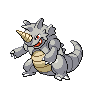
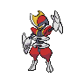

---

## Generic Trainers</h3>

| Trainer | P1 | P2 | P3 | P4 | P5 | P6 |
|:-------:|:--:|:--:|:--:|:--:|:--:|:--:|
|  Psychic Perry |  [Gothorita](../../pokemon/gothorita.wild_md/) Lv. 32 |  [Duosion](../../pokemon/duosion.wild_md/) Lv. 32 |
|  Psychic Dua |  [Litwick](../../pokemon/litwick.wild_md/) Lv. 31 |  [Elgyem](../../pokemon/elgyem.wild_md/) Lv. 31 |  [Sigilyph](../../pokemon/sigilyph.wild_md/) Lv. 31 |
|  Plasma Grunt |  [Linoone](../../pokemon/linoone.wild_md/) Lv. 58 |  [Krookodile](../../pokemon/krookodile.wild_md/) Lv. 58 |  [Scrafty](../../pokemon/scrafty.wild_md/) Lv. 58 |
|  Plasma Grunt |  [Ariados](../../pokemon/ariados.wild_md/) Lv. 58 |  [Crobat](../../pokemon/crobat.wild_md/) Lv. 58 |  [Rhydon](../../pokemon/rhydon.wild_md/) Lv. 58 |
|  Plasma Grunt |  [Weezing](../../pokemon/weezing.wild_md/) Lv. 58 |  [Muk](../../pokemon/muk.wild_md/) Lv. 58 |  [Garbodor](../../pokemon/garbodor.wild_md/) Lv. 58 |
|  Plasma Grunt |  [Krookodile](../../pokemon/krookodile.wild_md/) Lv. 60 |
|  Plasma Grunt |  [Bisharp](../../pokemon/bisharp.wild_md/) Lv. 59 |  [Drapion](../../pokemon/drapion.wild_md/) Lv. 59 |
|  Plasma Grunt |  [Scrafty](../../pokemon/scrafty.wild_md/) Lv. 59 |  [Liepard](../../pokemon/liepard.wild_md/) Lv. 59 |
|  Plasma Grunt |  [Tentacruel](../../pokemon/tentacruel.wild_md/) Lv. 59 |  [Seviper](../../pokemon/seviper.wild_md/) Lv. 59 |

