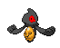
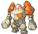

---

## Relic Castle – 1F

### Deep Sand

| Sprite | Pokémon | Encounter Type | Chance |
| :---: | --- | :---: | --- |
|  | [Sandile](../../pokemon/sandile.md/) | {: style='max-width: 24px;' } | 20% |
|  | [Sandshrew](../../pokemon/sandshrew.md/) | {: style='max-width: 24px;' } | 20% |
|  | [Rhyhorn](../../pokemon/rhyhorn.md/) | {: style='max-width: 24px;' } | 10% |
|  | [Numel](../../pokemon/numel.md/) | {: style='max-width: 24px;' } | 10% |
|  | [Golett](../../pokemon/golett.md/) | {: style='max-width: 24px;' } | 10% |
|  | [Bronzor](../../pokemon/bronzor.md/) | {: style='max-width: 24px;' } | 10% |
|  | [Onix](../../pokemon/onix.md/) | {: style='max-width: 24px;' } | 10% |
|  | [Trapinch](../../pokemon/trapinch.md/) | {: style='max-width: 24px;' } | 10%

---

## Relic Castle – B1F

### Deep Sand

| Sprite | Pokémon | Encounter Type | Chance |
| :---: | --- | :---: | --- |
|  | [Yamask](../../pokemon/yamask.md/) | {: style='max-width: 24px;' } | 20% |
|  | [Gastly](../../pokemon/gastly.md/) | {: style='max-width: 24px;' } | 20% |
|  | [Shuppet](../../pokemon/shuppet.md/) | {: style='max-width: 24px;' } | 10% |
|  | [Duskull](../../pokemon/duskull.md/) | {: style='max-width: 24px;' } | 10% |
|  | [Bronzor](../../pokemon/bronzor.md/) | {: style='max-width: 24px;' } | 10% |
|  | [Elgyem](../../pokemon/elgyem.md/) | {: style='max-width: 24px;' } | 10% |
|  | [Litwick](../../pokemon/litwick.md/) | {: style='max-width: 24px;' } | 10% |
|  | [Beldum](../../pokemon/beldum.md/) | {: style='max-width: 24px;' } | 4% |
|  | [Larvitar](../../pokemon/larvitar.md/) | {: style='max-width: 24px;' } | 4% |
|  | [Larvesta](../../pokemon/larvesta.md/) | {: style='max-width: 24px;' } | 2%

---

## Relic Castle – B2F / B3F / B4F / B5F

### Deep Sand

| Sprite | Pokémon | Encounter Type | Chance |
| :---: | --- | :---: | --- |
|  | [Krokorok](../../pokemon/krokorok.md/) | {: style='max-width: 24px;' } | 20% |
|  | [Cofagrigus](../../pokemon/cofagrigus.md/) | {: style='max-width: 24px;' } | 20% |
|  | [Vibrava](../../pokemon/vibrava.md/) | {: style='max-width: 24px;' } | 10% |
|  | [Hippowdon](../../pokemon/hippowdon.md/) | {: style='max-width: 24px;' } | 10% |
|  | [Sandslash](../../pokemon/sandslash.md/) | {: style='max-width: 24px;' } | 10% |
|  | [Claydol](../../pokemon/claydol.md/) | {: style='max-width: 24px;' } | 10% |
|  | [Sigilyph](../../pokemon/sigilyph.md/) | {: style='max-width: 24px;' } | 5% |
|  | [Crustle](../../pokemon/crustle.md/) | {: style='max-width: 24px;' } | 5% |
|  | [Darmanitan](../../pokemon/darmanitan-standard.md/) | {: style='max-width: 24px;' } | 5% |
|  | [Camerupt](../../pokemon/camerupt.md/) | {: style='max-width: 24px;' } | 5%

---

## Relic Castle – B6F / Maz

### Deep Sand

| Sprite | Pokémon | Encounter Type | Chance |
| :---: | --- | :---: | --- |
|  | [Krokorok](../../pokemon/krokorok.md/) | {: style='max-width: 24px;' } | 20% |
|  | [Cofagrigus](../../pokemon/cofagrigus.md/) | {: style='max-width: 24px;' } | 20% |
|  | [Vibrava](../../pokemon/vibrava.md/) | {: style='max-width: 24px;' } | 10% |
|  | [Hippowdon](../../pokemon/hippowdon.md/) | {: style='max-width: 24px;' } | 10% |
|  | [Sandslash](../../pokemon/sandslash.md/) | {: style='max-width: 24px;' } | 10% |
|  | [Claydol](../../pokemon/claydol.md/) | {: style='max-width: 24px;' } | 10% |
|  | [Sigilyph](../../pokemon/sigilyph.md/) | {: style='max-width: 24px;' } | 5% |
|  | [Crustle](../../pokemon/crustle.md/) | {: style='max-width: 24px;' } | 5% |
|  | [Darmanitan](../../pokemon/darmanitan-standard.md/) | {: style='max-width: 24px;' } | 5% |
|  | [Camerupt](../../pokemon/camerupt.md/) | {: style='max-width: 24px;' } | 5%

---

## Relic Castle – Pot Rooms

### Deep Sand

| Sprite | Pokémon | Encounter Type | Chance |
| :---: | --- | :---: | --- |
|  | [Unown](../../pokemon/unown.md/) | {: style='max-width: 24px;' } | 100% |

### Legendary Encounter

| Sprite | Pokémon | Level | Encounter Type | Location | Chance |
| :---: | --- | --- | :---: | --- | --- |
|  | Regirock | Level 50 | {: style='max-width: 24px;' } | Relic Castle, B5F | 1% |

### Legendary Encounter

| Sprite | Pokémon | Level | Encounter Type | Location | Chance |
| :---: | --- | --- | :---: | --- | --- |
|  | Registeel | Level 50 | {: style='max-width: 24px;' } | Relic Castle, B5F | 1% |

### Legendary Encounter

| Sprite | Pokémon | Level | Encounter Type | Location | Chance |
| :---: | --- | --- | :---: | --- | --- |
|  | Regigigas | Level 70 | {: style='max-width: 24px;' } | Relic Castle, Volcarona Room | 1% |

### Special Encounter

| Sprite | Pokémon | Level | Encounter Type | Location | Chance |
| :---: | --- | --- | :---: | --- | --- |
|  | Volcarona | Level 75 | Set | Relic Castle, Volcarona Room | – |
