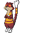
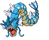

### Grass, Normal

| Sprite | Pokémon | Encounter Type | Chance |
| :---: | --- | :---: | --- |
|  | [Lillipup](../pokemon/lillipup.md/) | {: style='max-width: 24px;' } | 20% |
|  | [Pidgey](../pokemon/pidgey.md/) | {: style='max-width: 24px;' } | 20% |
|  | [Bidoof](../pokemon/bidoof.md/) | {: style='max-width: 24px;' } | 10% |
|  | [Sentret](../pokemon/sentret.md/) | {: style='max-width: 24px;' } | 10% |
|  | [Rattata](../pokemon/rattata.md/) | {: style='max-width: 24px;' } | 10% |
|  | [Zigzagoon](../pokemon/zigzagoon.md/) | {: style='max-width: 24px;' } | 10% |
|  | [Starly](../pokemon/starly.md/) | {: style='max-width: 24px;' } | 10% |
|  | [Hoothoot](../pokemon/hoothoot.md/) | {: style='max-width: 24px;' } | 10%

### Grass, Doubles

| Sprite | Pokémon | Encounter Type | Chance |
| :---: | --- | :---: | --- |
|  | [Herdier](../pokemon/herdier.md/) | {: style='max-width: 24px;' } | 20% |
|  | [Watchog](../pokemon/watchog.md/) | {: style='max-width: 24px;' } | 20% |
|  | [Bibarel](../pokemon/bibarel.md/) | {: style='max-width: 24px;' } | 10% |
|  | [Furret](../pokemon/furret.md/) | {: style='max-width: 24px;' } | 10% |
|  | [Raticate](../pokemon/raticate.md/) | {: style='max-width: 24px;' } | 10% |
|  | [Linoone](../pokemon/linoone.md/) | {: style='max-width: 24px;' } | 10% |
|  | [Mightyena](../pokemon/mightyena.md/) | {: style='max-width: 24px;' } | 5% |
|  | [Pidgeotto](../pokemon/pidgeotto.md/) | {: style='max-width: 24px;' } | 5% |
|  | [Staravia](../pokemon/staravia.md/) | {: style='max-width: 24px;' } | 5% |
|  | [Noctowl](../pokemon/noctowl.md/) | {: style='max-width: 24px;' } | 5%

### Grass, Special

| Sprite | Pokémon | Encounter Type | Chance |
| :---: | --- | :---: | --- |
|  | [Audino](../pokemon/audino.md/) | {: style='max-width: 24px;' } | 80% |
|  | [Happiny](../pokemon/happiny.md/) | {: style='max-width: 24px;' } | 10% |
|  | [Azurill](../pokemon/azurill.md/) | {: style='max-width: 24px;' } | 10%

### Surf, Normal

| Sprite | Pokémon | Encounter Type | Chance |
| :---: | --- | :---: | --- |
|  | [Basculin](../pokemon/basculin.md/) | {: style='max-width: 24px;' } | 60% |
|  | [Marill](../pokemon/marill.md/) | {: style='max-width: 24px;' } | 30% |
|  | [Feebas](../pokemon/feebas.md/) | {: style='max-width: 24px;' } | 10%

### Surf, Special

| Sprite | Pokémon | Encounter Type | Chance |
| :---: | --- | :---: | --- |
|  | [Basculin](../pokemon/basculin.md/) | {: style='max-width: 24px;' } | 60% |
|  | [Azumarill](../pokemon/azumarill.md/) | {: style='max-width: 24px;' } | 30% |
|  | [Feebas](../pokemon/feebas.md/) | {: style='max-width: 24px;' } | 10%

### Fish, Normal

| Sprite | Pokémon | Encounter Type | Chance |
| :---: | --- | :---: | --- |
|  | [Goldeen](../pokemon/goldeen.md/) | {: style='max-width: 24px;' } | 60% |
|  | [Magikarp](../pokemon/magikarp.md/) | {: style='max-width: 24px;' } | 30% |
|  | [Feebas](../pokemon/feebas.md/) | {: style='max-width: 24px;' } | 10%

### Fish, Special

| Sprite | Pokémon | Encounter Type | Chance |
| :---: | --- | :---: | --- |
|  | [Basculin](../pokemon/basculin.md/) | {: style='max-width: 24px;' } | 60% |
|  | [Dratini](../pokemon/dratini.md/) | {: style='max-width: 24px;' } | 30% |
|  | [Gyarados](../pokemon/gyarados.md/) | {: style='max-width: 24px;' } | 5% |
|  | [Milotic](../pokemon/milotic.md/) | {: style='max-width: 24px;' } | 5% |
