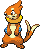
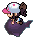

### Grass

| Sprite | Pokémon | Encounter Type | Chance |
| :---: | --- | :---: | --- |
|  | [Golduck](../pokemon/golduck.md/) | {: style='max-width: 24px;' } | 20% |
|  | [Bisharp](../pokemon/bisharp.md/) | {: style='max-width: 24px;' } | 20% |
|  | [Mandibuzz](../pokemon/mandibuzz.md/) | {: style='max-width: 24px;' } | 10% |
|  | [Braviary](../pokemon/braviary.md/) | {: style='max-width: 24px;' } | 10% |
|  | [Gligar](../pokemon/gligar.md/) | {: style='max-width: 24px;' } | 10%),

### Dark Grass

| Sprite | Pokémon | Encounter Type | Chance |
| :---: | --- | :---: | --- |
|  | [Loudred](../pokemon/loudred.md/) | {: style='max-width: 24px;' } | 20% |
|  | [Staravia](../pokemon/staravia.md/) | {: style='max-width: 24px;' } | 20% |
|  | [Vigoroth](../pokemon/vigoroth.md/) | {: style='max-width: 24px;' } | 10% |
|  | [Electabuzz](../pokemon/electabuzz.md/) | {: style='max-width: 24px;' } | 10% |
|  | [Magmar](../pokemon/magmar.md/) | {: style='max-width: 24px;' } | 10% |
|  | [Flygon](../pokemon/flygon.md/) | {: style='max-width: 24px;' } | 10% |
|  | [Rhydon](../pokemon/rhydon.md/) | {: style='max-width: 24px;' } | 10% |
|  | [Boldore](../pokemon/boldore.md/) | {: style='max-width: 24px;' } | 10%

### Rustling Grass

| Sprite | Pokémon | Encounter Type | Chance |
| :---: | --- | :---: | --- |
|  | [Audino](../pokemon/audino.md/) | {: style='max-width: 24px;' } | 70% |
|  | [Emolga](../pokemon/emolga.md/) | {: style='max-width: 24px;' } | 10% |
|  | [Electivire](../pokemon/electivire.md/) | {: style='max-width: 24px;' } | 5% |
|  | [Magmortar](../pokemon/magmortar.md/) | {: style='max-width: 24px;' } | 5% |
|  | [Gliscor](../pokemon/gliscor.md/) | {: style='max-width: 24px;' } | 5% |
|  | [Staraptor](../pokemon/staraptor.md/) | {: style='max-width: 24px;' } | 5%

### Surfing

| Sprite | Pokémon | Encounter Type | Chance |
| :---: | --- | :---: | --- |
|  | [Buizel](../pokemon/buizel.md/) | {: style='max-width: 24px;' } | 60% |
|  | [Floatzel](../pokemon/floatzel.md/) | {: style='max-width: 24px;' } | 40%

### Rippling Surfing

| Sprite | Pokémon | Encounter Type | Chance |
| :---: | --- | :---: | --- |
|  | [Dratini](../pokemon/dratini.md/) | {: style='max-width: 24px;' } | 60% |
|  | [Dragonair](../pokemon/dragonair.md/) | {: style='max-width: 24px;' } | 35% |
|  | [Dragonite](../pokemon/dragonite.md/) | {: style='max-width: 24px;' } | 5%

### Fishing

| Sprite | Pokémon | Encounter Type | Chance |
| :---: | --- | :---: | --- |
|  | [Goldeen](../pokemon/goldeen.md/) | {: style='max-width: 24px;' } | 70% |
|  | [Basculin](../pokemon/basculin-red-striped.md/) | {: style='max-width: 24px;' } | 30%

### Rippling Fishing

| Sprite | Pokémon | Encounter Type | Chance |
| :---: | --- | :---: | --- |
|  | [Goldeen](../pokemon/goldeen.md/) | {: style='max-width: 24px;' } | 60% |
|  | [Basculin](../pokemon/basculin-red-striped.md/) | {: style='max-width: 24px;' } | 30% |
|  | [Seaking](../pokemon/seaking.md/) | {: style='max-width: 24px;' } | 10% |
