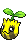
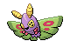

### Grass, Normal

| Sprite | Pokémon | Encounter Type | Chance |
| :---: | --- | :---: | --- |
|  | [Cherrim](../pokemon/cherrim.md/) | {: style='max-width: 24px;' } | 20% |
|  | [Combee](../pokemon/combee.md/) | {: style='max-width: 24px;' } | 20% |
|  | [Sunkern](../pokemon/sunkern.md/) | {: style='max-width: 24px;' } | 10% |
|  | [Pinsir](../pokemon/pinsir.md/) | {: style='max-width: 24px;' } | 10% |
|  | [Heracross](../pokemon/heracross.md/) | {: style='max-width: 24px;' } | 10%),

### Grass, Doubles

| Sprite | Pokémon | Encounter Type | Chance |
| :---: | --- | :---: | --- |
|  | [Tranquill](../pokemon/tranquill.md/) | {: style='max-width: 24px;' } | 40% |
|  | [Butterfree](../pokemon/butterfree.md/) | {: style='max-width: 24px;' } | 10% |
|  | [Beedrill](../pokemon/beedrill.md/) | {: style='max-width: 24px;' } | 10% |
|  | [Beautifly](../pokemon/beautifly.md/) | {: style='max-width: 24px;' } | 10% |
|  | [Dustox](../pokemon/dustox.md/) | {: style='max-width: 24px;' } | 10% |
|  | [Swadloon](../pokemon/swadloon.md/) | {: style='max-width: 24px;' } | 10% |
|  | [Whirlipede](../pokemon/whirlipede.md/) | {: style='max-width: 24px;' } | 10%

### Grass, Special

| Sprite | Pokémon | Encounter Type | Chance |
| :---: | --- | :---: | --- |
|  | [Emolga](../pokemon/emolga.md/) | {: style='max-width: 24px;' } | 95% |
|  | [Sunflora](../pokemon/sunflora.md/) | {: style='max-width: 24px;' } | 5% |
|  | [Vespiquen](../pokemon/vespiquen.md/) | {: style='max-width: 24px;' } | 5% |
