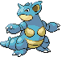

### Grass, Normal

| Sprite | Pokémon | Encounter Type | Chance |
| :---: | --- | :---: | --- |
|  | [Absol](../pokemon/absol.md/) | {: style='max-width: 24px;' } | 20% |
|  | [Drifblim](../pokemon/drifblim.md/) | {: style='max-width: 24px;' } | 20% |
|  | [Swellow](../pokemon/swellow.md/) | {: style='max-width: 24px;' } | 10% |
|  | [Lunatone](../pokemon/lunatone.md/) | {: style='max-width: 24px;' } | 10% |
|  | [Solrock](../pokemon/solrock.md/) | {: style='max-width: 24px;' } | 10% |
|  | [Wormadam](../pokemon/wormadam.md/) | {: style='max-width: 24px;' } | 10% |
|  | [Mothim](../pokemon/mothim.md/) | {: style='max-width: 24px;' } | 10% |
|  | [Pelipper](../pokemon/pelipper.md/) | {: style='max-width: 24px;' } | 10%

### Grass, Doubles

| Sprite | Pokémon | Encounter Type | Chance |
| :---: | --- | :---: | --- |
|  | [Golbat](../pokemon/golbat.md/) | {: style='max-width: 24px;' } | 20% |
|  | [Tangela](../pokemon/tangela.md/) | {: style='max-width: 24px;' } | 20% |
|  | [Nidorino](../pokemon/nidorino.md/) | {: style='max-width: 24px;' } | 10% |
|  | [Nidorina](../pokemon/nidorina.md/) | {: style='max-width: 24px;' } | 10% |
|  | [Yanma](../pokemon/yanma.md/) | {: style='max-width: 24px;' } | 10% |
|  | [Gloom](../pokemon/gloom.md/) | {: style='max-width: 24px;' } | 10% |
|  | [Weepinbell](../pokemon/weepinbell.md/) | {: style='max-width: 24px;' } | 10% |
|  | [Skiploom](../pokemon/skiploom.md/) | {: style='max-width: 24px;' } | 10%

### Grass, Special

| Sprite | Pokémon | Encounter Type | Chance |
| :---: | --- | :---: | --- |
|  | [Audino](../pokemon/audino.md/) | {: style='max-width: 24px;' } | 80% |
|  | [Tangrowth](../pokemon/tangrowth.md/) | {: style='max-width: 24px;' } | 5% |
|  | [Crobat](../pokemon/crobat.md/) | {: style='max-width: 24px;' } | 5% |
|  | [Nidoking](../pokemon/nidoking.md/) | {: style='max-width: 24px;' } | 5% |
|  | [Nidoqueen](../pokemon/nidoqueen.md/) | {: style='max-width: 24px;' } | 5%

### Surf, Normal

| Sprite | Pokémon | Encounter Type | Chance |
| :---: | --- | :---: | --- |
|  | [Pelipper](../pokemon/pelipper.md/) | {: style='max-width: 24px;' } | 60% |
|  | [Corsola](../pokemon/corsola.md/) | {: style='max-width: 24px;' } | 40%

### Surf, Special

| Sprite | Pokémon | Encounter Type | Chance |
| :---: | --- | :---: | --- |
|  | [Tentacruel](../pokemon/tentacruel.md/) | {: style='max-width: 24px;' } | 60% |
|  | [Starmie](../pokemon/starmie.md/) | {: style='max-width: 24px;' } | 30% |
|  | [Kingdra](../pokemon/kingdra.md/) | {: style='max-width: 24px;' } | 10%

### Fish, Normal

| Sprite | Pokémon | Encounter Type | Chance |
| :---: | --- | :---: | --- |
|  | [Shellder](../pokemon/shellder.md/) | {: style='max-width: 24px;' } | 65% |
|  | [Krabby](../pokemon/krabby.md/) | {: style='max-width: 24px;' } | 30% |
|  | [Luvdisc](../pokemon/luvdisc.md/) | {: style='max-width: 24px;' } | 5%

### Fish, Special

| Sprite | Pokémon | Encounter Type | Chance |
| :---: | --- | :---: | --- |
|  | [Shellder](../pokemon/shellder.md/) | {: style='max-width: 24px;' } | 60% |
|  | [Luvdisc](../pokemon/luvdisc.md/) | {: style='max-width: 24px;' } | 30% |
|  | [Kingler](../pokemon/kingler.md/) | {: style='max-width: 24px;' } | 5% |
|  | [Cloyster](../pokemon/cloyster.md/) | {: style='max-width: 24px;' } | 5% |

### Legendary Encounter

| Sprite | Pokémon | Level | Encounter Type | Location | Chance |
| :---: | --- | --- | :---: | --- | --- |
|  | Lugia | Level 70 | {: style='max-width: 24px;' } | Route 13 | 1% |
