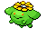

### Grass

| Sprite | Pokémon | Encounter Type | Chance |
| :---: | --- | :---: | --- |
|  | [Gothorita](../pokemon/gothorita.md/) | {: style='max-width: 24px;' } | 20% |
|  | [Duosion](../pokemon/duosion.md/) | {: style='max-width: 24px;' } | 20% |
|  | [Kirlia](../pokemon/kirlia.md/) | {: style='max-width: 24px;' } | 10% |
|  | [Lombre](../pokemon/lombre.md/) | {: style='max-width: 24px;' } | 10% |
|  | [Shuckle](../pokemon/shuckle.md/) | {: style='max-width: 24px;' } | 10% |
|  | [Luxio](../pokemon/luxio.md/) | {: style='max-width: 24px;' } | 10% |
|  | [Carnivine](../pokemon/carnivine.md/) | {: style='max-width: 24px;' } | 10% |
|  | [Skiploom](../pokemon/skiploom.md/) | {: style='max-width: 24px;' } | 10%

### Dark Grass

| Sprite | Pokémon | Encounter Type | Chance |
| :---: | --- | :---: | --- |
|  | [Altaria](../pokemon/altaria.md/) | {: style='max-width: 24px;' } | 20% |
|  | [Mienshao](../pokemon/mienshao.md/) | {: style='max-width: 24px;' } | 20% |
|  | [Beheeyem](../pokemon/beheeyem.md/) | {: style='max-width: 24px;' } | 10% |
|  | [Grumpig](../pokemon/grumpig.md/) | {: style='max-width: 24px;' } | 10% |
|  | [Drifblim](../pokemon/drifblim.md/) | {: style='max-width: 24px;' } | 10% |
|  | [Breloom](../pokemon/breloom.md/) | {: style='max-width: 24px;' } | 10% |
|  | [Tropius](../pokemon/tropius.md/) | {: style='max-width: 24px;' } | 10% |
|  | [Galvantula](../pokemon/galvantula.md/) | {: style='max-width: 24px;' } | 10%

### Rustling Grass

| Sprite | Pokémon | Encounter Type | Chance |
| :---: | --- | :---: | --- |
|  | [Chansey](../pokemon/chansey.md/) | {: style='max-width: 24px;' } | 75% |
|  | [Blissey](../pokemon/blissey.md/) | {: style='max-width: 24px;' } | 25%

### Surfing

| Sprite | Pokémon | Encounter Type | Chance |
| :---: | --- | :---: | --- |
|  | [Seaking](../pokemon/seaking.md/) | {: style='max-width: 24px;' } | 60% |
|  | [Lumineon](../pokemon/lumineon.md/) | {: style='max-width: 24px;' } | 40%

### Rippling Surfing

| Sprite | Pokémon | Encounter Type | Chance |
| :---: | --- | :---: | --- |
|  | [Politoed](../pokemon/politoed.md/) | {: style='max-width: 24px;' } | 60% |
|  | [Milotic](../pokemon/milotic.md/) | {: style='max-width: 24px;' } | 40%

### Fishing

| Sprite | Pokémon | Encounter Type | Chance |
| :---: | --- | :---: | --- |
|  | [Goldeen](../pokemon/goldeen.md/) | {: style='max-width: 24px;' } | 70% |
|  | [Basculin](../pokemon/basculin-red-striped.md/) | {: style='max-width: 24px;' } | 30%

### Rippling Fishing

| Sprite | Pokémon | Encounter Type | Chance |
| :---: | --- | :---: | --- |
|  | [Goldeen](../pokemon/goldeen.md/) | {: style='max-width: 24px;' } | 60% |
|  | [Basculin](../pokemon/basculin-red-striped.md/) | {: style='max-width: 24px;' } | 30% |
|  | [Seaking](../pokemon/seaking.md/) | {: style='max-width: 24px;' } | 10% |
