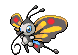

### Grass

| Sprite | Pokémon | Encounter Type | Chance |
| :---: | --- | :---: | --- |
|  | [Purrloin](../pokemon/purrloin.md/) | {: style='max-width: 24px;' } | 20% |
|  | [Patrat](../pokemon/patrat.md/) | {: style='max-width: 24px;' } | 20% |
|  | [Kricketot](../pokemon/kricketot.md/) | {: style='max-width: 24px;' } | 10% |
|  | [Caterpie](../pokemon/caterpie.md/) | {: style='max-width: 24px;' } | 10% |
|  | [Wurmple](../pokemon/wurmple.md/) | {: style='max-width: 24px;' } | 10% |
|  | [Weedle](../pokemon/weedle.md/) | {: style='max-width: 24px;' } | 10% |
|  | [Poochyena](../pokemon/poochyena.md/) | {: style='max-width: 24px;' } | 5% |
|  | [Meowth](../pokemon/meowth.md/) | {: style='max-width: 24px;' } | 5% |
|  | [Spearow](../pokemon/spearow.md/) | {: style='max-width: 24px;' } | 5% |
|  | [Mankey](../pokemon/mankey.md/) | {: style='max-width: 24px;' } | 5%

### Rustling Grass

| Sprite | Pokémon | Encounter Type | Chance |
| :---: | --- | :---: | --- |
|  | [Audino](../pokemon/audino.md/) | {: style='max-width: 24px;' } | 60% |
|  | [Skitty](../pokemon/skitty.md/) | {: style='max-width: 24px;' } | 10% |
|  | [Nincada](../pokemon/nincada.md/) | {: style='max-width: 24px;' } | 10% |
|  | [Butterfree](../pokemon/butterfree.md/) | {: style='max-width: 24px;' } | 5% |
|  | [Beedrill](../pokemon/beedrill.md/) | {: style='max-width: 24px;' } | 5% |
|  | [Beautifly](../pokemon/beautifly.md/) | {: style='max-width: 24px;' } | 5% |
|  | [Dustox](../pokemon/dustox.md/) | {: style='max-width: 24px;' } | 5% |
