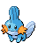

### Grass, Normal

| Sprite | Pokémon | Encounter Type | Chance |
| :---: | --- | :---: | --- |
|  | [Mareep](../pokemon/mareep.md/) | {: style='max-width: 24px;' } | 20% |
|  | [Taillow](../pokemon/taillow.md/) | {: style='max-width: 24px;' } | 20% |
|  | [Shellos](../pokemon/shellos.md/) | {: style='max-width: 24px;' } | 10% |
|  | [Sunkern](../pokemon/sunkern.md/) | {: style='max-width: 24px;' } | 10% |
|  | [Lotad](../pokemon/lotad.md/) | {: style='max-width: 24px;' } | 10% |
|  | [Seedot](../pokemon/seedot.md/) | {: style='max-width: 24px;' } | 10% |
|  | [Shinx](../pokemon/shinx.md/) | {: style='max-width: 24px;' } | 10% |
|  | [Abra](../pokemon/abra.md/) | {: style='max-width: 24px;' } | 5% |
|  | [Phanpy](../pokemon/phanpy.md/) | {: style='max-width: 24px;' } | 5%

### Grass, Doubles

| Sprite | Pokémon | Encounter Type | Chance |
| :---: | --- | :---: | --- |
|  | [Blitzle](../pokemon/blitzle.md/) | {: style='max-width: 24px;' } | 20% |
|  | [Pidove](../pokemon/pidove.md/) | {: style='max-width: 24px;' } | 20% |
|  | [Growlithe](../pokemon/growlithe.md/) | {: style='max-width: 24px;' } | 10% |
|  | [Vulpix](../pokemon/vulpix.md/) | {: style='max-width: 24px;' } | 10% |
|  | [Hoppip](../pokemon/hoppip.md/) | {: style='max-width: 24px;' } | 10% |
|  | [Budew](../pokemon/budew.md/) | {: style='max-width: 24px;' } | 10% |
|  | [Marill](../pokemon/marill.md/) | {: style='max-width: 24px;' } | 5% |
|  | [Houndour](../pokemon/houndour.md/) | {: style='max-width: 24px;' } | 5% |
|  | [Volbeat](../pokemon/volbeat.md/) | {: style='max-width: 24px;' } | 4% |
|  | [Illumise](../pokemon/illumise.md/) | {: style='max-width: 24px;' } | 4% |
|  | [Lombre](../pokemon/lombre.md/) | {: style='max-width: 24px;' } | 1% |
|  | [Nuzleaf](../pokemon/nuzleaf.md/) | {: style='max-width: 24px;' } | 1%

### Grass, Special

| Sprite | Pokémon | Encounter Type | Chance |
| :---: | --- | :---: | --- |
|  | [Audino](../pokemon/audino.md/) | {: style='max-width: 24px;' } | 70% |
|  | [Oshawott](../pokemon/oshawott.md/) | {: style='max-width: 24px;' } | 10% |
|  | [Squirtle](../pokemon/squirtle.md/) | {: style='max-width: 24px;' } | 5% |
|  | [Totodile](../pokemon/totodile.md/) | {: style='max-width: 24px;' } | 5% |
|  | [Mudkip](../pokemon/mudkip.md/) | {: style='max-width: 24px;' } | 5% |
|  | [Piplup](../pokemon/piplup.md/) | {: style='max-width: 24px;' } | 5%

### Surf, Normal

| Sprite | Pokémon | Encounter Type | Chance |
| :---: | --- | :---: | --- |
|  | [Slowpoke](../pokemon/slowpoke.md/) | {: style='max-width: 24px;' } | 60% |
|  | [Psyduck](../pokemon/psyduck.md/) | {: style='max-width: 24px;' } | 30% |
|  | [Marill](../pokemon/marill.md/) | {: style='max-width: 24px;' } | 10%

### Surf, Special

| Sprite | Pokémon | Encounter Type | Chance |
| :---: | --- | :---: | --- |
|  | [Golduck](../pokemon/golduck.md/) | {: style='max-width: 24px;' } | 60% |
|  | [Azumarill](../pokemon/azumarill.md/) | {: style='max-width: 24px;' } | 30% |
|  | [Slowbro](../pokemon/slowbro.md/) | {: style='max-width: 24px;' } | 5% |
|  | [Slowking](../pokemon/slowking.md/) | {: style='max-width: 24px;' } | 5%

### Fish, Normal

| Sprite | Pokémon | Encounter Type | Chance |
| :---: | --- | :---: | --- |
|  | [Poliwag](../pokemon/poliwag.md/) | {: style='max-width: 24px;' } | 60% |
|  | [Slowpoke](../pokemon/slowpoke.md/) | {: style='max-width: 24px;' } | 30% |
|  | [Chinchou](../pokemon/chinchou.md/) | {: style='max-width: 24px;' } | 5% |
|  | [Remoraid](../pokemon/remoraid.md/) | {: style='max-width: 24px;' } | 5%

### Fish, Special

| Sprite | Pokémon | Encounter Type | Chance |
| :---: | --- | :---: | --- |
|  | [Chinchou](../pokemon/chinchou.md/) | {: style='max-width: 24px;' } | 60% |
|  | [Qwilfish](../pokemon/qwilfish.md/) | {: style='max-width: 24px;' } | 30% |
|  | [Remoraid](../pokemon/remoraid.md/) | {: style='max-width: 24px;' } | 10% |
