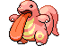
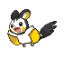

### Grass, Normal

| Sprite | Pokémon | Encounter Type | Chance |
| :---: | --- | :---: | --- |
|  | [Solosis](../pokemon/solosis.md/) | {: style='max-width: 24px;' } | 20% |
|  | [Gothita](../pokemon/gothita.md/) | {: style='max-width: 24px;' } | 20% |
|  | [Koffing](../pokemon/koffing.md/) | {: style='max-width: 24px;' } | 10% |
|  | [Trubbish](../pokemon/trubbish.md/) | {: style='max-width: 24px;' } | 10% |
|  | [Gulpin](../pokemon/gulpin.md/) | {: style='max-width: 24px;' } | 10% |
|  | [Grimer](../pokemon/grimer.md/) | {: style='max-width: 24px;' } | 10% |
|  | [Ditto](../pokemon/ditto.md/) | {: style='max-width: 24px;' } | 5% |
|  | [Mime Jr.](../pokemon/mime-jr.md/) | {: style='max-width: 24px;' } | 5% |
|  | [Bonsly](../pokemon/bonsly.md/) | {: style='max-width: 24px;' } | 5% |
|  | [Pachirisu](../pokemon/pachirisu.md/) | {: style='max-width: 24px;' } | 5%

### Grass, Doubles

| Sprite | Pokémon | Encounter Type | Chance |
| :---: | --- | :---: | --- |
|  | [Nidorina](../pokemon/nidorina.md/) | {: style='max-width: 24px;' } | 20% |
|  | [Nidorino](../pokemon/nidorino.md/) | {: style='max-width: 24px;' } | 20% |
|  | [Rufflet](../pokemon/rufflet.md/) | {: style='max-width: 24px;' } | 10% |
|  | [Lickitung](../pokemon/lickitung.md/) | {: style='max-width: 24px;' } | 10% |
|  | [Smeargle](../pokemon/smeargle.md/) | {: style='max-width: 24px;' } | 10% |
|  | [Minccino](../pokemon/minccino.md/) | {: style='max-width: 24px;' } | 10% |
|  | [Miltank](../pokemon/miltank.md/) | {: style='max-width: 24px;' } | 5% |
|  | [Tauros](../pokemon/tauros.md/) | {: style='max-width: 24px;' } | 5% |
|  | [Bagon](../pokemon/bagon.md/) | {: style='max-width: 24px;' } | 5% |
|  | [Munchlax](../pokemon/munchlax.md/) | {: style='max-width: 24px;' } | 5%

### Grass, Special

| Sprite | Pokémon | Encounter Type | Chance |
| :---: | --- | :---: | --- |
|  | [Audino](../pokemon/audino.md/) | {: style='max-width: 24px;' } | 40% |
|  | [Emolga](../pokemon/emolga.md/) | {: style='max-width: 24px;' } | 20% |
|  | [Cinccino](../pokemon/cinccino.md/) | {: style='max-width: 24px;' } | 10% |
|  | [Nidoqueen](../pokemon/nidoqueen.md/) | {: style='max-width: 24px;' } | 10% |
|  | [Nidoking](../pokemon/nidoking.md/) | {: style='max-width: 24px;' } | 10% |
|  | [Braviary](../pokemon/braviary.md/) | {: style='max-width: 24px;' } | 10% |
