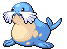

---

## Route 6 – Spring / Summer / A

### Grass, Normal

| Sprite | Pokémon | Encounter Type | Chance |
| :---: | --- | :---: | --- |
|  | [Cherubi](../pokemon/cherubi.md/) | {: style='max-width: 24px;' } | 20% |
|  | [Deerling](../pokemon/deerling.md/) | {: style='max-width: 24px;' } | 20% |
|  | [Stantler](../pokemon/stantler.md/) | {: style='max-width: 24px;' } | 10% |
|  | [Foongus](../pokemon/foongus.md/) | {: style='max-width: 24px;' } | 10% |
|  | [Pidgeotto](../pokemon/pidgeotto.md/) | {: style='max-width: 24px;' } | 10% |
|  | [Natu](../pokemon/natu.md/) | {: style='max-width: 24px;' } | 10% |
|  | [Mime Jr.](../pokemon/mime-jr.md/) | {: style='max-width: 24px;' } | 5% |
|  | [Bonsly](../pokemon/bonsly.md/) | {: style='max-width: 24px;' } | 5% |
|  | [Plusle](../pokemon/plusle.md/) | {: style='max-width: 24px;' } | 5% |
|  | [Minun](../pokemon/minun.md/) | {: style='max-width: 24px;' } | 5%

### Grass, Doubles

| Sprite | Pokémon | Encounter Type | Chance |
| :---: | --- | :---: | --- |
|  | [Cherrim](../pokemon/cherrim.md/) | {: style='max-width: 24px;' } | 20% |
|  | [Sawsbuck](../pokemon/sawsbuck.md/) | {: style='max-width: 24px;' } | 20% |
|  | [Stantler](../pokemon/stantler.md/) | {: style='max-width: 24px;' } | 10% |
|  | [Foongus](../pokemon/foongus.md/) | {: style='max-width: 24px;' } | 10% |
|  | [Pidgeotto](../pokemon/pidgeotto.md/) | {: style='max-width: 24px;' } | 10% |
|  | [Xatu](../pokemon/xatu.md/) | {: style='max-width: 24px;' } | 10% |
|  | [Mr. Mime](../pokemon/mr-mime.md/) | {: style='max-width: 24px;' } | 5% |
|  | [Sudowoodo](../pokemon/sudowoodo.md/) | {: style='max-width: 24px;' } | 5% |
|  | [Plusle](../pokemon/plusle.md/) | {: style='max-width: 24px;' } | 5% |
|  | [Minun](../pokemon/minun.md/) | {: style='max-width: 24px;' } | 5%

### Grass, Special

| Sprite | Pokémon | Encounter Type | Chance |
| :---: | --- | :---: | --- |
|  | [Chansey](../pokemon/chansey.md/) | {: style='max-width: 24px;' } | 80% |
|  | [Emolga](../pokemon/emolga.md/) | {: style='max-width: 24px;' } | 10% |
|  | [Leavanny](../pokemon/leavanny.md/) | {: style='max-width: 24px;' } | 5% |
|  | [Unfezant](../pokemon/unfezant.md/) | {: style='max-width: 24px;' } | 5%

### Surf, Normal

| Sprite | Pokémon | Encounter Type | Chance |
| :---: | --- | :---: | --- |
|  | [Finneon](../pokemon/finneon.md/) | {: style='max-width: 24px;' } | 60% |
|  | [Goldeen](../pokemon/goldeen.md/) | {: style='max-width: 24px;' } | 30% |
|  | [Chinchou](../pokemon/chinchou.md/) | {: style='max-width: 24px;' } | 10%

### Surf, Special

| Sprite | Pokémon | Encounter Type | Chance |
| :---: | --- | :---: | --- |
|  | [Lumineon](../pokemon/lumineon.md/) | {: style='max-width: 24px;' } | 60% |
|  | [Lanturn](../pokemon/lanturn.md/) | {: style='max-width: 24px;' } | 30% |
|  | [Seaking](../pokemon/seaking.md/) | {: style='max-width: 24px;' } | 10%

### Fish, Normal

| Sprite | Pokémon | Encounter Type | Chance |
| :---: | --- | :---: | --- |
|  | [Finneon](../pokemon/finneon.md/) | {: style='max-width: 24px;' } | 60% |
|  | [Chinchou](../pokemon/chinchou.md/) | {: style='max-width: 24px;' } | 40%

### Fish, Special

| Sprite | Pokémon | Encounter Type | Chance |
| :---: | --- | :---: | --- |
|  | [Lumineon](../pokemon/lumineon.md/) | {: style='max-width: 24px;' } | 60% |
|  | [Lanturn](../pokemon/lanturn.md/) | {: style='max-width: 24px;' } | 40%

---

## Route 6 – W

### Grass, Normal

| Sprite | Pokémon | Encounter Type | Chance |
| :---: | --- | :---: | --- |
|  | [Snover](../pokemon/snover.md/) | {: style='max-width: 24px;' } | 20% |
|  | [Deerling](../pokemon/deerling.md/) | {: style='max-width: 24px;' } | 20% |
|  | [Stantler](../pokemon/stantler.md/) | {: style='max-width: 24px;' } | 10% |
|  | [Foongus](../pokemon/foongus.md/) | {: style='max-width: 24px;' } | 10% |
|  | [Pidgeotto](../pokemon/pidgeotto.md/) | {: style='max-width: 24px;' } | 10% |
|  | [Natu](../pokemon/natu.md/) | {: style='max-width: 24px;' } | 10% |
|  | [Mime Jr.](../pokemon/mime-jr.md/) | {: style='max-width: 24px;' } | 5% |
|  | [Bonsly](../pokemon/bonsly.md/) | {: style='max-width: 24px;' } | 5% |
|  | [Plusle](../pokemon/plusle.md/) | {: style='max-width: 24px;' } | 5% |
|  | [Minun](../pokemon/minun.md/) | {: style='max-width: 24px;' } | 5%

### Grass, Doubles

| Sprite | Pokémon | Encounter Type | Chance |
| :---: | --- | :---: | --- |
|  | [Snover](../pokemon/snover.md/) | {: style='max-width: 24px;' } | 20% |
|  | [Sawsbuck](../pokemon/sawsbuck.md/) | {: style='max-width: 24px;' } | 20% |
|  | [Stantler](../pokemon/stantler.md/) | {: style='max-width: 24px;' } | 10% |
|  | [Foongus](../pokemon/foongus.md/) | {: style='max-width: 24px;' } | 10% |
|  | [Pidgeotto](../pokemon/pidgeotto.md/) | {: style='max-width: 24px;' } | 10% |
|  | [Xatu](../pokemon/xatu.md/) | {: style='max-width: 24px;' } | 10% |
|  | [Mr. Mime](../pokemon/mr-mime.md/) | {: style='max-width: 24px;' } | 5% |
|  | [Sudowoodo](../pokemon/sudowoodo.md/) | {: style='max-width: 24px;' } | 5% |
|  | [Plusle](../pokemon/plusle.md/) | {: style='max-width: 24px;' } | 5% |
|  | [Minun](../pokemon/minun.md/) | {: style='max-width: 24px;' } | 5%

### Grass, Special

| Sprite | Pokémon | Encounter Type | Chance |
| :---: | --- | :---: | --- |
|  | [Chansey](../pokemon/chansey.md/) | {: style='max-width: 24px;' } | 80% |
|  | [Emolga](../pokemon/emolga.md/) | {: style='max-width: 24px;' } | 10% |
|  | [Leavanny](../pokemon/leavanny.md/) | {: style='max-width: 24px;' } | 5% |
|  | [Unfezant](../pokemon/unfezant.md/) | {: style='max-width: 24px;' } | 5%

### Surf, Normal

| Sprite | Pokémon | Encounter Type | Chance |
| :---: | --- | :---: | --- |
|  | [Seel](../pokemon/seel.md/) | {: style='max-width: 24px;' } | 60% |
|  | [Spheal](../pokemon/spheal.md/) | {: style='max-width: 24px;' } | 30% |
|  | [Chinchou](../pokemon/chinchou.md/) | {: style='max-width: 24px;' } | 10%

### Surf, Special

| Sprite | Pokémon | Encounter Type | Chance |
| :---: | --- | :---: | --- |
|  | [Dewgong](../pokemon/dewgong.md/) | {: style='max-width: 24px;' } | 60% |
|  | [Sealeo](../pokemon/sealeo.md/) | {: style='max-width: 24px;' } | 30% |
|  | [Lanturn](../pokemon/lanturn.md/) | {: style='max-width: 24px;' } | 10%

### Fish, Normal

| Sprite | Pokémon | Encounter Type | Chance |
| :---: | --- | :---: | --- |
|  | [Seel](../pokemon/seel.md/) | {: style='max-width: 24px;' } | 60% |
|  | [Spheal](../pokemon/spheal.md/) | {: style='max-width: 24px;' } | 30% |
|  | [Chinchou](../pokemon/chinchou.md/) | {: style='max-width: 24px;' } | 10%

### Fish, Special

| Sprite | Pokémon | Encounter Type | Chance |
| :---: | --- | :---: | --- |
|  | [Dewgong](../pokemon/dewgong.md/) | {: style='max-width: 24px;' } | 60% |
|  | [Sealeo](../pokemon/sealeo.md/) | {: style='max-width: 24px;' } | 30% |
|  | [Lanturn](../pokemon/lanturn.md/) | {: style='max-width: 24px;' } | 10% |
