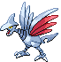

### Grass, Normal

| Sprite | Pokémon | Encounter Type | Chance |
| :---: | --- | :---: | --- |
|  | [Ponyta](../pokemon/ponyta.md/) | {: style='max-width: 24px;' } | 20% |
|  | [Aipom](../pokemon/aipom.md/) | {: style='max-width: 24px;' } | 20% |
|  | [Magby](../pokemon/magby.md/) | {: style='max-width: 24px;' } | 10% |
|  | [Nincada](../pokemon/nincada.md/) | {: style='max-width: 24px;' } | 10% |
|  | [Doduo](../pokemon/doduo.md/) | {: style='max-width: 24px;' } | 10% |
|  | [Cubone](../pokemon/cubone.md/) | {: style='max-width: 24px;' } | 10% |
|  | [Skarmory](../pokemon/skarmory.md/) | {: style='max-width: 24px;' } | 5% |
|  | [Pachirisu](../pokemon/pachirisu.md/) | {: style='max-width: 24px;' } | 5% |
|  | [Torkoal](../pokemon/torkoal.md/) | {: style='max-width: 24px;' } | 5% |
|  | [Gligar](../pokemon/gligar.md/) | {: style='max-width: 24px;' } | 5%

### Grass, Doubles

| Sprite | Pokémon | Encounter Type | Chance |
| :---: | --- | :---: | --- |
|  | [Rapidash](../pokemon/rapidash.md/) | {: style='max-width: 24px;' } | 20% |
|  | [Ambipom](../pokemon/ambipom.md/) | {: style='max-width: 24px;' } | 20% |
|  | [Magmar](../pokemon/magmar.md/) | {: style='max-width: 24px;' } | 10% |
|  | [Ninjask](../pokemon/ninjask.md/) | {: style='max-width: 24px;' } | 10% |
|  | [Dodrio](../pokemon/dodrio.md/) | {: style='max-width: 24px;' } | 10% |
|  | [Marowak](../pokemon/marowak.md/) | {: style='max-width: 24px;' } | 10% |
|  | [Heatmor](../pokemon/heatmor.md/) | {: style='max-width: 24px;' } | 5% |
|  | [Bouffalant](../pokemon/bouffalant.md/) | {: style='max-width: 24px;' } | 5% |
|  | [Miltank](../pokemon/miltank.md/) | {: style='max-width: 24px;' } | 5% |
|  | [Tauros](../pokemon/tauros.md/) | {: style='max-width: 24px;' } | 5%

### Grass, Shaking

| Sprite | Pokémon | Encounter Type | Chance |
| :---: | --- | :---: | --- |
|  | [Audino](../pokemon/audino.md/) | {: style='max-width: 24px;' } | 60% |
|  | [Emolga](../pokemon/emolga.md/) | {: style='max-width: 24px;' } | 30% |
|  | [Gliscor](../pokemon/gliscor.md/) | {: style='max-width: 24px;' } | 10% |
