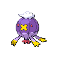

---

## Generic Trainers</h3>

| Trainer | P1 | P2 | P3 | P4 | P5 | P6 |
|:-------:|:--:|:--:|:--:|:--:|:--:|:--:|
|  PKMN Ranger Brenda |  [Vaporeon](../../pokemon/vaporeon.md/) Lv. 52 |  [Absol](../../pokemon/absol.md/) Lv. 52 |
|  PKMN Ranger Claude |  [Drifblim](../../pokemon/drifblim.md/) Lv. 52 |  [Lickilicky](../../pokemon/lickilicky.md/) Lv. 52 |
|  Fisherman Sean |  [Seadra](../../pokemon/seadra.md/) Lv. 50 |  [Seaking](../../pokemon/seaking.md/) Lv. 50 |  [Kingler](../../pokemon/kingler.md/) Lv. 50 |

