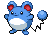

### Grass

| Sprite | Pokémon | Encounter Type | Chance |
| :---: | --- | :---: | --- |
|  | [Lillipup](../../pokemon/lillipup.md/) | {: style='max-width: 24px;' } | 20% |
|  | [Pidgey](../../pokemon/pidgey.md/) | {: style='max-width: 24px;' } | 20% |
|  | [Bidoof](../../pokemon/bidoof.md/) | {: style='max-width: 24px;' } | 10% |
|  | [Sentret](../../pokemon/sentret.md/) | {: style='max-width: 24px;' } | 10% |
|  | [Rattata](../../pokemon/rattata.md/) | {: style='max-width: 24px;' } | 10% |
|  | [Zigzagoon](../../pokemon/zigzagoon.md/) | {: style='max-width: 24px;' } | 10% |
|  | [Starly](../../pokemon/starly.md/) | {: style='max-width: 24px;' } | 10% |
|  | [Hoothoot](../../pokemon/hoothoot.md/) | {: style='max-width: 24px;' } | 10%

### Dark Grass

| Sprite | Pokémon | Encounter Type | Chance |
| :---: | --- | :---: | --- |
|  | [Herdier](../../pokemon/herdier.md/) | {: style='max-width: 24px;' } | 20% |
|  | [Watchog](../../pokemon/watchog.md/) | {: style='max-width: 24px;' } | 20% |
|  | [Bibarel](../../pokemon/bibarel.md/) | {: style='max-width: 24px;' } | 10% |
|  | [Furret](../../pokemon/furret.md/) | {: style='max-width: 24px;' } | 10% |
|  | [Raticate](../../pokemon/raticate.md/) | {: style='max-width: 24px;' } | 10% |
|  | [Linoone](../../pokemon/linoone.md/) | {: style='max-width: 24px;' } | 10% |
|  | [Mightyena](../../pokemon/mightyena.md/) | {: style='max-width: 24px;' } | 5% |
|  | [Pidgeotto](../../pokemon/pidgeotto.md/) | {: style='max-width: 24px;' } | 5% |
|  | [Staravia](../../pokemon/staravia.md/) | {: style='max-width: 24px;' } | 5% |
|  | [Noctowl](../../pokemon/noctowl.md/) | {: style='max-width: 24px;' } | 5%

### Rustling Grass

| Sprite | Pokémon | Encounter Type | Chance |
| :---: | --- | :---: | --- |
|  | [Audino](../../pokemon/audino.md/) | {: style='max-width: 24px;' } | 80% |
|  | [Happiny](../../pokemon/happiny.md/) | {: style='max-width: 24px;' } | 10% |
|  | [Azurill](../../pokemon/azurill.md/) | {: style='max-width: 24px;' } | 10%

### Surfing

| Sprite | Pokémon | Encounter Type | Chance |
| :---: | --- | :---: | --- |
|  | [Basculin](../../pokemon/basculin-red-striped.md/) | {: style='max-width: 24px;' } | 60% |
|  | [Marill](../../pokemon/marill.md/) | {: style='max-width: 24px;' } | 30% |
|  | [Feebas](../../pokemon/feebas.md/) | {: style='max-width: 24px;' } | 10%

### Rippling Surfing

| Sprite | Pokémon | Encounter Type | Chance |
| :---: | --- | :---: | --- |
|  | [Basculin](../../pokemon/basculin-red-striped.md/) | {: style='max-width: 24px;' } | 60% |
|  | [Azumarill](../../pokemon/azumarill.md/) | {: style='max-width: 24px;' } | 30% |
|  | [Feebas](../../pokemon/feebas.md/) | {: style='max-width: 24px;' } | 10%

### Fishing

| Sprite | Pokémon | Encounter Type | Chance |
| :---: | --- | :---: | --- |
|  | [Goldeen](../../pokemon/goldeen.md/) | {: style='max-width: 24px;' } | 60% |
|  | [Magikarp](../../pokemon/magikarp.md/) | {: style='max-width: 24px;' } | 30% |
|  | [Feebas](../../pokemon/feebas.md/) | {: style='max-width: 24px;' } | 10%

### Rippling Fishing

| Sprite | Pokémon | Encounter Type | Chance |
| :---: | --- | :---: | --- |
|  | [Basculin](../../pokemon/basculin-red-striped.md/) | {: style='max-width: 24px;' } | 60% |
|  | [Dratini](../../pokemon/dratini.md/) | {: style='max-width: 24px;' } | 30% |
|  | [Gyarados](../../pokemon/gyarados.md/) | {: style='max-width: 24px;' } | 5% |
|  | [Milotic](../../pokemon/milotic.md/) | {: style='max-width: 24px;' } | 5% |
