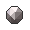
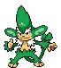

# Route 10 – Important Trainers

---

## Rival Cheren – 7

**Battle Type:** Single Battle

=== "Tepig"

    | Pokémon | Attributes | Item | Moves |
    |:-------:|------------|:----:|-------|
    |  | **Lv. 66** [Staraptor](../../pokemon/staraptor.md/) **Ability:** Reckless {: width="48"} {: width="48"} |  Sharp Beak | 1: Brave Bird 2: Close Combat 3: Double-Edge 4: U-turn |
    |  | **Lv. 66** [Gigalith](../../pokemon/gigalith.md/) **Ability:** Sturdy {: width="48"} |  Hard Stone | 1: Stone Edge 2: Stealth Rock 3: Earthquake 4: Explosion |
    |  | **Lv. 66** [Alakazam](../../pokemon/alakazam.md/) **Ability:** Magic Guard {: width="48"} |  Twisted Spoon | 1: Psychic 2: Shadow Ball 3: Energy Ball 4: Aura Sphere |
    |  | **Lv. 66** [Whimsicott](../../pokemon/whimsicott.md/) **Ability:** Intimidate {: width="48"} {: width="48"} |  Lum Berry | 1: Flamethrower 2: Dark Pulse 3: Nasty Plot 4: Will-O-Wisp |
    |  | **Lv. 66** [Simisear](../../pokemon/simisear.md/) **Ability:** Torrent {: width="48"} |  Flying Gem | 1: Work Up 2: Acrobatics 3: Focus Blast 4: Water Spout |
    |  | **Lv. 68** [Samurott](../../pokemon/samurott.md/) **Ability:** Contrary {: width="48"} {: width="48"} |  Sitrus Berry | 1: Leaf Blade 2: Leech Seed 3: Glare 4: Draco Meteor |
    

=== "Snivy"

    | Pokémon | Attributes | Item | Moves |
    |:-------:|------------|:----:|-------|
    |  | **Lv. 66** [Staraptor](../../pokemon/staraptor.md/) **Ability:** Reckless {: width="48"} {: width="48"} |  Sharp Beak | 1: Brave Bird 2: Close Combat 3: Double-Edge 4: U-turn |
    |  | **Lv. 66** [Gigalith](../../pokemon/gigalith.md/) **Ability:** Sturdy {: width="48"} |  Hard Stone | 1: Stone Edge 2: Stealth Rock 3: Earthquake 4: Explosion |
    |  | **Lv. 66** [Alakazam](../../pokemon/alakazam.md/) **Ability:** Magic Guard {: width="48"} |  Twisted Spoon | 1: Psychic 2: Shadow Ball 3: Energy Ball 4: Aura Sphere |
    |  | **Lv. 66** [Gyarados](../../pokemon/gyarados.md/) **Ability:** Prankster {: width="48"} {: width="48"} |  Lum Berry | 1: Leech Seed 2: Hurricane 3: Substitute 4: Cotton Guard |
    |  | **Lv. 66** [Simisage](../../pokemon/simisage.md/) **Ability:** Blaze {: width="48"} |  Flying Gem | 1: Work Up 2: Acrobatics 3: Focus Blast 4: Fire Blast |
    |  | **Lv. 68** [Emboar](../../pokemon/emboar.md/) **Ability:** ? {: width="48"} {: width="48"} |  Sitrus Berry | 1: Hydro Pump 2: Swords Dance 3: Megahorn 4: Secret Sword |
    

=== "Oshawott"

    | Pokémon | Attributes | Item | Moves |
    |:-------:|------------|:----:|-------|
    |  | **Lv. 66** [Staraptor](../../pokemon/staraptor.md/) **Ability:** Reckless {: width="48"} {: width="48"} |  Sharp Beak | 1: Brave Bird 2: Close Combat 3: Double-Edge 4: U-turn |
    |  | **Lv. 66** [Gigalith](../../pokemon/gigalith.md/) **Ability:** Sturdy {: width="48"} |  Hard Stone | 1: Stone Edge 2: Stealth Rock 3: Earthquake 4: Explosion |
    |  | **Lv. 66** [Alakazam](../../pokemon/alakazam.md/) **Ability:** Magic Guard {: width="48"} |  Twisted Spoon | 1: Psychic 2: Shadow Ball 3: Energy Ball 4: Aura Sphere |
    |  | **Lv. 66** [Houndoom](../../pokemon/houndoom.md/) **Ability:** Moxie {: width="48"} {: width="48"} |  Lum Berry | 1: Aqua Tail 2: Bounce 3: Dragon Dance 4: Earthquake |
    |  | **Lv. 66** [Simipour](../../pokemon/simipour.md/) **Ability:** Overgrow {: width="48"} |  Flying Gem | 1: Work Up 2: Acrobatics 3: Focus Blast 4: Power Whip |
    |  | **Lv. 68** [Serperior](../../pokemon/serperior.md/) **Ability:** ? {: width="48"} {: width="48"} |  Sitrus Berry | 1: Flare Blitz 2: Bulk Up 3: Wild Charge 4: Earthquake |
    

