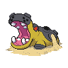

---

## Important Trainers

1. [Rival Cheren – 7](important_trainer_rosters.wild_md#rival-cheren-7)

---

## Generic Trainers</h3>

| Trainer | P1 | P2 | P3 | P4 | P5 | P6 |
|:-------:|:--:|:--:|:--:|:--:|:--:|:--:|
|  Battle Girl Amy |  [Machamp](../../pokemon/machamp.wild_md/) Lv. 60 |  [Lucario](../../pokemon/lucario.wild_md/) Lv. 60 |  [Conkeldurr](../../pokemon/conkeldurr.wild_md/) Lv. 60 |  [Infernape](../../pokemon/infernape.wild_md/) Lv. 60 |
|  Ace Trainer Johan |  [Tangrowth](../../pokemon/tangrowth.wild_md/) Lv. 63 |  [Ampharos](../../pokemon/ampharos.wild_md/) Lv. 63 |  [Magmortar](../../pokemon/magmortar.wild_md/) Lv. 63 |  [Scizor](../../pokemon/scizor.wild_md/) Lv. 63 |
|  Veteran Karla |  [Reuniclus](../../pokemon/reuniclus.wild_md/) Lv. 63 |  [Rhyperior](../../pokemon/rhyperior.wild_md/) Lv. 63 |  [Escavalier](../../pokemon/escavalier.wild_md/) Lv. 63 |  [Beartic](../../pokemon/beartic.wild_md/) Lv. 63 |  [Ninetales](../../pokemon/ninetales.wild_md/) Lv. 63 |
|  Black Belt Corey |  [Throh](../../pokemon/throh.wild_md/) Lv. 60 |  [Sawk](../../pokemon/sawk.wild_md/) Lv. 60 |
|  Hiker Bret |  [Gigalith](../../pokemon/gigalith.wild_md/) Lv. 60 |  [Conkeldurr](../../pokemon/conkeldurr.wild_md/) Lv. 60 |  [Probopass](../../pokemon/probopass.wild_md/) Lv. 60 |
|  Ace Trainer Cheyenne |  [Togekiss](../../pokemon/togekiss.wild_md/) Lv. 63 |  [Gyarados](../../pokemon/gyarados.wild_md/) Lv. 63 |  [Vanilluxe](../../pokemon/vanilluxe.wild_md/) Lv. 63 |  [Galvantula](../../pokemon/galvantula.wild_md/) Lv. 63 |  [Porygon-Z](../../pokemon/porygon-z.wild_md/) Lv. 63 |
|  Veteran Chester |  [Samurott](../../pokemon/samurott.wild_md/) Lv. 63 |  [Hippowdon](../../pokemon/hippowdon.wild_md/) Lv. 63 |  [Exeggutor](../../pokemon/exeggutor.wild_md/) Lv. 63 |  [Skarmory](../../pokemon/skarmory.wild_md/) Lv. 63 |  [Luxray](../../pokemon/luxray.wild_md/) Lv. 63 |

