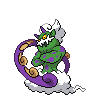

---

## Route 10 – Main R

### Grass

| Sprite | Pokémon | Encounter Type | Chance |
| :---: | --- | :---: | --- |
|  | [Herdier](../../pokemon/herdier.md/) | {: style='max-width: 24px;' } | 20% |
|  | [Pidgeotto](../../pokemon/pidgeotto.md/) | {: style='max-width: 24px;' } | 20% |
|  | [Rufflet](../../pokemon/rufflet.md/) | {: style='max-width: 24px;' } | 10% |
|  | [Vullaby](../../pokemon/vullaby.md/) | {: style='max-width: 24px;' } | 10% |
|  | [Machoke](../../pokemon/machoke.md/) | {: style='max-width: 24px;' } | 10% |
|  | [Primeape](../../pokemon/primeape.md/) | {: style='max-width: 24px;' } | 10% |
|  | [Amoonguss](../../pokemon/amoonguss.md/) | {: style='max-width: 24px;' } | 10% |
|  | [Tranquill](../../pokemon/tranquill.md/) | {: style='max-width: 24px;' } | 10%

### Dark Grass

| Sprite | Pokémon | Encounter Type | Chance |
| :---: | --- | :---: | --- |
|  | [Mandibuzz](../../pokemon/mandibuzz.md/) | {: style='max-width: 24px;' } | 20% |
|  | [Braviary](../../pokemon/braviary.md/) | {: style='max-width: 24px;' } | 20% |
|  | [Bouffalant](../../pokemon/bouffalant.md/) | {: style='max-width: 24px;' } | 10% |
|  | [Grumpig](../../pokemon/grumpig.md/) | {: style='max-width: 24px;' } | 10% |
|  | [Drapion](../../pokemon/drapion.md/) | {: style='max-width: 24px;' } | 10% |
|  | [Scrafty](../../pokemon/scrafty.md/) | {: style='max-width: 24px;' } | 10% |
|  | [Heracross](../../pokemon/heracross.md/) | {: style='max-width: 24px;' } | 10% |
|  | [Manectric](../../pokemon/manectric.md/) | {: style='max-width: 24px;' } | 10%

### Rustling Grass

| Sprite | Pokémon | Encounter Type | Chance |
| :---: | --- | :---: | --- |
|  | [Audino](../../pokemon/audino.md/) | {: style='max-width: 24px;' } | 100% |

### Legendary Encounter

| Sprite | Pokémon | Level | Encounter Type | Location | Chance |
| :---: | --- | --- | :---: | --- | --- |
|  | Thundurus | Level 40 | {: style='max-width: 24px;' } | Route 10, Main Route, Blaze Black | 1% |

### Legendary Encounter

| Sprite | Pokémon | Level | Encounter Type | Location | Chance |
| :---: | --- | --- | :---: | --- | --- |
|  | Tornadus | Level 40 | {: style='max-width: 24px;' } | Route 10, Main Route, Volt White | 1%

---

## Route 10 – Leag

### Grass

| Sprite | Pokémon | Encounter Type | Chance |
| :---: | --- | :---: | --- |
|  | [Linoone](../../pokemon/linoone.md/) | {: style='max-width: 24px;' } | 20% |
|  | [Bibarel](../../pokemon/bibarel.md/) | {: style='max-width: 24px;' } | 20% |
|  | [Skiploom](../../pokemon/skiploom.md/) | {: style='max-width: 24px;' } | 10% |
|  | [Arbok](../../pokemon/arbok.md/) | {: style='max-width: 24px;' } | 10% |
|  | [Sandslash](../../pokemon/sandslash.md/) | {: style='max-width: 24px;' } | 10% |
|  | [Dodrio](../../pokemon/dodrio.md/) | {: style='max-width: 24px;' } | 10% |
|  | [Zangoose](../../pokemon/zangoose.md/) | {: style='max-width: 24px;' } | 10% |
|  | [Seviper](../../pokemon/seviper.md/) | {: style='max-width: 24px;' } | 10%

### Dark Grass

| Sprite | Pokémon | Encounter Type | Chance |
| :---: | --- | :---: | --- |
|  | [Scyther](../../pokemon/scyther.md/) | {: style='max-width: 24px;' } | 20% |
|  | [Pinsir](../../pokemon/pinsir.md/) | {: style='max-width: 24px;' } | 20% |
|  | [Cherrim](../../pokemon/cherrim.md/) | {: style='max-width: 24px;' } | 10% |
|  | [Fearow](../../pokemon/fearow.md/) | {: style='max-width: 24px;' } | 10% |
|  | [Herdier](../../pokemon/herdier.md/) | {: style='max-width: 24px;' } | 10% |
|  | [Rapidash](../../pokemon/rapidash.md/) | {: style='max-width: 24px;' } | 10% |
|  | [Tropius](../../pokemon/tropius.md/) | {: style='max-width: 24px;' } | 10% |
|  | [Girafarig](../../pokemon/girafarig.md/) | {: style='max-width: 24px;' } | 10%

### Rustling Grass

| Sprite | Pokémon | Encounter Type | Chance |
| :---: | --- | :---: | --- |
|  | [Chansey](../../pokemon/chansey.md/) | {: style='max-width: 24px;' } | 90% |
|  | [Blissey](../../pokemon/blissey.md/) | {: style='max-width: 24px;' } | 10% |

### Legendary Encounter

| Sprite | Pokémon | Level | Encounter Type | Location | Chance |
| :---: | --- | --- | :---: | --- | --- |
|  | Latias | Level 60 | {: style='max-width: 24px;' } | Route 10, League Path | 1% |

### Legendary Encounter

| Sprite | Pokémon | Level | Encounter Type | Location | Chance |
| :---: | --- | --- | :---: | --- | --- |
|  | Latios | Level 60 | {: style='max-width: 24px;' } | Route 10, League Path | 1% |
