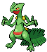
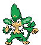
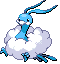
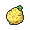

# Route 11 – Important Trainers

---

## Backpacker Cilan

**Battle Type:** Triple Battle

    | Pokémon | Attributes | Item | Moves |
    |:-------:|------------|:----:|-------|
|  | **Lv. 86** [Serperior](../../pokemon/serperior.md/) **Ability:** Contrary {: width="48"} {: width="48"} |  Yache Berry | 1: Leaf Storm 2: Light Screen 3: Reflect 4: Sunny Day |
|  | **Lv. 86** [Venusaur](../../pokemon/venusaur.md/) **Ability:** Chlorophyll {: width="48"} {: width="48"} |  Payapa Berry | 1: Growth 2: Earthquake 3: Power Whip 4: Sludge Bomb |
|  | **Lv. 86** [Meganium](../../pokemon/meganium.md/) **Ability:** Natural Cure {: width="48"} |  Kebia Berry | 1: Aromatherapy 2: Petal Dance 3: Toxic 4: Leech Seed |
|  | **Lv. 86** [Sceptile](../../pokemon/sceptile.md/) **Ability:** Adaptability {: width="48"} |  Tanga Berry | 1: Energy Ball 2: Focus Blast 3: Dragon Pulse 4: Leaf Storm |
|  | **Lv. 86** [Torterra](../../pokemon/torterra.md/) **Ability:** Sturdy {: width="48"} {: width="48"} |  Occa Berry | 1: Earthquake 2: Crunch 3: Wood Hammer 4: Stone Edge |
|  | **Lv. 88** [Simisage](../../pokemon/simisage.md/) **Ability:** Unburden {: width="48"} |  Liechi Berry | 1: Leaf Storm 2: Rock Slide 3: Shadow Claw 4: Low Kick |

---

## Backpacker Cress

**Battle Type:** Triple Battle

    | Pokémon | Attributes | Item | Moves |
    |:-------:|------------|:----:|-------|
|  | **Lv. 86** [Samurott](../../pokemon/samurott.md/) **Ability:** Vital Spirit {: width="48"} {: width="48"} |  Wacan Berry | 1: Shell Smash 2: Aqua Jet 3: Megahorn 4: Razor Shell |
|  | **Lv. 86** [Blastoise](../../pokemon/blastoise.md/) **Ability:** Sturdy {: width="48"} |  Rindo Berry | 1: Shell Smash 2: Hydro Pump 3: Blizzard 4: Focus Blast |
|  | **Lv. 86** [Feraligatr](../../pokemon/feraligatr.md/) **Ability:** Sheer Force {: width="48"} |  Wacan Berry | 1: Dragon Dance 2: Waterfall 3: Crunch 4: Earthquake |
|  | **Lv. 86** [Swampert](../../pokemon/swampert.md/) **Ability:** Mold Breaker {: width="48"} {: width="48"} |  Rindo Berry | 1: Earthquake 2: Waterfall 3: Avalanche 4: Hammer Arm |
|  | **Lv. 86** [Empoleon](../../pokemon/empoleon.md/) **Ability:** Defiant {: width="48"} {: width="48"} |  Shuca Berry | 1: Hydro Pump 2: Flash Cannon 3: Grass Knot 4: Aqua Jet |
|  | **Lv. 88** [Simipour](../../pokemon/simipour.md/) **Ability:** Unburden {: width="48"} |  Petaya Berry | 1: Hydro Pump 2: Ice Beam 3: Grass Knot 4: Focus Blast |

---

## Battle Girl Iris

**Battle Type:** Triple Battle

    | Pokémon | Attributes | Item | Moves |
    |:-------:|------------|:----:|-------|
|  | **Lv. 87** [Kingdra](../../pokemon/kingdra.md/) **Ability:** Swift Swim {: width="48"} {: width="48"} |  Damp Rock | 1: Rain Dance 2: Hydro Pump 3: Blizzard 4: Dragon Pulse |
|  | **Lv. 87** [Druddigon](../../pokemon/druddigon.md/) **Ability:** Rough Skin {: width="48"} |  Rocky Helmet | 1: Outrage 2: Superpower 3: Rock Slide 4: Substitute |
|  | **Lv. 87** [Altaria](../../pokemon/altaria.md/) **Ability:** Natural Cure {: width="48"} {: width="48"} |  Sitrus Berry | 1: Outrage 2: Roost 3: Cotton Guard 4: Ice Beam |
|  | **Lv. 89** [Garchomp](../../pokemon/garchomp.md/) **Ability:** Rough Skin {: width="48"} {: width="48"} |  Yache Berry | 1: Outrage 2: Earthquake 3: Stone Edge 4: Draco Meteor |
|  | **Lv. 89** [Dragonite](../../pokemon/dragonite.md/) **Ability:** Multiscale {: width="48"} {: width="48"} |  Sitrus Berry | 1: Outrage 2: Hurricane 3: Thunder 4: Roost |
|  | **Lv. 89** [Haxorus](../../pokemon/haxorus.md/) **Ability:** Mold Breaker {: width="48"} |  Choice Band | 1: Outrage 2: Dual Chop 3: Earthquake 4: Brick Break |

