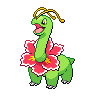
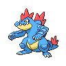
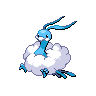

---

## Backpacker Cilan

**Battle Type:** Triple Battle

| Pokemon | Attributes | Moves |
|:-------:|------------|-------|
|  |**Lv. 86** [Serperior](../../pokemon/serperior.md/) **Item:** Yache Berry **Ability:** Contrary | 1. Leaf Storm 2. Light Screen 3. Reflect 4. Sunny Day |
|  |**Lv. 86** [Venusaur](../../pokemon/venusaur.md/) **Item:** Payapa Berry **Ability:** Chlorophyll | 1. Growth 2. Earthquake 3. Power Whip 4. Sludge Bomb |
|  |**Lv. 86** [Meganium](../../pokemon/meganium.md/) **Item:** Kebia Berry **Ability:** Natural Cure | 1. Aromatherapy 2. Petal Dance 3. Toxic 4. Leech Seed |
|  |**Lv. 86** [Sceptile](../../pokemon/sceptile.md/) **Item:** Tanga Berry **Ability:** Adaptability | 1. Energy Ball 2. Focus Blast 3. Dragon Pulse 4. Leaf Storm |
|  |**Lv. 86** [Torterra](../../pokemon/torterra.md/) **Item:** Occa Berry **Ability:** Sturdy | 1. Earthquake 2. Crunch 3. Wood Hammer 4. Stone Edge |
|  |**Lv. 88** [Simisage](../../pokemon/simisage.md/) **Item:** Liechi Berry **Ability:** Unburden | 1. Leaf Storm 2. Rock Slide 3. Shadow Claw 4. Low Kick |

---

## Backpacker Cress

**Battle Type:** Triple Battle

| Pokemon | Attributes | Moves |
|:-------:|------------|-------|
|  |**Lv. 86** [Samurott](../../pokemon/samurott.md/) **Item:** Wacan Berry **Ability:** Vital Spirit | 1. Shell Smash 2. Aqua Jet 3. Megahorn 4. Razor Shell |
|  |**Lv. 86** [Blastoise](../../pokemon/blastoise.md/) **Item:** Rindo Berry **Ability:** Sturdy | 1. Shell Smash 2. Hydro Pump 3. Blizzard 4. Focus Blast |
|  |**Lv. 86** [Feraligatr](../../pokemon/feraligatr.md/) **Item:** Wacan Berry **Ability:** Sheer Force | 1. Dragon Dance 2. Waterfall 3. Crunch 4. Earthquake |
|  |**Lv. 86** [Swampert](../../pokemon/swampert.md/) **Item:** Rindo Berry **Ability:** Mold Breaker | 1. Earthquake 2. Waterfall 3. Avalanche 4. Hammer Arm |
|  |**Lv. 86** [Empoleon](../../pokemon/empoleon.md/) **Item:** Shuca Berry **Ability:** Defiant | 1. Hydro Pump 2. Flash Cannon 3. Grass Knot 4. Aqua Jet |
|  |**Lv. 88** [Simipour](../../pokemon/simipour.md/) **Item:** Petaya Berry **Ability:** Unburden | 1. Hydro Pump 2. Ice Beam 3. Grass Knot 4. Focus Blast |

---

## Battle Girl Iris

**Battle Type:** Triple Battle

| Pokemon | Attributes | Moves |
|:-------:|------------|-------|
|  |**Lv. 87** [Kingdra](../../pokemon/kingdra.md/) **Item:** Damp Rock **Ability:** Swift Swim | 1. Rain Dance 2. Hydro Pump 3. Blizzard 4. Dragon Pulse |
|  |**Lv. 87** [Druddigon](../../pokemon/druddigon.md/) **Item:** Rocky Helmet **Ability:** Rough Skin | 1. Outrage 2. Superpower 3. Rock Slide 4. Substitute |
|  |**Lv. 87** [Altaria](../../pokemon/altaria.md/) **Item:** Sitrus Berry **Ability:** Natural Cure | 1. Outrage 2. Roost 3. Cotton Guard 4. Ice Beam |
|  |**Lv. 89** [Garchomp](../../pokemon/garchomp.md/) **Item:** Yache Berry **Ability:** Rough Skin | 1. Outrage 2. Earthquake 3. Stone Edge 4. Draco Meteor |
|  |**Lv. 89** [Dragonite](../../pokemon/dragonite.md/) **Item:** Sitrus Berry **Ability:** Multiscale | 1. Outrage 2. Hurricane 3. Thunder 4. Roost |
|  |**Lv. 89** [Haxorus](../../pokemon/haxorus.md/) **Item:** Choice Band **Ability:** Mold Breaker | 1. Outrage 2. Dual Chop 3. Earthquake 4. Brick Break |

