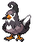

### Grass

| Sprite | Pokémon | Encounter Type | Chance |
| :---: | --- | :---: | --- |
|  | [Golduck](../../pokemon/golduck.md/) | {: style='max-width: 24px;' } | 20% |
|  | [Bisharp](../../pokemon/bisharp.md/) | {: style='max-width: 24px;' } | 20% |
|  | [Mandibuzz](../../pokemon/mandibuzz.md/) | {: style='max-width: 24px;' } | 10% |
|  | [Braviary](../../pokemon/braviary.md/) | {: style='max-width: 24px;' } | 10% |
|  | [Gligar](../../pokemon/gligar.md/) | {: style='max-width: 24px;' } | 10%),

### Dark Grass

| Sprite | Pokémon | Encounter Type | Chance |
| :---: | --- | :---: | --- |
|  | [Loudred](../../pokemon/loudred.md/) | {: style='max-width: 24px;' } | 20% |
|  | [Staravia](../../pokemon/staravia.md/) | {: style='max-width: 24px;' } | 20% |
|  | [Vigoroth](../../pokemon/vigoroth.md/) | {: style='max-width: 24px;' } | 10% |
|  | [Electabuzz](../../pokemon/electabuzz.md/) | {: style='max-width: 24px;' } | 10% |
|  | [Magmar](../../pokemon/magmar.md/) | {: style='max-width: 24px;' } | 10% |
|  | [Flygon](../../pokemon/flygon.md/) | {: style='max-width: 24px;' } | 10% |
|  | [Rhydon](../../pokemon/rhydon.md/) | {: style='max-width: 24px;' } | 10% |
|  | [Boldore](../../pokemon/boldore.md/) | {: style='max-width: 24px;' } | 10%

### Rustling Grass

| Sprite | Pokémon | Encounter Type | Chance |
| :---: | --- | :---: | --- |
|  | [Audino](../../pokemon/audino.md/) | {: style='max-width: 24px;' } | 70% |
|  | [Emolga](../../pokemon/emolga.md/) | {: style='max-width: 24px;' } | 10% |
|  | [Electivire](../../pokemon/electivire.md/) | {: style='max-width: 24px;' } | 5% |
|  | [Magmortar](../../pokemon/magmortar.md/) | {: style='max-width: 24px;' } | 5% |
|  | [Gliscor](../../pokemon/gliscor.md/) | {: style='max-width: 24px;' } | 5% |
|  | [Staraptor](../../pokemon/staraptor.md/) | {: style='max-width: 24px;' } | 5%

### Surfing

| Sprite | Pokémon | Encounter Type | Chance |
| :---: | --- | :---: | --- |
|  | [Buizel](../../pokemon/buizel.md/) | {: style='max-width: 24px;' } | 60% |
|  | [Floatzel](../../pokemon/floatzel.md/) | {: style='max-width: 24px;' } | 40%

### Rippling Surfing

| Sprite | Pokémon | Encounter Type | Chance |
| :---: | --- | :---: | --- |
|  | [Dratini](../../pokemon/dratini.md/) | {: style='max-width: 24px;' } | 60% |
|  | [Dragonair](../../pokemon/dragonair.md/) | {: style='max-width: 24px;' } | 35% |
|  | [Dragonite](../../pokemon/dragonite.md/) | {: style='max-width: 24px;' } | 5%

### Fishing

| Sprite | Pokémon | Encounter Type | Chance |
| :---: | --- | :---: | --- |
|  | [Goldeen](../../pokemon/goldeen.md/) | {: style='max-width: 24px;' } | 70% |
|  | [Basculin](../../pokemon/basculin-red-striped.md/) | {: style='max-width: 24px;' } | 30%

### Rippling Fishing

| Sprite | Pokémon | Encounter Type | Chance |
| :---: | --- | :---: | --- |
|  | [Goldeen](../../pokemon/goldeen.md/) | {: style='max-width: 24px;' } | 60% |
|  | [Basculin](../../pokemon/basculin-red-striped.md/) | {: style='max-width: 24px;' } | 30% |
|  | [Seaking](../../pokemon/seaking.md/) | {: style='max-width: 24px;' } | 10% |
