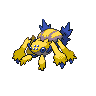

---

## Artist Burgh

**Battle Type:** Single Battle

| Pokemon | Attributes | Moves |
|:-------:|------------|-------|
|  |**Lv. 87** [Yanmega](../../pokemon/yanmega.md/) **Item:** Occa Berry  **Ability:** ? 1: Bug Buzz 2: Air Slash 3: Psychic 4: Shadow Ball |
|  |**Lv. 87** [Crustle](../../pokemon/crustle.md/) **Item:** White Herb  **Ability:** ? 1: Shell Smash 2: Stone Edge 3: X-Scissor 4: Earthquake |
|  |**Lv. 87** [Scizor](../../pokemon/scizor.md/) **Item:** Life Orb  **Ability:** ? 1: Bullet Punch 2: Bug Bite 3: Superpower 4: Pursuit |
|  |**Lv. 87** [Venomoth](../../pokemon/venomoth.md/) **Item:** Starf Berry  **Ability:** ? 1: Quiver Dance 2: Bug Buzz 3: Sludge Bomb 4: Sleep Powder |
|  |**Lv. 87** [Scolipede](../../pokemon/scolipede.md/) **Item:** Liechi Berry  **Ability:** ? 1: Megahorn 2: Toxic Spikes 3: Spikes 4: Rock Slide |
|  |**Lv. 89** [Leavanny](../../pokemon/leavanny.md/) **Item:** Focus Sash  **Ability:** ? 1: X-Scissor 2: Leaf Blade 3: Agility 4: Shadow Claw |

---

## Lady Elesa

**Battle Type:** Single Battle

| Pokemon | Attributes | Moves |
|:-------:|------------|-------|
|  |**Lv. 88** [Emolga](../../pokemon/emolga.md/) **Item:** Starf Berry  **Ability:** Static |  1: Baton Pass 2: Agility 3: Thunder 4: Light Screen |
|  |**Lv. 88** [Electivire](../../pokemon/electivire.md/) **Item:** Sitrus Berry  **Ability:** Motor Drive |  1: Volt Tackle 2: Cross Chop 3: Ice Punch 4: Earthquake |
|  |**Lv. 88** [Jolteon](../../pokemon/jolteon.md/) **Item:** Starf Berry  **Ability:** Lightning Rod |  1: Thunder 2: Shadow Ball 3: Baton Pass 4: Thunder Wave |
|  |**Lv. 88** [Eelektross](../../pokemon/eelektross.md/) **Item:** Flying Gem  **Ability:** Levitate |  1: Acrobatics 2: Thunder 3: Rock Slide 4: Flamethrower |
|  |**Lv. 88** [Galvantula](../../pokemon/galvantula.md/) **Item:** Wide Lens  **Ability:** Compound Eyes |  1: Thunder 2: Bug Buzz 3: Energy Ball 4: Thunder Wave |
|  |**Lv. 90** [Zebstrika](../../pokemon/zebstrika.md/) **Item:** Life Orb  **Ability:** Sap Sipper |  1: Volt Tackle 2: Flame Charge 3: Quick Attack 4: Return |

