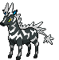

# Route 13 – Important Trainers

---

## Artist Burgh

**Battle Type:** Single Battle

    | Pokémon | Attributes | Item | Moves |
    |:-------:|------------|:----:|-------|
|  | **Lv. 87** [Yanmega](../../pokemon/yanmega.md/) **Ability:** ? {: width="48"} {: width="48"} |  Occa Berry | 1: Bug Buzz 2: Air Slash 3: Psychic 4: Shadow Ball |
|  | **Lv. 87** [Crustle](../../pokemon/crustle.md/) **Ability:** ? {: width="48"} {: width="48"} |  White Herb | 1: Shell Smash 2: Stone Edge 3: X-Scissor 4: Earthquake |
|  | **Lv. 87** [Scizor](../../pokemon/scizor.md/) **Ability:** ? {: width="48"} {: width="48"} |  Life Orb | 1: Bullet Punch 2: Bug Bite 3: Superpower 4: Pursuit |
|  | **Lv. 87** [Venomoth](../../pokemon/venomoth.md/) **Ability:** ? {: width="48"} {: width="48"} |  Starf Berry | 1: Quiver Dance 2: Bug Buzz 3: Sludge Bomb 4: Sleep Powder |
|  | **Lv. 87** [Scolipede](../../pokemon/scolipede.md/) **Ability:** ? {: width="48"} {: width="48"} |  Liechi Berry | 1: Megahorn 2: Toxic Spikes 3: Spikes 4: Rock Slide |
|  | **Lv. 89** [Leavanny](../../pokemon/leavanny.md/) **Ability:** ? {: width="48"} {: width="48"} |  Focus Sash | 1: X-Scissor 2: Leaf Blade 3: Agility 4: Shadow Claw |

---

## Lady Elesa

**Battle Type:** Single Battle

    | Pokémon | Attributes | Item | Moves |
    |:-------:|------------|:----:|-------|
|  | **Lv. 88** [Emolga](../../pokemon/emolga.md/) **Ability:** Static {: width="48"} {: width="48"} |  Starf Berry | 1: Baton Pass 2: Agility 3: Thunder 4: Light Screen |
|  | **Lv. 88** [Electivire](../../pokemon/electivire.md/) **Ability:** Motor Drive {: width="48"} {: width="48"} |  Sitrus Berry | 1: Volt Tackle 2: Cross Chop 3: Ice Punch 4: Earthquake |
|  | **Lv. 88** [Jolteon](../../pokemon/jolteon.md/) **Ability:** Lightning Rod {: width="48"} |  Starf Berry | 1: Thunder 2: Shadow Ball 3: Baton Pass 4: Thunder Wave |
|  | **Lv. 88** [Eelektross](../../pokemon/eelektross.md/) **Ability:** Levitate {: width="48"} |  Flying Gem | 1: Acrobatics 2: Thunder 3: Rock Slide 4: Flamethrower |
|  | **Lv. 88** [Galvantula](../../pokemon/galvantula.md/) **Ability:** Compound Eyes {: width="48"} {: width="48"} |  Wide Lens | 1: Thunder 2: Bug Buzz 3: Energy Ball 4: Thunder Wave |
|  | **Lv. 90** [Zebstrika](../../pokemon/zebstrika.md/) **Ability:** Sap Sipper {: width="48"} |  Life Orb | 1: Volt Tackle 2: Flame Charge 3: Quick Attack 4: Return |

