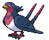
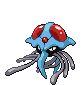

### Grass

| Sprite | Pokémon | Encounter Type | Chance |
| :---: | --- | :---: | --- |
|  | [Absol](../../pokemon/absol.md/) | {: style='max-width: 24px;' } | 20% |
|  | [Drifblim](../../pokemon/drifblim.md/) | {: style='max-width: 24px;' } | 20% |
|  | [Swellow](../../pokemon/swellow.md/) | {: style='max-width: 24px;' } | 10% |
|  | [Lunatone](../../pokemon/lunatone.md/) | {: style='max-width: 24px;' } | 10% |
|  | [Solrock](../../pokemon/solrock.md/) | {: style='max-width: 24px;' } | 10% |
|  | [Wormadam](../../pokemon/wormadam-plant.md/) | {: style='max-width: 24px;' } | 10% |
|  | [Mothim](../../pokemon/mothim.md/) | {: style='max-width: 24px;' } | 10% |
|  | [Pelipper](../../pokemon/pelipper.md/) | {: style='max-width: 24px;' } | 10%

### Dark Grass

| Sprite | Pokémon | Encounter Type | Chance |
| :---: | --- | :---: | --- |
|  | [Golbat](../../pokemon/golbat.md/) | {: style='max-width: 24px;' } | 20% |
|  | [Tangela](../../pokemon/tangela.md/) | {: style='max-width: 24px;' } | 20% |
|  | [Nidorino](../../pokemon/nidorino.md/) | {: style='max-width: 24px;' } | 10% |
|  | [Nidorina](../../pokemon/nidorina.md/) | {: style='max-width: 24px;' } | 10% |
|  | [Yanma](../../pokemon/yanma.md/) | {: style='max-width: 24px;' } | 10% |
|  | [Gloom](../../pokemon/gloom.md/) | {: style='max-width: 24px;' } | 10% |
|  | [Weepinbell](../../pokemon/weepinbell.md/) | {: style='max-width: 24px;' } | 10% |
|  | [Skiploom](../../pokemon/skiploom.md/) | {: style='max-width: 24px;' } | 10%

### Rustling Grass

| Sprite | Pokémon | Encounter Type | Chance |
| :---: | --- | :---: | --- |
|  | [Audino](../../pokemon/audino.md/) | {: style='max-width: 24px;' } | 80% |
|  | [Tangrowth](../../pokemon/tangrowth.md/) | {: style='max-width: 24px;' } | 5% |
|  | [Crobat](../../pokemon/crobat.md/) | {: style='max-width: 24px;' } | 5% |
|  | [Nidoking](../../pokemon/nidoking.md/) | {: style='max-width: 24px;' } | 5% |
|  | [Nidoqueen](../../pokemon/nidoqueen.md/) | {: style='max-width: 24px;' } | 5%

### Surfing

| Sprite | Pokémon | Encounter Type | Chance |
| :---: | --- | :---: | --- |
|  | [Pelipper](../../pokemon/pelipper.md/) | {: style='max-width: 24px;' } | 60% |
|  | [Corsola](../../pokemon/corsola.md/) | {: style='max-width: 24px;' } | 40%

### Rippling Surfing

| Sprite | Pokémon | Encounter Type | Chance |
| :---: | --- | :---: | --- |
|  | [Tentacruel](../../pokemon/tentacruel.md/) | {: style='max-width: 24px;' } | 60% |
|  | [Starmie](../../pokemon/starmie.md/) | {: style='max-width: 24px;' } | 30% |
|  | [Kingdra](../../pokemon/kingdra.md/) | {: style='max-width: 24px;' } | 10%

### Fishing

| Sprite | Pokémon | Encounter Type | Chance |
| :---: | --- | :---: | --- |
|  | [Shellder](../../pokemon/shellder.md/) | {: style='max-width: 24px;' } | 65% |
|  | [Krabby](../../pokemon/krabby.md/) | {: style='max-width: 24px;' } | 30% |
|  | [Luvdisc](../../pokemon/luvdisc.md/) | {: style='max-width: 24px;' } | 5%

### Rippling Fishing

| Sprite | Pokémon | Encounter Type | Chance |
| :---: | --- | :---: | --- |
|  | [Shellder](../../pokemon/shellder.md/) | {: style='max-width: 24px;' } | 60% |
|  | [Luvdisc](../../pokemon/luvdisc.md/) | {: style='max-width: 24px;' } | 30% |
|  | [Kingler](../../pokemon/kingler.md/) | {: style='max-width: 24px;' } | 5% |
|  | [Cloyster](../../pokemon/cloyster.md/) | {: style='max-width: 24px;' } | 5% |

### Legendary Encounter

| Sprite | Pokémon | Level | Encounter Type | Location | Chance |
| :---: | --- | --- | :---: | --- | --- |
|  | Lugia | Level 70 | {: style='max-width: 24px;' } | Route 13 | 1% |
