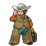
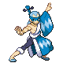
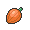

---

## Hiker Clay

**Battle Type:** Single Battle

    | Pokémon | Attributes | Item | Moves |
    |:-------:|------------|:----:|-------|
|  | **Lv. 88** [Hippowdon](../../pokemon/hippowdon.md/) **Ability:** Sand Stream {: width="48"} |  Passho Berry | 1: Earthquake 2: Slack Off 3: Stone Edge 4: Crunch |
|  | **Lv. 88** [Seismitoad](../../pokemon/seismitoad.md/) **Ability:** Water Absorb {: width="48"} {: width="48"} |  Rindo Berry | 1: Earthquake 2: Muddy Water 3: Grass Knot 4: Drain Punch |
|  | **Lv. 88** [Rhyperior](../../pokemon/rhyperior.md/) **Ability:** Solid Rock {: width="48"} {: width="48"} |  Life Orb | 1: Earthquake 2: Stone Edge 3: Megahorn 4: Superpower |
|  | **Lv. 88** [Donphan](../../pokemon/donphan.md/) **Ability:** Sturdy {: width="48"} |  Custap Berry | 1: Earthquake 2: Ice Shard 3: Endeavor 4: Stone Edge |
|  | **Lv. 88** [Krookodile](../../pokemon/krookodile.md/) **Ability:** Intimidate {: width="48"} {: width="48"} |  Chople Berry | 1: Earthquake 2: Crunch 3: Stone Edge 4: Outrage |
|  | **Lv. 90** [Excadrill](../../pokemon/excadrill.md/) **Ability:** Sand Rush {: width="48"} {: width="48"} |  Air Balloon | 1: Earthquake 2: Rock Slide 3: X-Scissor 4: Horn Drill |

---

## Ace Trainer Skyla

**Battle Type:** Triple Battle

    | Pokémon | Attributes | Item | Moves |
    |:-------:|------------|:----:|-------|
|  | **Lv. 88** [Swoobat](../../pokemon/swoobat.md/) **Ability:** Simple {: width="48"} {: width="48"} |  Focus Sash | 1: Psychic 2: Stored Power 3: Air Slash 4: Calm Mind |
|  | **Lv. 88** [Braviary](../../pokemon/braviary.md/) **Ability:** Defiant {: width="48"} {: width="48"} |  White Herb | 1: Crush Claw 2: Extreme Speed 3: Brave Bird 4: Rock Slide |
|  | **Lv. 88** [Tropius](../../pokemon/tropius.md/) **Ability:** Chlorophyll {: width="48"} {: width="48"} |  Power Herb | 1: Leaf Blade 2: Earthquake 3: Fly 4: Roost |
|  | **Lv. 90** [Skarmory](../../pokemon/skarmory.md/) **Ability:** Sturdy {: width="48"} {: width="48"} |  Sitrus Berry | 1: Brave Bird 2: Steel Wing 3: Roost 4: X-Scissor |
|  | **Lv. 90** [Gliscor](../../pokemon/gliscor.md/) **Ability:** Poison Heal {: width="48"} {: width="48"} |  Toxic Orb | 1: Earthquake 2: Fling 3: Stone Edge 4: Acrobatics |
|  | **Lv. 90** [Swanna](../../pokemon/swanna.md/) **Ability:** Big Pecks {: width="48"} {: width="48"} |  Life Orb | 1: Surf 2: Ice Beam 3: Brave Bird 4: Tailwind |

---

## Ace Trainer Brycen

**Battle Type:** Triple Battle

    | Pokémon | Attributes | Item | Moves |
    |:-------:|------------|:----:|-------|
|  | **Lv. 88** [Abomasnow](../../pokemon/abomasnow.md/) **Ability:** Snow Warning {: width="48"} {: width="48"} |  Expert Belt | 1: Blizzard 2: Wood Hammer 3: Focus Blast 4: Earthquake |
|  | **Lv. 88** [Lapras](../../pokemon/lapras.md/) **Ability:** Shell Armor {: width="48"} {: width="48"} |  Chople Berry | 1: Blizzard 2: Hydro Pump 3: Sing 4: Perish Song |
|  | **Lv. 88** [Glalie](../../pokemon/glalie.md/) **Ability:** Levitate {: width="48"} {: width="48"} |  Occa Berry | 1: Blizzard 2: Earthquake 3: Ice Shard 4: Stone Edge |
|  | **Lv. 88** [Cryogonal](../../pokemon/cryogonal.md/) **Ability:** Levitate {: width="48"} |  Focus Sash | 1: Blizzard 2: Flash Cannon 3: Reflect 4: Sheer Cold |
|  | **Lv. 90** [Vanilluxe](../../pokemon/vanilluxe.md/) **Ability:** Weak Armor {: width="48"} |  Life Orb | 1: Blizzard 2: Flash Cannon 3: Water Pulse 4: Energy Ball |
|  | **Lv. 90** [Beartic](../../pokemon/beartic.md/) **Ability:** Sheer Force {: width="48"} {: width="48"} |  Life Orb | 1: Icicle Crash 2: Stone Edge 3: Dive 4: Close Combat |

