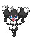

### Grass

| Sprite | Pokémon | Encounter Type | Chance |
| :---: | --- | :---: | --- |
|  | [Gothorita](../../pokemon/gothorita.md/) | {: style='max-width: 24px;' } | 20% |
|  | [Duosion](../../pokemon/duosion.md/) | {: style='max-width: 24px;' } | 20% |
|  | [Kirlia](../../pokemon/kirlia.md/) | {: style='max-width: 24px;' } | 10% |
|  | [Lombre](../../pokemon/lombre.md/) | {: style='max-width: 24px;' } | 10% |
|  | [Shuckle](../../pokemon/shuckle.md/) | {: style='max-width: 24px;' } | 10% |
|  | [Luxio](../../pokemon/luxio.md/) | {: style='max-width: 24px;' } | 10% |
|  | [Carnivine](../../pokemon/carnivine.md/) | {: style='max-width: 24px;' } | 10% |
|  | [Skiploom](../../pokemon/skiploom.md/) | {: style='max-width: 24px;' } | 10%

### Dark Grass

| Sprite | Pokémon | Encounter Type | Chance |
| :---: | --- | :---: | --- |
|  | [Altaria](../../pokemon/altaria.md/) | {: style='max-width: 24px;' } | 20% |
|  | [Mienshao](../../pokemon/mienshao.md/) | {: style='max-width: 24px;' } | 20% |
|  | [Beheeyem](../../pokemon/beheeyem.md/) | {: style='max-width: 24px;' } | 10% |
|  | [Grumpig](../../pokemon/grumpig.md/) | {: style='max-width: 24px;' } | 10% |
|  | [Drifblim](../../pokemon/drifblim.md/) | {: style='max-width: 24px;' } | 10% |
|  | [Breloom](../../pokemon/breloom.md/) | {: style='max-width: 24px;' } | 10% |
|  | [Tropius](../../pokemon/tropius.md/) | {: style='max-width: 24px;' } | 10% |
|  | [Galvantula](../../pokemon/galvantula.md/) | {: style='max-width: 24px;' } | 10%

### Rustling Grass

| Sprite | Pokémon | Encounter Type | Chance |
| :---: | --- | :---: | --- |
|  | [Chansey](../../pokemon/chansey.md/) | {: style='max-width: 24px;' } | 75% |
|  | [Blissey](../../pokemon/blissey.md/) | {: style='max-width: 24px;' } | 25%

### Surfing

| Sprite | Pokémon | Encounter Type | Chance |
| :---: | --- | :---: | --- |
|  | [Seaking](../../pokemon/seaking.md/) | {: style='max-width: 24px;' } | 60% |
|  | [Lumineon](../../pokemon/lumineon.md/) | {: style='max-width: 24px;' } | 40%

### Rippling Surfing

| Sprite | Pokémon | Encounter Type | Chance |
| :---: | --- | :---: | --- |
|  | [Politoed](../../pokemon/politoed.md/) | {: style='max-width: 24px;' } | 60% |
|  | [Milotic](../../pokemon/milotic.md/) | {: style='max-width: 24px;' } | 40%

### Fishing

| Sprite | Pokémon | Encounter Type | Chance |
| :---: | --- | :---: | --- |
|  | [Goldeen](../../pokemon/goldeen.md/) | {: style='max-width: 24px;' } | 70% |
|  | [Basculin](../../pokemon/basculin-red-striped.md/) | {: style='max-width: 24px;' } | 30%

### Rippling Fishing

| Sprite | Pokémon | Encounter Type | Chance |
| :---: | --- | :---: | --- |
|  | [Goldeen](../../pokemon/goldeen.md/) | {: style='max-width: 24px;' } | 60% |
|  | [Basculin](../../pokemon/basculin-red-striped.md/) | {: style='max-width: 24px;' } | 30% |
|  | [Seaking](../../pokemon/seaking.md/) | {: style='max-width: 24px;' } | 10% |
