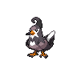
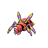

---

## Generic Trainers</h3>

| Trainer | P1 | P2 | P3 | P4 | P5 | P6 |
|:-------:|:--:|:--:|:--:|:--:|:--:|:--:|
|  Cycling Hector |  [Staravia](../../pokemon/staravia.md/) Lv. 30 |  [Ponyta](../../pokemon/ponyta.md/) Lv. 30 |
|  Backpacker Peter |  [Klink](../../pokemon/klink.md/) Lv. 30 |  [Prinplup](../../pokemon/prinplup.md/) Lv. 30 |
|  Cycling Krissa |  [Archen](../../pokemon/archen.md/) Lv. 30 |  [Grotle](../../pokemon/grotle.md/) Lv. 30 |
|  Policeman Daniel |  [Houndoom](../../pokemon/houndoom.md/) Lv. 30 |  [Magmar](../../pokemon/magmar.md/) Lv. 30 |
|  Backpacker Lora |  [Cherrim](../../pokemon/cherrim.md/) Lv. 30 |  [Monferno](../../pokemon/monferno.md/) Lv. 30 |
|  Backpacker Stephen |  [Corphish](../../pokemon/corphish.md/) Lv. 30 |  [Ariados](../../pokemon/ariados.md/) Lv. 30 |

