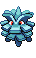
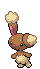
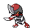

### Grass

| Sprite | Pokémon | Encounter Type | Chance |
| :---: | --- | :---: | --- |
|  | [Ekans](../../pokemon/ekans.md/) | {: style='max-width: 24px;' } | 20% |
|  | [Pineco](../../pokemon/pineco.md/) | {: style='max-width: 24px;' } | 20% |
|  | [Skorupi](../../pokemon/skorupi.md/) | {: style='max-width: 24px;' } | 10% |
|  | [Electrike](../../pokemon/electrike.md/) | {: style='max-width: 24px;' } | 10% |
|  | [Combee](../../pokemon/combee.md/) | {: style='max-width: 24px;' } | 10% |
|  | [Paras](../../pokemon/paras.md/) | {: style='max-width: 24px;' } | 10% |
|  | [Buneary](../../pokemon/buneary.md/) | {: style='max-width: 24px;' } | 5% |
|  | [Pawniard](../../pokemon/pawniard.md/) | {: style='max-width: 24px;' } | 5% |
|  | [Drifloon](../../pokemon/drifloon.md/) | {: style='max-width: 24px;' } | 5% |
|  | [Spoink](../../pokemon/spoink.md/) | {: style='max-width: 24px;' } | 5%

### Dark Grass

| Sprite | Pokémon | Encounter Type | Chance |
| :---: | --- | :---: | --- |
|  | [Zangoose](../../pokemon/zangoose.md/) | {: style='max-width: 24px;' } | 20% |
|  | [Seviper](../../pokemon/seviper.md/) | {: style='max-width: 24px;' } | 20% |
|  | [Stunky](../../pokemon/stunky.md/) | {: style='max-width: 24px;' } | 10% |
|  | [Glameow](../../pokemon/glameow.md/) | {: style='max-width: 24px;' } | 10% |
|  | [Slugma](../../pokemon/slugma.md/) | {: style='max-width: 24px;' } | 10% |
|  | [Vespiquen](../../pokemon/vespiquen.md/) | {: style='max-width: 24px;' } | 10% |
|  | [Parasect](../../pokemon/parasect.md/) | {: style='max-width: 24px;' } | 10% |
|  | [Girafarig](../../pokemon/girafarig.md/) | {: style='max-width: 24px;' } | 5% |
|  | [Castform](../../pokemon/castform.md/) | {: style='max-width: 24px;' } | 5%

### Rustling Grass

| Sprite | Pokémon | Encounter Type | Chance |
| :---: | --- | :---: | --- |
|  | [Audino](../../pokemon/audino.md/) | {: style='max-width: 24px;' } | 70% |
|  | [Emolga](../../pokemon/emolga.md/) | {: style='max-width: 24px;' } | 10% |
|  | [Bisharp](../../pokemon/bisharp.md/) | {: style='max-width: 24px;' } | 10% |
|  | [Lopunny](../../pokemon/lopunny.md/) | {: style='max-width: 24px;' } | 10% |
