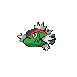
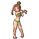
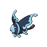

---

## Generic Trainers</h3>

| Trainer | P1 | P2 | P3 | P4 | P5 | P6 |
|:-------:|:--:|:--:|:--:|:--:|:--:|:--:|
|  Fisherman Lydon |  [Basculin](../../pokemon/basculin-red-striped.md/) Lv. 52 |  [Qwilfish](../../pokemon/qwilfish.md/) Lv. 52 |  [Gyarados](../../pokemon/gyarados.md/) Lv. 52 |
|  Swimmer Joyce |  [Lumineon](../../pokemon/lumineon.md/) Lv. 52 |  [Starmie](../../pokemon/starmie.md/) Lv. 52 |  [Lanturn](../../pokemon/lanturn.md/) Lv. 52 |
|  Swimmer Wright |  [Tentacruel](../../pokemon/tentacruel.md/) Lv. 53 |  [Feraligatr](../../pokemon/feraligatr.md/) Lv. 53 |
|  Swimmer Berke |  [Omastar](../../pokemon/omastar.md/) Lv. 53 |  [Kabutops](../../pokemon/kabutops.md/) Lv. 53 |
|  Swimmer Caroline |  [Jellicent](../../pokemon/jellicent.md/) Lv. 52 |  [Dewgong](../../pokemon/dewgong.md/) Lv. 52 |  [Lapras](../../pokemon/lapras.md/) Lv. 52 |

