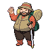
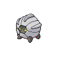
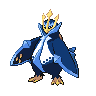

---

## Generic Trainers</h3>

| Trainer | P1 | P2 | P3 | P4 | P5 | P6 |
|:-------:|:--:|:--:|:--:|:--:|:--:|:--:|
|  Hiker Jeremiah |  [Golem](../../pokemon/golem.wild_md/) Lv. 52 |  [Ursaring](../../pokemon/ursaring.wild_md/) Lv. 52 |  [Slaking](../../pokemon/slaking.wild_md/) Lv. 52 |
|  Backpacker Kumiko |  [Infernape](../../pokemon/infernape.wild_md/) Lv. 52 |  [Tangrowth](../../pokemon/tangrowth.wild_md/) Lv. 52 |  [Amoonguss](../../pokemon/amoonguss.wild_md/) Lv. 52 |
|  Backpacker Sam |  [Sceptile](../../pokemon/sceptile.wild_md/) Lv. 52 |  [Armaldo](../../pokemon/armaldo.wild_md/) Lv. 52 |  [Seviper](../../pokemon/seviper.wild_md/) Lv. 52 |
|  Veteran Ray |  [Shelgon](../../pokemon/shelgon.wild_md/) Lv. 54 |  [Gigalith](../../pokemon/gigalith.wild_md/) Lv. 54 |  [Empoleon](../../pokemon/empoleon.wild_md/) Lv. 54 |
|  Battle Girl Hillary |  [Hitmonchan](../../pokemon/hitmonchan.wild_md/) Lv. 53 |  [Electivire](../../pokemon/electivire.wild_md/) Lv. 53 |

