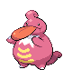

### Grass

| Sprite | Pokémon | Encounter Type | Chance |
| :---: | --- | :---: | --- |
|  | [Throh](../../pokemon/throh.md/) | {: style='max-width: 24px;' } | 20% |
|  | [Sawk](../../pokemon/sawk.md/) | {: style='max-width: 24px;' } | 20% |
|  | [Heracross](../../pokemon/heracross.md/) | {: style='max-width: 24px;' } | 10% |
|  | [Munchlax](../../pokemon/munchlax.md/) | {: style='max-width: 24px;' } | 10% |
|  | [Dwebble](../../pokemon/dwebble.md/) | {: style='max-width: 24px;' } | 10% |
|  | [Lickitung](../../pokemon/lickitung.md/) | {: style='max-width: 24px;' } | 10% |
|  | [Kangaskhan](../../pokemon/kangaskhan.md/) | {: style='max-width: 24px;' } | 10% |
|  | [Tropius](../../pokemon/tropius.md/) | {: style='max-width: 24px;' } | 10%

### Dark Grass

| Sprite | Pokémon | Encounter Type | Chance |
| :---: | --- | :---: | --- |
|  | [Throh](../../pokemon/throh.md/) | {: style='max-width: 24px;' } | 20% |
|  | [Sawk](../../pokemon/sawk.md/) | {: style='max-width: 24px;' } | 20% |
|  | [Heracross](../../pokemon/heracross.md/) | {: style='max-width: 24px;' } | 10% |
|  | [Munchlax](../../pokemon/munchlax.md/) | {: style='max-width: 24px;' } | 10% |
|  | [Crustle](../../pokemon/crustle.md/) | {: style='max-width: 24px;' } | 10% |
|  | [Lickitung](../../pokemon/lickitung.md/) | {: style='max-width: 24px;' } | 10% |
|  | [Kangaskhan](../../pokemon/kangaskhan.md/) | {: style='max-width: 24px;' } | 10% |
|  | [Tropius](../../pokemon/tropius.md/) | {: style='max-width: 24px;' } | 10%

### Rustling Grass

| Sprite | Pokémon | Encounter Type | Chance |
| :---: | --- | :---: | --- |
|  | [Audino](../../pokemon/audino.md/) | {: style='max-width: 24px;' } | 90% |
|  | [Snorlax](../../pokemon/snorlax.md/) | {: style='max-width: 24px;' } | 5% |
|  | [Lickilicky](../../pokemon/lickilicky.md/) | {: style='max-width: 24px;' } | 5%

### Surfing

| Sprite | Pokémon | Encounter Type | Chance |
| :---: | --- | :---: | --- |
|  | [Carvanha](../../pokemon/carvanha.md/) | {: style='max-width: 24px;' } | 60% |
|  | [Luvdisc](../../pokemon/luvdisc.md/) | {: style='max-width: 24px;' } | 30% |
|  | [Qwilfish](../../pokemon/qwilfish.md/) | {: style='max-width: 24px;' } | 10%

### Rippling Surfing

| Sprite | Pokémon | Encounter Type | Chance |
| :---: | --- | :---: | --- |
|  | [Alomomola](../../pokemon/alomomola.md/) | {: style='max-width: 24px;' } | 60% |
|  | [Qwilfish](../../pokemon/qwilfish.md/) | {: style='max-width: 24px;' } | 30% |
|  | [Sharpedo](../../pokemon/sharpedo.md/) | {: style='max-width: 24px;' } | 10%

### Fishing

| Sprite | Pokémon | Encounter Type | Chance |
| :---: | --- | :---: | --- |
|  | [Tentacool](../../pokemon/tentacool.md/) | {: style='max-width: 24px;' } | 60% |
|  | [Horsea](../../pokemon/horsea.md/) | {: style='max-width: 24px;' } | 40%

### Rippling Fishing

| Sprite | Pokémon | Encounter Type | Chance |
| :---: | --- | :---: | --- |
|  | [Qwilfish](../../pokemon/qwilfish.md/) | {: style='max-width: 24px;' } | 60% |
|  | [Seadra](../../pokemon/seadra.md/) | {: style='max-width: 24px;' } | 30% |
|  | [Tentacruel](../../pokemon/tentacruel.md/) | {: style='max-width: 24px;' } | 10% |

### Special Encounter

| Sprite | Pokémon | Level | Encounter Type | Location | Chance |
| :---: | --- | --- | :---: | --- | --- |
|  | Phione | Level 30 | {: style='max-width: 24px;' } | Route 17 | 1% |
