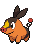

# Route 2 – Important Trainers

---

## Rival Bianca – 2

**Battle Type:** Single Battle

=== "Tepig"

    | Pokémon | Attributes | Item | Moves |
    |:-------:|------------|:----:|-------|
    |  | **Lv. 9** [Meowth](../../pokemon/meowth.md/) **Ability:** Technician {: width="48"} | No Item | 1. — 2. — 3. — 4. — |
    |  | **Lv. 10** [Snivy](../../pokemon/snivy.md/) **Ability:** Contrary {: width="48"} | No Item | 1. — 2. — 3. — 4. — |
    

=== "Snivy"

    | Pokémon | Attributes | Item | Moves |
    |:-------:|------------|:----:|-------|
    |  | **Lv. 9** [Meowth](../../pokemon/meowth.md/) **Ability:** Technician {: width="48"} | No Item | 1. — 2. — 3. — 4. — |
    |  | **Lv. 10** [Oshawott](../../pokemon/oshawott.md/) **Ability:** Vital Spirit {: width="48"} | No Item | 1. — 2. — 3. — 4. — |
    

=== "Oshawott"

    | Pokémon | Attributes | Item | Moves |
    |:-------:|------------|:----:|-------|
    |  | **Lv. 9** [Meowth](../../pokemon/meowth.md/) **Ability:** Technician {: width="48"} | No Item | 1. — 2. — 3. — 4. — |
    |  | **Lv. 10** [Tepig](../../pokemon/tepig.md/) **Ability:** Adaptability {: width="48"} | No Item | 1. — 2. — 3. — 4. — |
    

